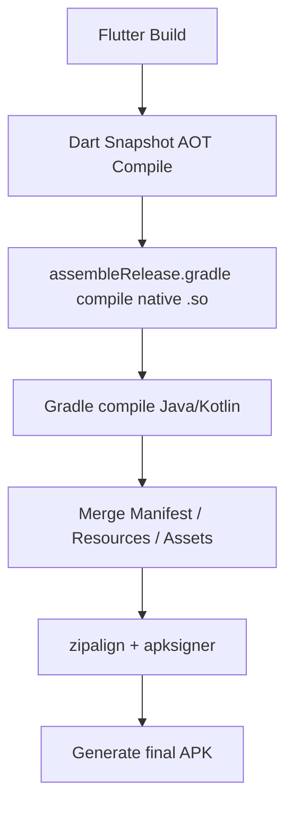

# <font color=red>[Dart.**`🐦Flutter`**](https://flutter.dev/?utm_source=google&utm_medium=cpc&utm_campaign=brand_sem&utm_content=apac_apac&gad_source=1&gad_campaignid=13034410756&gbraid=0AAAAAC-INI-9jKGdZCm6a9Zp2RvENOQVv&gclid=Cj0KCQjwj8jDBhD1ARIsACRV2TuPZFDZ2Py9BmKbsRj_mVS18Mf58tJhFzuzJIuxzTe316eALXjyW0AaAhelEALw_wcB&gclsrc=aw.ds)🧪靶场项目</font>@配置说明

<p align="left">
  <a></a>
  <a></a>
  <a></a>
  <a></a>
  <a href="https://github.com/295060456/JobsFlutterBaseConfigDemo"></a>
  <a></a>
  <a href="https://github.com/295060456/JobsFlutterBaseConfigDemo/stargazers"></a>
  <a href="https://github.com/295060456/JobsFlutterBaseConfigDemo/network"></a>
  <a></a>
  <a></a>
  <a></a>
</p>

[toc]

当前总行数：

## 🔥<font id=前言>前言</font>

* **工欲善其事必先利其器**
* **站在巨人的肩膀上，才能看得更远**
* **面向信仰编程**
* 🔔 温馨提示：👉  [<font color=red>**完整展示本文档**</font>](https://github.com/295060456/JobsFlutterBaseConfigDemo/blob/main/README.md)

## 💾 参考资料

* [**Flutter 实战@第二版**](https://book.flutterchina.club/)

## 一、🎯目的和功效 <a href="#前言" style="font-size:17px; color:green;"><b>🔼</b></a>

* 品控标准（只能严格的保证编译器正常，而不能完全保证运行时的不出错）
  * 一定要保证这个工程的成功编译通过，方便以后项目直接进行引用，乃至开新版本
  * <font color=blue>**示例Demo可能因为相关Api的升级，没有及时的覆盖处理，可能会出现闪退。修复即可**</font>
* 自此以后，所有新开的项目都可以根据这个**根项目**来进行统一的调配和使用
  * 将它作为所有项目的母版和基类，最大限度的做到全局的统一
  * 日积月累的记录一些平时生产生活中萌发的一些优秀的想法、灵光一现的创意。包括但不仅限于：<u>语法糖的封装</u>、<u>方法的调用</u>，<u>第三方的选用</u>、以及一些心得体会
* 作为某些代码**实践靶场**，在实际开发过程中，是非常有必要的
  * 为我们快速且稳定的复现一些业务场景，作为代码实验室🧪，而搭建的一个平台
* 作为代码笔记，记录一些常用的代码，方便查阅
  * 主要形式是可以运行的代码 + 文字性叙述 + 图文混编讲解
  * 作为学习的资料，可以快速了解到一些常用的知识，大幅**降低学习成本**
  * 作为其他项目的参考，可以快速的了解到项目的架构，代码规范，以及一些设计模式
  * 这么一些优秀的成果，其来源不仅仅是来自于作者本身的持续付出与积累。更是这个领域大家庭中各路优秀作者的智慧结晶
* 独立的测试单元
  * 对于单个的[**Flutter**](https://flutter.dev/)工程文件（小**Demo**）可以利用[**运行脚本**](./【MacOS】☀️双击运行Flutter项目（iOS 模拟器）.command)，在**MacOS**的**终端**直接拖入进行运行和展示（终端运行不支持断点，只能输出日志）
  * 为了保证各个**Demo**在形式上的独立性，所以尽可能的在单个`.dart`文件里面进行叙述。**每一个[Flutter](https://flutter.dev/)的Demo文件里，都会存在其程序的入口函数** 

## 二、🌱环境配置 <a href="#前言" style="font-size:17px; color:green;"><b>🔼</b></a>

### 1、[**XCode**](https://developer.apple.com/xcode/)  <a href="#前言" style="font-size:17px; color:green;"><b>🔼</b></a>

### 2、[**Android Studio**](https://developer.android.com/studio?hl=zh-cn) <a href="#前言" style="font-size:17px; color:green;"><b>🔼</b></a>

#### 2.1、[**点我👉下载Android Studio历史版本**](https://developer.android.com/studio/archive?utm_source=chatgpt.com&hl=zh-cn) <a href="#前言" style="font-size:17px; color:green;"><b>🔼</b></a>


#### 2.2、<font color=red>**配置JDK的地方和其他SDK的不一样**</font> <a href="#前言" style="font-size:17px; color:green;"><b>🔼</b></a>

* 配置JDK：

  <div style="text-align: center;">
    
    
  </div>

* 配置其他的SDK：

  <div style="text-align: center;">
  
  
  </div> 

#### 2.3、**`./android/gradlew`**

> 这个文件是来自：`android/gradle/wrapper/gradle-wrapper.propertie`
>
> ```
> distributionUrl=https\://services.gradle.org/distributions/gradle-7.6.3-bin.zip
> ```
>
> 去 `https://services.gradle.org` 下载指定版本 zip

```shell
./android/gradlew -v # 先定位到Flutter项目的根目录。运行成功的前提是指定项目使用的Jenv.JDK或者是全局配置的Java变量
```

### 3、[**VSCode**](https://code.visualstudio.com/) <a href="#前言" style="font-size:17px; color:green;"><b>🔼</b></a>

* 如果[**VSCode**](https://code.visualstudio.com/)打开[**Flutter**](https://flutter.dev/)项目以后没有办法通过`command`+`click`的形式点进去看，那么需要`command`+`shift`+`x` => 安装[**Dart**](https://dart.dev/)/[**Flutter**](https://flutter.dev/)

  

  

  * [**VSCode**](https://code.visualstudio.com/)的配置文件

    > 直接同步下列文件到目标项目中
  
    ```
    Flutter项目的根目录/
    └── .vscode/
        ├── extensions.json          ✅ 插件推荐列表（✅ 推荐加入 Git）
        ├── launch.json              ▶️ 启动配置（如调试 main.dart）（✅ 推荐加入 Git）
        ├── settings.json            ⚙️ 全局项目设置（⚠️ 视情况加入 Git，建议仅保留通用设置）
        ├── settings.local.json      🧪 本地专属设置（❌ 不建议加入 Git，应添加至 .gitignore）
        └── tasks.json               🔁 自定义任务（如自动构建、格式化）（✅ 推荐加入 Git）
    ```

    * `extensions.json`
  
      ```json
      /// 推荐使用的插件清单（团队统一）✅推荐加入Git管理
      {
          "recommendations": [
              // ✅ Flutter/Dart 支持
              "dart-code.flutter", // Flutter 插件（包含 Dart 支持）
              // ✅ 通用开发体验
              "esbenp.prettier-vscode", // Prettier 格式化工具
              "editorconfig.editorconfig", // 统一代码风格配置
              "streetsidesoftware.code-spell-checker", // 拼写检查器（防错别字）
              "gruntfuggly.todo-tree", // 高亮 TODO / FIXME 等标记
              "formulahendry.auto-rename-tag", // 自动重命名 HTML/Widget 标签
              "formulahendry.auto-close-tag", // 自动闭合标签（如 HTML）
              // ✅ Git 支持增强
              "eamodio.gitlens", // Git 历史高亮与增强
              "github.vscode-pull-request-github", // GitHub PR 工具
              // ✅ 国际化支持（如果你用到了 easy_localization 或 i18n）
              "lokalise.i18n-ally", // i18n 文件辅助管理
              // ✅ 中文语言包（可选）
              "ms-ceintl.vscode-language-pack-zh-hans" // 中文语言支持（若为中文环境）
          ]
      }
      ```
  
    * `launch.json`
  
      ```json
      /// 调试配置（如 Flutter 调试参数）。✅推荐加入Git管理
      {
          // 使用 IntelliSense 了解相关属性。
          // 悬停以查看现有属性的描述。
          // 欲了解更多信息，请访问: https://go.microsoft.com/fwlink/?linkid=830387
          "version": "0.2.0",
          "configurations": [
              {
                  "name": "JobsFlutterBaseConfigDemo", // 调试配置名称
                  "request": "launch", // 调试器请求类型，通常为 "launch" 或 "attach"
                  "type": "dart", // 调试器类型，通常为 "dart" 或 "flutter"
                  "program": "lib/调用本地相册+调用本机摄像头拍照（全部验证通过）/CameraDemo.dart", // ❤️要调试的程序的入口点
                  "flutterMode": "debug"
              },
              // {
              //     "name": "JobsFlutterBaseConfigDemo (profile mode)",
              //     "request": "launch",
              //     "type": "dart",
              //     "flutterMode": "profile"
              // },
              // {
              //     "name": "JobsFlutterBaseConfigDemo (release mode)",
              //     "request": "launch",
              //     "type": "dart",
              //     "flutterMode": "release"
              // }
          ]
      }
      ```
  
    * `settings.json`
  
      ```json
      /// 个人本地设置配置。❌不推荐加入Git管理
      {
        "_comment": "🚫 本文件为个人本地 VS Code 设置，仅供自己使用，❌ 不推荐加入 Git 管理",
        "__cmake_note": "✅ 指定 CMake 项目的源代码目录（用于 CMake 插件）",
        "cmake.sourceDirectory": "/Users/jobs/Documents/GitHub/JobsFlutterBaseConfig/jobs_flutter_base_config/linux",
        "__java_note": "✅ Java 编译时的空值分析模式（自动启用 null 安全检查）",
        "java.compile.nullAnalysis.mode": "automatic",
        "__dart_imports_note": "✅ Dart 编辑器：整理 import 时总是使用 package 引用风格",
        "dart.editImports": "always_use_package_imports",
        "__flutter_sdk_note": "✅ Flutter SDK 路径（使用 FVM 管理的版本路径）",
        "dart.flutterSdkPath": ".fvm/versions/3.32.6",
        "__format_note": "✅ 每次保存文件时自动格式化代码",
        "editor.formatOnSave": true,
        "__autosave_note": "✅ 当窗口失焦时自动保存",
        "files.autoSave": "afterDelay",
        "__autosave_delay_note": "✅ 自动保存延迟，100ms",
        "files.autoSaveDelay": 100,
        "__hot_exit_note": "✅ 关闭窗口时自动保存未保存文件（热退出）",
        "files.hotExit": "onExitAndWindowClose",
        "__trim_whitespace_note": "✅ 每次保存时自动移除每行末尾多余的空格",
        "files.trimTrailingWhitespace": true,
        "__final_newline_note": "✅ 文件末尾自动插入一个换行符，符合编码规范",
        "files.insertFinalNewline": true,
        "__save_conflict_note": "✅ 保存文件时如有冲突，自动覆盖磁盘上的版本（避免弹出冲突提示）",
        "files.saveConflictResolution": "overwriteFileOnDisk",
        "__restoreWindows_note": "✅ 启动时恢复上次打开的文件",
        "window.restoreWindows": "all",
        "__bracket_guides_note": "✅ 显示括号对的引导线，方便查看嵌套结构（active 表示仅在光标位于括号上时显示）",
        "editor.guides.bracketPairs": "active",
        "__bracket_colorization_note": "✅ 启用括号颜色匹配功能，为不同层级的括号着色",
        "editor.bracketPairColorization.enabled": true,
        "__bracket_match_note": "✅ 始终高亮当前括号对，便于匹配括号位置",
        "editor.matchBrackets": "always",
      }
      ```
  
  * **Git**忽略文件`.gitignore`对于[**VSCode**](https://code.visualstudio.com/)的配置文件的处理
  
    ```plaintext
    # The .vscode folder contains launch configuration and tasks you configure in
    # VS Code which you may wish to be included in version control, so this line
    # is commented out by default.
    .vscode/settings.json
    !.vscode/settings.local.json
    ```
  
* 安装插件

  * [**GitLens — Git supercharged**](https://marketplace.visualstudio.com/items?itemName=eamodio.gitlens)

  * [**Bracket Select**](https://marketplace.visualstudio.com/items?itemName=chunsen.bracket-select)（默认快捷键：`option` + `A`）
  
    > 选中括号内的内容以备操作

### 4、[**ohmyz.sh**](https://ohmyz.sh/) <a href="#前言" style="font-size:17px; color:green;"><b>🔼</b></a>

```shell
sh -c "$(curl -fsSL https://raw.githubusercontent.com/ohmyzsh/ohmyzsh/master/tools/install.sh)"
```

or

```shell
sh -c "$(wget https://raw.githubusercontent.com/ohmyzsh/ohmyzsh/master/tools/install.sh -O -)"
```

### 5、[**Homebrew**](https://brew.sh/)  <a href="#前言" style="font-size:17px; color:green;"><b>🔼</b></a>

```shell
/bin/bash -c "$(curl -fsSL https://raw.githubusercontent.com/Homebrew/install/HEAD/install.sh)"
```

#### 5.1、[**Homebrew**](https://brew.sh/).[<font color=red>Dart</font>](https://dart.dev/)  <a href="#前言" style="font-size:17px; color:green;"><b>🔼</b></a>

> [**Flutter**](https://flutter.dev/) 里面自带一个[Dart](https://dart.dev/) 环境，理论上是比最新的[Dart](https://dart.dev/) 版本落后的。如果系统里面既装了[Dart](https://dart.dev/) 环境又装了[**Flutter**](https://flutter.dev/)环境，那么[**Flutter**](https://flutter.dev/)项目默认使用[**Flutter**](https://flutter.dev/).SDK里面自带那个[Dart](https://dart.dev/) 环境

```
brew tap dart-lang/dart
```

#### 5.2、[**Homebrew**](https://brew.sh/).[<font color=red>jenv</font>](https://github.com/jenv/jenv)  <a href="#前言" style="font-size:17px; color:green;"><b>🔼</b></a>

>涉及到[**Android**](https://www.android.com/)的部分需要[**Java**](https://www.java.com/zh-CN/)环境的支持（打包、运行）
>
>[<font color=red>jenv</font>](https://github.com/jenv/jenv)不会自动下载/关联JDK，需要手动进行操作
>
>如果使用[<font color=red>jenv</font>](https://github.com/jenv/jenv)那么系统全局环境变量里面就不能写  
>
>```shell
>'export JAVA_HOME=$(/usr/libexec/java_home)'
>'export PATH="$JAVA_HOME/bin:$PATH"'
>```

* ```shell
  jenv versions --bare --verbose
  ```

  >在 shell 脚本中遍历所有已添加的 JDK 版本路径；
  >
  >检查某个版本到底对应哪个目录（例如是否是 Homebrew 安装的、SDKMAN 安装的等）；

* ```shell
  jenv add/remove JDK.path
  ```

  >```shell
  ># Homebrew.JDK.path 的固定格式
  >/opt/homebrew/opt/openjdk@17/libexec/openjdk.jdk/Contents/Home 
  >```
  >
  >```shell
  >jenv_add() {
  >	for v in 8 11 17 21; do
  >path="/opt/homebrew/opt/openjdk@${v}/libexec/openjdk.jdk/Contents/Home"
  >[[ -x "$path/bin/java" ]] && jenv add "$path"
  >done
  >
  >jenv rehash 
  >}
  >```

* ```shell
  jenv rehash # 重新生成 shims，使得你添加或切换的 Java 版本能被系统识别并生效。
  ```

* 用 [**jenv**](https://github.com/jenv/jenv)切换[**Java**](https://www.java.com/zh-CN/)环境

  ```shell
  jenv versions --bare --verbose # 用这里的结果
  
  jenv global openjdk64-24.0.2   # 全局（所有项目默认）
  jenv local openjdk64-17.0.16    # 当前目录（项目级）
  java --version                 # 验证
  ```
  
  > **整个MacOS系统里面用最新的JDK；而在具体的[Flutter](https://flutter.dev/)项目里面用指定版本的JDK**
  >
  > ```shell
  > ➜  Desktop java --version              
  > openjdk 24.0.2 2025-07-15
  > OpenJDK Runtime Environment Homebrew (build 24.0.2)
  > OpenJDK 64-Bit Server VM Homebrew (build 24.0.2, mixed mode, sharing)
  > ➜  Desktop /Users/jobs/Documents/Github/flutter_tiyu_app 
  > ➜  flutter_tiyu_app git:(JobsBranch@永利（金）) ✗ java --version
  > openjdk 17.0.16 2025-07-15
  > OpenJDK Runtime Environment Homebrew (build 17.0.16+0)
  > OpenJDK 64-Bit Server VM Homebrew (build 17.0.16+0, mixed mode, sharing)
  > ➜  flutter_tiyu_app git:(JobsBranch@永利（金）) ✗ 
  > ```

#### 5.3、[**Typora**](https://typora.io/)  <a href="#前言" style="font-size:17px; color:green;"><b>🔼</b></a>

#### 5.4、系统环境变量  <a href="#前言" style="font-size:17px; color:green;"><b>🔼</b></a>

> <font color=red>为了方便管理，只配置**`bash_profile`**和**`.zshrc`**</font>

<details>
<summary>.bash_profile</summary>

```shell
# 每次打开终端默认进入桌面目录
cd "$HOME/Desktop"

# 配置 Rbenv.ruby 环境变量（需安装 rbenv）
if command -v rbenv &>/dev/null; then
  export PATH="$HOME/.rbenv/bin:$PATH"
  eval "$(rbenv init -)"
else
  echo "⚠️ 未检测到 rbenv，请执行 brew install rbenv 安装"
fi
if command -v ruby &>/dev/null; then
  export PATH="/usr/local/opt/ruby/bin:$PATH"
  export LDFLAGS="-L/usr/local/opt/ruby/lib"
  export CPPFLAGS="-I/usr/local/opt/ruby/include"
  export PKG_CONFIG_PATH="/usr/local/opt/ruby/lib/pkgconfig"
else
  echo "⚠️ 未检测到 ruby，建议执行 brew install ruby"
fi

# 配置 Curl 环境变量（需 Homebrew 安装）
if command -v curl &>/dev/null; then
  export PATH="/usr/local/opt/curl/bin:$PATH"
  export LDFLAGS="-L/usr/local/opt/curl/lib"
  export CPPFLAGS="-I/usr/local/opt/curl/include"
  export PKG_CONFIG_PATH="/usr/local/opt/curl/lib/pkgconfig"
else
  echo "⚠️ curl 未通过 brew 安装，建议执行 brew install curl"
fi

# 配置 VSCode 命令行（code）
if [[ -d "/Applications/Visual Studio Code.app/Contents/Resources/app/bin" ]]; then
  export PATH="$PATH:/Applications/Visual Studio Code.app/Contents/Resources/app/bin"
  if ! command -v code &>/dev/null; then
    echo "⚠️ VSCode 已安装但未配置 code 命令，请在 VSCode 中运行：Shell Command: Install code in PATH"
  fi
else
  echo "⚠️ 未检测到 VSCode，请先安装 Visual Studio Code 后再运行本脚本"
fi

# 配置 Flutter 环境变量
if ! command -v fvm &>/dev/null; then
  if [[ -d "/opt/homebrew/Caskroom/flutter/latest/flutter/bin" ]]; then
    export PATH="/opt/homebrew/Caskroom/flutter/latest/flutter/bin:$PATH"
  elif [[ -d "/usr/local/Caskroom/flutter/latest/flutter/bin" ]]; then
    export PATH="/usr/local/Caskroom/flutter/latest/flutter/bin:$PATH"
  elif [[ -d "$HOME/flutter/bin" ]]; then
    export PATH="$HOME/flutter/bin:$PATH"
  elif [[ -d "$HOME/Documents/GitHub.Jobs/Flutter.SDK/Flutter.SDK.last/bin" ]]; then
    export PATH="$HOME/Documents/GitHub.Jobs/Flutter.SDK/Flutter.SDK.last/bin:$PATH"
  else
    echo "⚠️ 未找到 Flutter SDK，请手动配置路径"
  fi
fi
export PUB_HOSTED_URL=https://pub.dartlang.org
export FLUTTER_STORAGE_BASE_URL=https://storage.googleapis.com

# 配置 FVM 环境变量
export PATH="$HOME/.pub-cache/bin:$PATH"
if command -v fvm &>/dev/null; then
  flutter() { fvm flutter "$@"; }
else
  echo "⚠️ 未检测到 fvm，请执行 flutter pub global activate fvm 安装"
fi

# 配置 Android SDK 环境变量
if [[ -d "$HOME/Library/Android/sdk" ]]; then
  export ANDROID_SDK_ROOT="$HOME/Library/Android/sdk"
  export PATH="$PATH:$ANDROID_SDK_ROOT/platform-tools:$ANDROID_SDK_ROOT/cmdline-tools/latest/bin:$ANDROID_SDK_ROOT/emulator:$ANDROID_SDK_ROOT/tools:$ANDROID_SDK_ROOT/tools/bin"
else
  echo "⚠️ 未检测到 Android SDK，请安装 Android Studio 或配置 ANDROID_SDK_ROOT"
fi

# 配置 JDK / OpenJDK / SDKMAN
export JAVA_HOME="/opt/homebrew/opt/openjdk"  # 默认值（优先级最低）
if /usr/libexec/java_home &>/dev/null; then
  export JAVA_HOME=$(/usr/libexec/java_home)
fi
case ":$PATH:" in
  *":$JAVA_HOME/bin:"*) ;;
  *) export PATH="$JAVA_HOME/bin:$PATH" ;;
esac
if [[ -s "$HOME/.sdkman/bin/sdkman-init.sh" ]]; then
  export SDKMAN_DIR="$HOME/.sdkman"
  source "$HOME/.sdkman/bin/sdkman-init.sh"
else
  echo "⚠️ 未检测到 SDKMAN，请访问 https://sdkman.io 安装"
fi

# 配置 Gradle 环境变量
if command -v gradle &>/dev/null; then
  export PATH="$HOME/Documents/Gradle/gradle-8.7/bin:$PATH"
else
  echo "⚠️ 未检测到 gradle，建议执行 brew install gradle 安装"
fi

# 配置 pipx 环境变量
if command -v pipx &>/dev/null; then
  export PATH="$PATH:$HOME/.local/bin"
else
  echo "⚠️ pipx 未安装，建议执行 brew install pipx"
fi

```
</details> 

<details>
<summary>.zshrc</summary>

```dart
export ZSH="$HOME/.oh-my-zsh"
ZSH_THEME="robbyrussell"
plugins=(git)
source $ZSH/oh-my-zsh.sh

flutter() { fvm flutter "$@"; }

jobs() {
  local files=(
    "$HOME/.bash_profile"
    "$HOME/.bashrc"
    "$HOME/.zshrc"
    "$HOME/.oh-my-zsh/oh-my-zsh.sh"
  )
  for file in "${files[@]}"; do
    if [[ -f "$file" ]]; then
      source "$file"
      echo "\033[1;32m✅ 已加载配置文件：file://$file\033[0m"
    else
      echo "\033[1;33m⚠️ 未找到配置文件：file://$file\033[0m"
    fi
  done
  echo "\n📎 ⌘Command + 点击路径可打开对应文件（macOS Terminal 支持）"
}

if [[ -z "$JOBS_ALREADY_RUN" ]]; then
  export JOBS_ALREADY_RUN=1
  command -v jobs &>/dev/null && jobs
fi

```
</details>

### 6、[<font color=red>**FVM**</font>](https://fvm.app/) = <font color=red>**F**</font>lutter <font color=red>**V**</font>ersion <font color=red>**M**</font>anagement <a href="#前言" style="font-size:17px; color:green;"><b>🔼</b></a>

> 为每一个项目配置（锁定🔒）一个单独的[**Flutter**](https://flutter.dev/)环境，和系统环境区分开，方便切环境运行（测试）代码

* 安装[**FVM**](https://fvm.app/)的大前提是先安装**dart**环境。🍺Homebrew 核心源中目前**没有**收录 Dart 的 `fvm` 工具

  ```dart
  dart pub global activate fvm
  ```

* 由[**FVM**](https://fvm.app/)锁定的版本信息，写入在[**Flutter**](https://flutter.dev/)项目根目录下的**`.fvm/fvm_config.json`**（隐藏文件夹）

  ```json
  {
    "flutterSdkVersion": "3.13.9", /// 当前项目锁定使用的 Flutter 版本
    "pinVersions": false /// 是否锁定精确版本（通常设为 false）
  }
  ```

* 由[**FVM**](https://fvm.app/)管理的[**Flutter**](https://flutter.dev/).**SDK**的缓存目录：`.fvm/flutter_sdk/`

* 环境变量配置：`.bash_profile`

  > 🌟全局定义了一个 shell 函数，把所有的 `flutter` 命令都转发给 `fvm`
  >
  > 📌 那么 [**FVM**](https://fvm.app/) 是怎么知道用哪个 [**Flutter**](https://flutter.dev/).**SDK**？
  >
  > * [**FVM**](https://fvm.app/) 会优先查找**当前项目的 `.fvm/fvm_config.json`** 文件；
  >
  > * 如果你不在 [**Flutter**](https://flutter.dev/) 项目目录，[**FVM**](https://fvm.app/) 会使用你设置的 **全局默认 [Flutter](https://flutter.dev/).SDK 版本**。
  >
  >   ```shell
  >   ➜  Desktop fvm global
  >   ? Select a version:  ›
  >   ❯ stable
  >     3.32.6
  >     3.24.5
  >   ```

  ```shell
  # 配置 FVM 环境变量
  export PATH="$HOME/.pub-cache/bin:$PATH"
  if command -v fvm &>/dev/null; then
    flutter() { fvm flutter "$@"; }
  else
    echo "⚠️ 未检测到 fvm，请执行 flutter pub global activate fvm 安装"
  fi
  ```

  ```shell
  ➜  Desktop which flutter

  flutter () {
  	fvm flutter "$@"
  }
  ```

* 🔒锁版本文件

  

  | 文件/路径                                                    | 位置               | 是否建议提交   | 作用                                                         | 备注说明                                                     |
  | ------------------------------------------------------------ | ------------------ | -------------- | ------------------------------------------------------------ | ------------------------------------------------------------ |
  | `.fvmrc`                                                     | 项目根目录         | ✅ **建议提交** | 显式标记希望使用的 Flutter 版本（如 `3.32.6` 或 `stable`）方便团队协作、CI 自动读取 | 仅一行纯文本，不支持注释，适用于版本声明                     |
  | `.fvm/fvm_config.json`                                       | 项目目录内 `.fvm/` | ❌ **建议忽略** | 实际执行时 FVM 内部记录的配置信息：包含 `flutterSdkVersion`、`channel`、`cachePath` 等 | [**FVM**](https://fvm.app/) 自动生成，用于代理和定位 SDK，不可手动编辑 |
  | `.fvm/flutter_sdk`                                           | `.fvm/` 中软链接   | ❌ 忽略         | 指向你电脑上的实际 SDK 位置（`~/.fvm/versions/3.32.6`）      | 用于让 `fvm flutter` 命令生效，指向实际安装版本              |
  | `~/.fvm/versions/<version>`                                  | 全局路径           | ✅ 本地缓存     | 实际安装的 SDK，供多个项目共用                               | 每个版本只安装一次，多项目共享此目录，无需提交               |
  | `release` 文件<br>`.fvm/versions/<version>/version` 或 `release` | SDK 内部           | ❌ 不关心       | [**Flutter**](https://flutter.dev/).**SDK** 自带的版本描述文件，标识当前版本及 channel | 可用于诊断或展示 SDK 内部信息，一般无需关心或操作            |
  
* 🧰[**FVM**](https://fvm.app/)命令行使用方式：

  * **查看当前 [FVM](https://fvm.app/) 的全局默认版本**

    ```shell
    fvm global
    ```

  * **查看所有可用版本**

    ```
    fvm releases
    ```

  * **查看当前项目锁定版本**

    ```shell
    fvm flutter --version
    ```

  * 查询可用**`channel`**

    ```shell
    fvm flutter channel
    ```

    ```shell
    ➜  Desktop flutter channel
    Flutter channels:
      master (latest development branch, for contributors)
      main (latest development branch, follows master channel)
      beta (updated monthly, recommended for experienced users)
    * stable (updated quarterly, for new users and for production app releases)
    ```

    | channel  | 说明                                                         | 适用人群       |
    | -------- | ------------------------------------------------------------ | -------------- |
    | `stable` | **稳定发布，适合生产环境**                                   | 普通开发者 ✅   |
    | `beta`   | **新功能预览版，较稳定**                                     | 有经验的开发者 |
    | `main`   | **主开发分支，功能最前沿**<br>从 [**Flutter**](https://flutter.dev/) 3.22 开始，[**Flutter**](https://flutter.dev/) 团队对 channel 进行了重构，**废弃了 `dev` channel 的独立维护**，其功能完全被 `main` 取代。 | 需体验最新特性 |
    | `master` | **[Flutter](https://flutter.dev/) 引擎贡献者使用**           | 深度参与者     |

  * 升级（切换）由[**FVM**](https://fvm.app/)管理的[**Flutter**](https://flutter.dev/).**SDK**

    ```shell
    # 如果有必要，需要先切换channel，再upgrade
    fvm flutter channel main
    fvm flutter upgrade
    ```

    | 命令                 | 含义                                                         | 是否修改项目配置                |
    | -------------------- | ------------------------------------------------------------ | ------------------------------- |
    | `fvm install stable` | 安装**最新稳定版本**到本地缓存                               | ❌                               |
    | `fvm use stable`     | 设置当前项目使用最新稳定版本                                 | ✅                               |
    | `fvm global stable`  | 设置全局默认版本                                             | ✅（全局）                       |
    | `fvm upgrade`        | 1️⃣ **获取当前项目 `.fvm/fvm_config.json` 中配置的 `flutterSdkVersion` 所属 channel（如 stable、beta、dev、master）**；<br>2️⃣ 然后从该 **channel** 中 **升级到该 channel 的最新版本** | ✅（更新版本但不换 **channel**） |

## 三、💥代码讲解 <a href="#前言" style="font-size:17px; color:green;"><b>🔼</b></a>

### 1、🖨️打印方式 <a href="#前言" style="font-size:17px; color:green;"><b>🔼</b></a>

#### 1.1、 <font id=极光原生推送>🌌</font><a href="#极光原生推送" style="font-size:20px; color:green;"><b>极光原生推送</b></a>封装的全局打印（🧨强烈推荐）<a href="#前言" style="font-size:17px; color:green;"><b>🔼</b></a> 

> 虽然这个方法原本是插件内部封装的，但它本质上是一个对 `print()` 的增强封装，用法通用、效果更强大。

```dart
FlutterPluginEngagelab.printMy(xxx);
```

| 优点                    | 说明                    |
| ----------------------- | ----------------------- |
| ✅ 统一管理日志输出      | 方便集中控制            |
| ✅ 可扩展（加颜色/时间） | 比原生 `print()` 更灵活 |
| ✅ 可加日志等级 / tag    | 比如 `[INFO]` `[ERROR]` |
| ✅ 可屏蔽 Release 输出   | 保证线上不暴露调试信息  |
| ✅ 日志更美观 / 可写文件 | 后期接入文件记录也方便  |

#### 1.2、`debugPrint` <a href="#前言" style="font-size:17px; color:green;"><b>🔼</b></a>

```dart
debugPrint("XXX");
```

#### 1.3、`JobsPrint` <a href="#前言" style="font-size:17px; color:green;"><b>🔼</b></a>

> 1️⃣ 日志打印输出文件和行
>
> 2️⃣ 如果要打印类的实例，需要在类中添加 `Map<String, dynamic> toJson() `方法
>
> 3️⃣ 对<a href="#极光原生推送" style="font-size:16px; color:green;"><b>极光原生推送</b></a>的一定程度的二次封装

```dart
import 'package:flutter_plugin_engagelab/flutter_plugin_engagelab.dart';

void JobsPrint(Object? message) {
  /// 获取当前调用栈，目的是找到谁调用了这个日志函数。
  final StackTrace stackTrace = StackTrace.current;
  /// 把堆栈信息按行切割为数组。每一行大概表示一个方法的调用栈帧。
  final List<String> stackTraceLines = stackTrace.toString().split('\n');
  /// 取第2行（stackTraceLines[1]）：因为第1行是当前函数本身的调用，第2行才是调用 JobsPrint() 的地方。
  /// 然后传给 _formatStackTraceLine() 方法提取出文件和行号信息。
  final String logLine = stackTraceLines.length > 1
      ? _formatStackTraceLine(stackTraceLines[1])
      : 'Unknown location';
  FlutterPluginEngagelab.printMy('[$logLine] ${_messageToString(message)}');
}
```

### 2、`SystemChrome`常用于设置<u>**状态栏和系统底部导航栏样式**</u>的配置 <a href="#前言" style="font-size:17px; color:green;"><b>🔼</b></a>

<font color=red>**尤其在 APP 启动时、页面初始化时非常常见**</font>

> 1、`SystemChrome`：来自 `package:flutter/services.dart`，用于设置系统级 UI 交互（如状态栏、导航栏）
>
> 2、`SystemUiOverlayStyle`：一个数据类，描述状态栏/导航栏的颜色、图标亮度等

```dart
SystemChrome.setSystemUIOverlayStyle(const SystemUiOverlayStyle(
    statusBarColor: Colors.white, // 状态栏背景颜色
    statusBarIconBrightness: Brightness.dark, // 状态栏图标颜色（黑色）
    statusBarBrightness: Brightness.light, // 适用于iOS

    systemNavigationBarColor: Colors.white, // 导航栏背景颜色
    systemNavigationBarIconBrightness: Brightness.dark, // 导航栏图标为黑色
    systemNavigationBarDividerColor: Colors.white, // 导航栏分割线颜色（可选）
  ));
```

###  3、🚪配置入口 <a href="#前言" style="font-size:17px; color:green;"><b>🔼</b></a>

#### 3.1、🚪配置项目入口   <a href="#前言" style="font-size:17px; color:green;"><b>🔼</b></a>

```dart
Future<void> main() async{return runApp(XXX)};
void main() => runApp(XXX);
```

<details>
<summary>MaterialApp</summary>

```dart
import 'package:jobs_flutter_base_config/JobsDemoTools/JobsFlutterTools/JobsRunners/JobsMaterialRunner.dart';// 公共测试器路径
void main() => runApp(const JobsMaterialRunner(CustomOverlayDemo(),title:'XXX'));
/// 或者
void main() {
  runApp(JobsMaterialRunner.builder(
    title: 'Flutter Bloc Demo',
    builder: (ctx) {
      return BlocProvider(
        create: (_) => CounterBloc(),
        child: const CounterPage(),
      );
    },
  ));
}
```
</details>

<details>
<summary>CupertinoApp</summary>

```dart
  import 'package:jobs_flutter_base_config/JobsDemoTools/JobsFlutterTools/JobsRunners/JobsCupertinoRunner.dart';// 公共测试器路径
  void main() => runApp(const JobsCupertinoRunner(CustomOverlayDemo(),title:'XXX'));
  /// 或者
  void main() {
    runApp(JobsCupertinoRunner.builder(
      title: 'Flutter Bloc Demo',
      builder: (ctx) {
        return BlocProvider(
          create: (_) => CounterBloc(),
          child: const CounterPage(),
        );
      },
    ));
  }
```
</details>

<details>
<summary>GetMaterialApp</summary>

```dart
import 'package:jobs_flutter_base_config/JobsDemoTools/JobsFlutterTools/JobsRunners/JobsGetXRunner.dart';// 公共测试器路径
void main() =>
    runApp(JobsGetRunner(const PageB(), navigatorObservers:[routeObserver],title: '路由变化的监听测试'));
/// 或者
void main() {
  runApp(JobsGetRunner.builder(
    title: 'Obx 测试',
    builder: (ctx) => Center(
      child: Obx(() => Text('当前值：${controller.count}')),
    ),
  ));
}
```
</details>

#### 3.2、🚪配置页面的入口   <a href="#前言" style="font-size:17px; color:green;"><b>🔼</b></a>

##### 3.2.1、🚪配置首页入口   <a href="#前言" style="font-size:17px; color:green;"><b>🔼</b></a>

<details>
<summary>点击展开代码</summary>

```dart
GetMaterialApp(
  initialRoute: AppPages.INITIAL,      // 从哪个页面开始
  initialBinding: MainBindings(),      // 启动前先注入哪些依赖
  getPages: AppPages.routes,           // 有哪些页面能被跳转
)
```
```dart
MaterialApp(
  home: Builder(
    builder: (ctx) => Scaffold(
      appBar: AppBar(
        title:
            Text(title ?? (child?.runtimeType.toString() ?? 'Builder')),
      ),
      body: Center(
        child: builder != null
            ? builder!(ctx)
            : child ?? Text('请传入 child 或 builder'.tr),
      ),
    ),
  ),
)
```

```dart
CupertinoApp(
  home: Builder(
    builder: (ctx) => CupertinoPageScaffold(
      navigationBar: CupertinoNavigationBar(
        middle:
            Text(title ?? (child?.runtimeType.toString() ?? 'Builder')),
      ),
      child: SafeArea(
        child: child ?? Text('请传入 child 或 builder'.tr),
      ),
    ),
  ),
)
```

</details>

##### 3.2.2、搭建页面的基本结构   <a href="#前言" style="font-size:17px; color:green;"><b>🔼</b></a>

> [**Flutter**](https://flutter.dev/) 页面如果没有被如下👇结构组件包裹，就没有默认 UI 背景结构（如白底、**AppBar**、状态栏空间等）——看起来就像“一片黑”或者“没有显示内容”。

| 组件名                                    | 所属库                                   | 用途 / 特点                                                  |
| ----------------------------------------- | ---------------------------------------- | ------------------------------------------------------------ |
| **Scaffold**                              | Material                                 | 最常用，构建 Material 风格页面结构（AppBar、Drawer、FAB、BottomSheet 等） |
| **CupertinoPageScaffold**                 | Cupertino                                | 构建 iOS 风格页面结构，支持 `navigationBar` 和 `child`       |
| **CupertinoTabScaffold**                  | Cupertino                                | iOS 风格的底部标签栏结构，配合 `CupertinoTabBar` 使用        |
| **NestedScrollView**                      | Material                                 | 支持协调滚动的页面结构（如 Collapsing AppBar）               |
| **CustomScrollView**                      | Material                                 | 更灵活的滚动结构，通常配合 SliverAppBar、SliverList 使用     |
| **PageView**                              | Material                                 | 可横向翻页的容器，常用于引导页或 Tab 页面切换                |
| **TabBarView** + **DefaultTabController** | Material                                 | 用于构建 Tab 页面结构，搭配 AppBar 的 TabBar 使用            |
| **Navigator** / **Router**                | Flutter Core                             | 构建自定义的导航堆栈管理结构（底层的页面容器）               |
| **ShellRoute (GoRouter)**                 | go_router                                | 用于统一页面结构的嵌套路由容器（Web 和 App 通用）            |
| **GetMaterialApp + GetBuilder / GetView** | [**GetX**](https://pub.dev/packages/get) | [**GetX**](https://pub.dev/packages/get)  状态管理中用于统一结构的容器类组合 |
| **Phoenix**                               | `flutter_phoenix`                        | 用于“热重启”整个 app 的容器结构                              |
| **DevicePreview**                         | `device_preview`                         | 用于响应式预览，模拟不同设备的结构容器                       |

### 4、[**Flutter**](https://flutter.dev/)<font color=red>**项目中比较标准且完整的启动流程**</font> <a href="#前言" style="font-size:17px; color:green;"><b>🔼</b></a>

> 1️⃣ `SystemChrome` 限制方向
>
> 2️⃣ `WakelockPlus` 保持屏幕常亮
>
> 3️⃣ [**`GetX`**](https://pub.dev/packages/get)  依赖注入、路由
>
> 4️⃣ `SpUtil` 读取缓存
>
> 5️⃣ `ScreenUtil` 适配设计图尺寸
>
> 6️⃣ `EasyLoading` 全局 loading 提示
>
> 7️⃣ 多语言支持
>
> 8️⃣ 自定义生命周期监听

<details>
<summary>点击展开代码</summary>

```dart
SystemChrome.setPreferredOrientations([
    DeviceOrientation.portraitUp,/// 强制设置 App 只允许竖屏朝上
  ]).then((_) async {
    WakelockPlus.enable();/// 保持屏幕常亮，不自动息屏
    Get.put(AppLifecycleController()); /// 注册生命周期监听
    String currentLanguage =
        await SpUtil.getString("currentLanguageType") ?? "zh";
    NetworkService().setLanguageNum(currentLanguage);
    /// 自定义路由监听器，可在页面切换时做记录、埋点、统计等。
    final AppNavigatorObserver appNavigatorObserver = AppNavigatorObserver();
    runApp(
      /// ScreenUtilInit 是 flutter_screenutil 提供的入口，配合设计稿尺寸进行尺寸适配；
      /// 1125x2436 是 iPhone X 的设计尺寸（单位是 px，不是 dp）；
      /// 可自动适配不同分辨率设备，保证 UI 不变形。
      ScreenUtilInit(
        designSize: const Size(1125, 2436), /// 目前给到的设计图尺寸，如有变动，后续再改
        minTextAdapt: true,
        splitScreenMode: true,
        builder: (context, child) {
          return GetMaterialApp(
            debugShowCheckedModeBanner: false,
            title: 'XXXXX',
            navigatorObservers: [appNavigatorObserver],
            localizationsDelegates: const [
              GlobalMaterialLocalizations.delegate,
              GlobalWidgetsLocalizations.delegate,
              GlobalCupertinoLocalizations.delegate,
            ],
            supportedLocales: supportedLocales,/// 支持语言列表；
            initialRoute: AppPages.INITIAL,
            initialBinding: MainBindings(),
            getPages: AppPages.routes,
            builder: EasyLoading.init(),/// 配置全局 loading 样式；
            translations: AppTranslations(),/// 实现了 GetTranslations 的类，提供语言资源。
            locale: Locale(currentLanguage),/// 当前语言；
            fallbackLocale: const Locale("en"),/// 无匹配时的默认语言。
          );
        },
      ),
    );
    configLoading();/// 配置 EasyLoading 的样式，如动画、字体、遮罩等。
  });
```
</details>

### 5、`WidgetsFlutterBinding`确保 **Flutter** 框架与底层平台（如 MethodChannel、插件）之间的桥梁已完成初始化 <a href="#前言" style="font-size:17px; color:green;"><b>🔼</b></a>

> [**Flutter**](https://flutter.dev/) 有一个叫做 **`WidgetsBinding`** 的东西，它是所有 **`Widget`** 框架的核心，它负责：
>
> - 管理生命周期（如 `build`、`rebuild`）
> - 管理 `SchedulerBinding`（帧调度）
> - 管理平台通道（如使用 `MethodChannel` 调用原生方法）
>
> 在 `runApp()` 之前，你必须保证这个 **Binding** 已经初始化。

```dart
WidgetsFlutterBinding.ensureInitialized();
```

比如，在使用以下功能前，一定要进行初始化：

- 使用 `SharedPreferences.getInstance()`
- 调用 `SystemChrome.setPreferredOrientations(...)`
- 使用 `await Firebase.initializeApp()`
- 使用 `PathProvider.getApplicationDocumentsDirectory()`
- 调用原生插件（任何与平台通道有关的）

> 如果没有调用 `WidgetsFlutterBinding.ensureInitialized()`，可能会报错类似：
>
> ```shell
> Binding has not yet been initialized.
> ```

### 6、`DartPingIOS`在 **iOS** 上启用 **native** 层实现的 <font color=red>**ping 功能**</font> <a href="#前言" style="font-size:17px; color:green;"><b>🔼</b></a>

> 1️⃣ 因为 **iOS** 的网络权限和限制较多，`dart_ping` 需要通过原生插件配合实现 `ping`，所以需要先进行手动注册
>
> 2️⃣ 这个调用对 **Android 不需要**（在 [**Android**](https://www.android.com/) 上使用 `Ping` 不需要额外处理，直接用即可）

<details>
<summary>注册</summary>

```dart
DartPingIOS.register();
```
</details>

<details>
<summary>使用</summary>

```dart
final ping = Ping('8.8.8.8', count: 4);

ping.stream.listen((event) {
  print(event.summary); // 或 event.response
});
```
</details>

<details>
<summary>配置</summary>

* `Info.plist `

  ```xml
  <key>NSAppTransportSecurity</key>
  <dict>
    <key>NSAllowsArbitraryLoads</key>
    <true/>
  </dict>
  ```

* `pubspec.yaml`

  ```yaml
  dependencies:
    dart_ping: any
  # iOS 需要单独引入
  dart_ping_ios: any
  ```

### 7、利用**`SharedPreferences`**对数据进行存取 <a href="#前言" style="font-size:17px; color:green;"><b>🔼</b></a>

> 1️⃣ 封装原生 `SharedPreferences` 支持的所有类型
>
> 2️⃣ 额外支持了自定义对象（**Bean**）的存取
>
> 💥 [**Flutter**](https://flutter.dev/).**`SharedPreferences`** == OC.**`NSUserDefaults`** == Swift.**`UserDefaults`**

<details>
<summary>点击展开代码</summary>

```dart
/// SpUtil.dart
import 'dart:convert';
import 'package:shared_preferences/shared_preferences.dart';
import 'app_json_serializable.dart';
/// 存储配置信息的工具类
class SpUtil {
  /// 保存String类型数据
  static Future<void> saveString(String key, String value) async {
    final prefs = await SharedPreferences.getInstance();
    await prefs.setString(key, value);
  }
  /// 获取String类型数据
  static Future<String?> getString(String key) async {
    final prefs = await SharedPreferences.getInstance();
    return prefs.getString(key);
  }
  /// 保存Int类型数据
  static Future<void> saveInt(String key, int value) async {
    final prefs = await SharedPreferences.getInstance();
    await prefs.setInt(key, value);
  }
  /// 获取Int类型数据
  static Future<int?> getInt(String key) async {
    final prefs = await SharedPreferences.getInstance();
    return prefs.getInt(key);
  }
  /// 保存Double类型数据
  static Future<void> saveDouble(String key, double value) async {
    final prefs = await SharedPreferences.getInstance();
    await prefs.setDouble(key, value);
  }
  /// 获取Double类型数据
  static Future<double?> getDouble(String key) async {
    final prefs = await SharedPreferences.getInstance();
    return prefs.getDouble(key);
  }
  /// 保存Bool类型数据
  static Future<void> saveBool(String key, bool value) async {
    final prefs = await SharedPreferences.getInstance();
    await prefs.setBool(key, value);
  }
  /// 获取Bool类型数据
  static Future<bool?> getBool(String key) async {
    final prefs = await SharedPreferences.getInstance();
    return prefs.getBool(key);
  }
  /// 保存String类型列表数据
  static Future<void> saveStringList(String key, List<String> value) async {
    final prefs = await SharedPreferences.getInstance();
    await prefs.setStringList(key, value);
  }
  /// 获取String类型列表数据
  static Future<List<String>?> getStringList(String key) async {
    final prefs = await SharedPreferences.getInstance();
    return prefs.getStringList(key);
  }
  /// 通过key删除指定数据
  static Future<void> remove(String key) async {
    final prefs = await SharedPreferences.getInstance();
    await prefs.remove(key);
  }
  /// 清空数据
  static Future<void> clear() async {
    final prefs = await SharedPreferences.getInstance();
    await prefs.clear();
  }
  /// 保存序列化的bean
  static Future<void> saveBean<T extends AppJsonSerializable>(
      String key, T value) async {
    final prefs = await SharedPreferences.getInstance();
    String jsonString = jsonEncode(value.toJson());
    await prefs.setString(key, jsonString);
  }
  /// 拿出bean
  static Future<T?> getBean<T extends AppJsonSerializable>(
      String key, T Function(Map<String, dynamic>) fromJson) async {
    final prefs = await SharedPreferences.getInstance();
    String? jsonString = prefs.getString(key);
    if (jsonString != null) {
      Map<String, dynamic> jsonMap = jsonDecode(jsonString);
      return fromJson(jsonMap);
    }
    return null;
  }
}
```
</details>

### 8、[**Flutter**](https://flutter.dev/).**SDK**标准<a href="#模态" style="color:green; font-size:25px;"><b>模态</b></a>弹窗组件（截至 2025）<a href="#前言" style="font-size:17px; color:green;"><b>🔼</b></a>

| 名称                            | 类型                        | 用途说明                       | 所属库                           |
| ------------------------------- | --------------------------- | ------------------------------ | -------------------------------- |
| **`showDialog()`**              | <font color=red>方法</font> | 通用弹窗封装                   | `package:flutter/material.dart`  |
| **`showGeneralDialog()`**       | <font color=red>方法</font> | 自定义内容和动画的底层弹窗方法 | `package:flutter/material.dart`  |
| **`showModalBottomSheet()`**    | <font color=red>方法</font> | 弹出底部模态弹窗               | `package:flutter/material.dart`  |
| **`showDatePicker()`**          | <font color=red>方法</font> | 弹出日期选择器                 | `package:flutter/material.dart`  |
| **`showTimePicker()`**          | <font color=red>方法</font> | 弹出时间选择器                 | `package:flutter/material.dart`  |
| **`showSearch()`**              | <font color=red>方法</font> | 弹出搜索页（全屏弹窗）         | `package:flutter/material.dart`  |
| **`showAboutDialog()`**         | <font color=red>方法</font> | 显示应用信息弹窗               | `package:flutter/material.dart`  |
| **`showLicensePage()`**         | <font color=red>方法</font> | 显示 **License** 页面          | `package:flutter/material.dart`  |
| **`showCupertinoDialog()`**     | <font color=red>方法</font> | 弹出 iOS 风格弹窗              | `package:flutter/cupertino.dart` |
| **`showCupertinoModalPopup()`** | <font color=red>方法</font> | 弹出 iOS 风格底部弹窗          | `package:flutter/cupertino.dart` |

| 名称                        | 类型                          | 用途说明                           | 所属库                           |
| --------------------------- | ----------------------------- | ---------------------------------- | -------------------------------- |
| **`AlertDialog`**           | <font color=green>组件</font> | 标准提示对话框                     | `package:flutter/material.dart`  |
| **`SimpleDialog`**          | <font color=green>组件</font> | 简单选项对话框                     | `package:flutter/material.dart`  |
| **`Dialog`**                | <font color=green>组件</font> | 可自定义内容                       | `package:flutter/material.dart`  |
| **`LicensePage`**           | <font color=green>组件</font> | **License** 页面容器               | `package:flutter/material.dart`  |
| **`CupertinoAlertDialog`**  | <font color=green>组件</font> | iOS 风格对话框组件                 | `package:flutter/cupertino.dart` |
| **`CupertinoActionSheet`**  | <font color=green>组件</font> | iOS 风格底部弹窗内容               | `package:flutter/cupertino.dart` |
| **`CupertinoPopupSurface`** | <font color=green>组件</font> | 弹窗表面组件（用于自定义弹窗外观） | `package:flutter/cupertino.dart` |


* `AlertDialog`（最常用）

  <details>
  <summary>点击展开代码</summary>

  ```dart
  showDialog(
    context: context,
    builder: (context) {
      return AlertDialog(
        title: Text('提示'),
        content: Text('你确定要删除吗？'),
        actions: [
          TextButton(
            onPressed: () => Navigator.of(context).pop(false),
            child: Text('取消'),
          ),
          TextButton(
            onPressed: () => Navigator.of(context).pop(true),
            child: Text('确定'),
          ),
        ],
      );
    },
  );
  ```
  </details>
  
* `SimpleDialog`

  <details>
  <summary>点击展开代码</summary>
  
  ```dart
  /// 适合展示多个选项
  showDialog(
    context: context,
    builder: (context) {
      return SimpleDialog(
        title: Text('请选择'),
        children: [
          SimpleDialogOption(
            onPressed: () => Navigator.pop(context, 'A'),
            child: Text('选项A'),
          ),
          SimpleDialogOption(
            onPressed: () => Navigator.pop(context, 'B'),
            child: Text('选项B'),
          ),
        ],
      );
    },
  );
  ```
  </details>
  
* `Dialog`

  <details>
  <summary>点击展开代码</summary>

  ```dart
  /// 一个基础的对话框容器，通常用于自定义弹窗
  showDialog(
    context: context,
    builder: (context) {
      return Dialog(
        shape: RoundedRectangleBorder(borderRadius: BorderRadius.circular(12)),
        child: Padding(
          padding: const EdgeInsets.all(16.0),
          child: Column(
            mainAxisSize: MainAxisSize.min,
            children: [
              Text('自定义内容'),
              SizedBox(height: 10),
              ElevatedButton(
                onPressed: () => Navigator.pop(context),
                child: Text('关闭'),
              ),
            ],
          ),
        ),
      );
    },
  );
  ```
  </details>

* `showDialog`

  <details>
  <summary>点击展开代码</summary>

  ```dart
  /// 异步等待用户返回结果
  /// Dart 中所有未初始化的对象变量（包括 bool）在类中默认值是 null，因为 Dart 是一个 空安全（null safety）语言。
  bool? confirmed = await showDialog<bool>(
    context: context,
    builder: (context) {
      return AlertDialog(
        title: Text('确认'),
        content: Text('是否保存？'),
        actions: [
          TextButton(onPressed: () => Navigator.pop(context, false), child: Text('取消')),
          TextButton(onPressed: () => Navigator.pop(context, true), child: Text('确定')),
        ],
      );
    },
  );
  if (confirmed == true) {
    // 用户点击了确定
  }
  ```
  </details>
  
* `showGeneralDialog`

  <details>
  <summary>点击展开代码</summary>

  ```dart
  /// 完全自定义弹窗 + 动画
  showGeneralDialog(
    context: context,
    barrierDismissible: true,
    barrierLabel: '弹窗',
    barrierColor: Colors.black54,
    transitionDuration: Duration(milliseconds: 300),
    pageBuilder: (_, __, ___) {
      return Center(
        child: Container(
          width: 250,
          height: 150,
          padding: EdgeInsets.all(20),
          color: Colors.white,
          child: Text('自定义弹窗内容'),
        ),
      );
    },
    transitionBuilder: (_, animation, __, child) {
      return ScaleTransition(
        scale: animation,
        child: child,
      );
    },
  );
  ```
  </details>
  
  ...demo未完待补充


### 9、[**`EasyLoading`**](https://pub.dev/documentation/flutter_easyloading/latest/) <a href="#前言" style="font-size:17px; color:green;"><b>🔼</b></a>

| 类型       | 方法                                    | 说明                |
| ---------- | --------------------------------------- | ------------------- |
| 加载中     | `EasyLoading.show()`                    | 显示默认加载动画    |
| 自定义提示 | `EasyLoading.show(status: '加载中...')` | 自定义提示文本      |
| 成功提示   | `EasyLoading.showSuccess('成功')`       | 显示带 ✅ 的成功提示 |
| 失败提示   | `EasyLoading.showError('失败')`         | 显示带 ❌ 的错误提示 |
| 信息提示   | `EasyLoading.showInfo('信息')`          | 显示 ℹ️ 的信息提示   |
| 关闭提示   | `EasyLoading.dismiss()`                 | 隐藏所有提示        |

```yaml
/// pubspec.yaml
dependencies:
  flutter_easyloading: any
```

```dart
void configLoading() {
  // EasyLoading.instance
  //   ..loadingStyle = EasyLoadingStyle.light
  //   ..backgroundColor = Colors.white // 自定义背景颜色
  //   ..dismissOnTap = true; // 点击不能关闭加载框

  EasyLoading.instance
    ..indicatorType = EasyLoadingIndicatorType.fadingCircle
    ..loadingStyle = EasyLoadingStyle.custom
    ..backgroundColor = Colors.white
    ..indicatorColor = const Color(theme01MainColor)
    ..textColor = const Color(theme01MainColor)
    ..dismissOnTap = true; // 点击不能关闭加载框
  // ..maskType = EasyLoadingMaskType.custom
  // ..maskColor = Colors.black.withOpacity(0.1)
}
```

### 10、<font id=极光原生推送>[**极光原生推送**](https://www.engagelab.com/zh_CN)</font>：[**`FlutterPluginEngagelab`**](https://pub.dev/packages/flutter_plugin_engagelab) <a href="#前言" style="font-size:17px; color:green;"><b>🔼</b></a>

> 来自于：`package:flutter_plugin_engagelab/flutter_plugin_engagelab.dart`
>
> 1️⃣ iOS / Android 推送消息接收与处理
>
> 2️⃣ 获取设备注册 ID
>
> 3️⃣ 设置角标
>
> 4️⃣ 推送事件回调
>
> 5️⃣ 设置调试模式等...

| 方法                                          | 说明                                               |
| --------------------------------------------- | -------------------------------------------------- |
| **`addEventHandler({ onMTCommonReceiver })`** | 注册原生端发来的事件处理回调                       |
| **`getRegistrationId()`**                     | 获取当前设备的 **Registration ID**（推送唯一标识） |
| **`initIos({appKey, channel})`**              | 初始化 iOS 推送 SDK                                |
| **`initAndroid()`**                           | 初始化 Android 推送 SDK                            |
| **`setNotificationBadge(int count)`**         | 设置通知角标数（如：0）                            |
| **`resetNotificationBadge()`**                | 重置角标                                           |
| **`printMy(String msg)`**                     | 用于 **debug** 打印（SDK 内封装）                  |
| **`checkNotificationAuthorizationIos()`**     | 检查 iOS 用户是否开启通知权限                      |
| **`configDebugMode(bool)`**                   | 设置是否开启调试模式                               |

```dart
/// pubspec.yaml
dependencies:
  flutter_plugin_engagelab: any
```

### 11、[**`OpenInstall`**](https://www.openinstallglobal.com/)：移动端的安装/拉新/渠道统计 SDK <a href="#前言" style="font-size:17px; color:green;"><b>🔼</b></a>

```dart
Future<void> initOpeninstall() async {
  OpeninstallFlutterPlugin openinstallFlutterPlugin =
      OpeninstallFlutterPlugin();
  openinstallFlutterPlugin.setDebug(true);
  openinstallFlutterPlugin.init(wakeupHandler);
  // 错误：应该在业务需要时再调用 install 获取参数
  // openinstallFlutterPlugin.install(installHandler);
}

Future wakeupHandler(Map<String, Object> data) async {
  FlutterPluginEngagelab.printMy("wakeupHandler: $data");
}
```

* `install()` 是用于获取安装参数的，**只能调用一次且应当在需要时（如首次打开 APP 的时候）调用**。否则可能时机不对导致参数获取不到。

### 12、⏰获取当前时间 <a href="#前言" style="font-size:17px; color:green;"><b>🔼</b></a>

```dart
/// 调用输出（格式）：2025/07/13T14:38:45.123 PM
String getNowTime() {
  final time = DateTime.now();

  DateFormat formatter = DateFormat('yyyy/MM/ddTHH:mm:ss.SSS');
  String formattedDate = formatter.format(time);

  DateFormat amPmFormatter = DateFormat('a');
  String amPm = amPmFormatter.format(time);
  return '$formattedDate ${amPm == 'AM' ? 'AM' : 'PM'}';
}
```

```dart
// 当前时间
DateTime now = DateTime.now();
// 指定时间
DateTime specific = DateTime(2024, 7, 31, 14, 30); // 2024年7月31日 14:30
// 从字符串解析（注意格式）
DateTime parsed = DateTime.parse("2024-07-31 14:30:00");

print(now.year);       // 年
print(now.month);      // 月
print(now.day);        // 日
print(now.hour);       // 时
print(now.minute);     // 分
print(now.second);     // 秒
print(now.weekday);    // 星期几（1=星期一，7=星期日）
```

* 📆 日期格式符

  | 格式符  | 含义             | 示例输出 | 说明                      |
  | ------- | ---------------- | -------- | ------------------------- |
  | `y`     | 年（1位或多位）  | `2025`   | 只写一个 `y` 会是简写年份 |
  | `yy`    | 年（两位）       | `25`     | 2025 → 25                 |
  | `yyyy`  | 年（四位）       | `2025`   | 常用                      |
  | `M`     | 月份（1–12）     | `7`      | 一位数无前导 0            |
  | `MM`    | 月份（两位）     | `07`     | 补足前导 0                |
  | `MMM`   | 月份缩写         | `Jul`    | 英文缩写                  |
  | `MMMM`  | 月份全称         | `July`   | 英文全称                  |
  | `MMMMM` | 月份首字母       | `J`      |                           |
  | `d`     | 日（1–31）       | `3`      |                           |
  | `dd`    | 日（两位）       | `03`     |                           |
  | `E`     | 星期缩写         | `Sun`    |                           |
  | `EEE`   | 星期缩写         | `Sun`    |                           |
  | `EEEE`  | 星期全称         | `Sunday` |                           |
  | `EEEEE` | 星期首字母       | `S`      |                           |
  | `c`     | 周中的天（数字） | `7`      | 通常周日为 7              |

* ⏰ 时间格式符（Time fields）

  | 格式符 | 含义                 | 示例输出     | 说明                     |
  | ------ | -------------------- | ------------ | ------------------------ |
  | `a`    | 上午/下午            | `AM` 或 `PM` | 可根据 locale 显示中文   |
  | `h`    | 12小时制小时（1–12） | `5`          | 无前导 0                 |
  | `hh`   | 12小时制小时（两位） | `05`         | 有前导 0                 |
  | `H`    | 24小时制小时（0–23） | `17`         | 无前导 0                 |
  | `HH`   | 24小时制小时（两位） | `17`         | 有前导 0                 |
  | `m`    | 分钟（0–59）         | `8`          |                          |
  | `mm`   | 分钟（两位）         | `08`         |                          |
  | `s`    | 秒（0–59）           | `3`          |                          |
  | `ss`   | 秒（两位）           | `03`         |                          |
  | `S`    | 毫秒（1 位）         | `4`          | 可能输出一位、两位或三位 |
  | `SSS`  | 毫秒（三位）         | `004`        | 推荐用                   |

* 🌍 时区

  | 格式符 | 含义             | 示例输出              | 说明                   |
  | ------ | ---------------- | --------------------- | ---------------------- |
  | `z`    | 时区缩写         | `GMT+8`               | 不一定是标准时区名     |
  | `zzzz` | 时区全称         | `Greenwich Mean Time` | 部分 locale 才支持     |
  | `Z`    | RFC 822 时区格式 | `+0800`               | 通常用于 API、ISO 标准 |
  | `ZZZZ` | 时区全称 + 偏移  | `GMT+08:00`           | 比 `Z` 更人性化        |

* 🔣 其他符号用法

  | 符号       | 含义                     | 示例或说明                          |
  | ---------- | ------------------------ | ----------------------------------- |
  | `'...'`    | 字面量（原样输出）       | `'T'` → `T`                         |
  | `T`        | 字符 T（需要写成 `'T'`） | 常用于分隔日期与时间（如 ISO 格式） |
  | `G`        | 公元纪元（Era）          | `AD`、`BC`                          |
  | `Q`        | 季度（数字）             | `3`                                 |
  | `QQQ`      | 季度缩写                 | `Q3`                                |
  | `QQQQ`     | 季度全称                 | `3rd quarter`                       |
  | `w` / `ww` | 一年中的第几周           | `27`                                |
  | `D`        | 一年中的第几天           | `194`                               |
  | `k` / `kk` | 24小时制（1–24）         | `24`（不会是 0）                    |
  | `K` / `KK` | 12小时制（0–11）         | `0` 表示 12点                       |

### 13、<font id=Navigator>✅**`Navigator`**</font> <a href="#前言" style="font-size:17px; color:green;"><b>🔼</b></a>

> 1️⃣ 在 [**Flutter**](https://flutter.dev/) 中，每一个 `Navigator` 都会有**自己的路由栈**，并不是全局唯一的
>
> 2️⃣ 可以有多个 **Navigator**👇
>
> ```dart
> MaterialApp → Navigator A （根）
>           └── Scaffold → Navigator B （嵌套）
> ```
>
> 3️⃣ 默认调用 `Navigator.of(context)`，是**从当前 context 向上查找最近的 Navigator**，**而不是找最上层的**

#### 13.1、正向传参 <a href="#前言" style="font-size:17px; color:green;"><b>🔼</b></a>

* 构造函数传参（✅最推荐）

  ```dart
  Navigator.push(
    context,
    MaterialPageRoute(builder: (context) => SecondPage(name: 'Jobs')),
  );
  ```

  ```dart
  class SecondPage extends StatelessWidget {
    final String name;
    const SecondPage({super.key, required this.name});
  }
  ```

* 全局变量或状态管理器传参：（如使用 `Provider`、[**`GetX`**](https://pub.dev/packages/get) 、`Riverpod`、`Bloc` 等状态管理框架共享数据）

  * [**`Provider`**](https://pub.dev/packages/provider)

    <details>
    <summary>点击展开代码</summary>

    ```dart
    import 'package:flutter/material.dart';
    import 'package:provider/provider.dart';
    
    void main() {
      runApp(
        ChangeNotifierProvider(create: (_) => UserModel(), child: MyApp()),
      );
    }
    
    class UserModel extends ChangeNotifier {
      String name = '默认名';
      void updateName(String newName) {
        name = newName;
        notifyListeners();
      }
    }
    
    class MyApp extends StatelessWidget {
      @override
      Widget build(BuildContext context) => MaterialApp(home: HomePage());
    }
    
    class HomePage extends StatelessWidget {
      @override
      Widget build(BuildContext context) {
        final user = Provider.of<UserModel>(context);
        return Scaffold(
          appBar: AppBar(title: Text('首页')),
          body: Center(
            child: ElevatedButton(
              child: Text('设置用户名并跳转'),
              onPressed: () {
                user.updateName('Provider 用户');
                Navigator.push(context, MaterialPageRoute(builder: (_) => SecondPage()));
              },
            ),
          ),
        );
      }
    }
    
    class SecondPage extends StatelessWidget {
      @override
      Widget build(BuildContext context) {
        final user = Provider.of<UserModel>(context);
        return Scaffold(
          appBar: AppBar(title: Text('第二页')),
          body: Center(child: Text('用户名：${user.name}')),
        );
      }
    }
    ```
    </details>
    
  * [**`GetX`**](https://pub.dev/packages/get)
  
    <details>
    <summary>点击展开代码</summary>

    ```dart
    import 'package:flutter/material.dart';
    import 'package:get/get.dart';
    
    void main() {
      runApp(GetMaterialApp(home: HomePage()));
    }
    
    class UserController extends GetxController {
      var name = '默认名'.obs;
    }
    
    class HomePage extends StatelessWidget {
      final UserController controller = Get.put(UserController());
    
      @override
      Widget build(BuildContext context) => Scaffold(
            appBar: AppBar(title: Text('首页')),
            body: Center(
              child: ElevatedButton(
                child: Text('设置用户名并跳转'),
                onPressed: () {
                  controller.name.value = 'GetX 用户';
                  Get.to(() => SecondPage());
                },
              ),
            ),
          );
    }
    
    class SecondPage extends StatelessWidget {
      final UserController controller = Get.find();
      @override
      Widget build(BuildContext context) => Scaffold(
            appBar: AppBar(title: Text('第二页')),
            body: Center(
              child: Obx(() => Text('用户名：${controller.name.value}')),
            ),
          );
    }
    ```
    </details>
    
  * [**`Riverpod`**](https://pub.dev/packages/riverpod)
  
    <details>
    <summary>点击展开代码</summary>

    ```dart
    import 'package:flutter/material.dart';
    import 'package:flutter_riverpod/flutter_riverpod.dart';
    
    final userProvider = StateProvider<String>((ref) => '默认名');
    
    void main() {
      runApp(ProviderScope(child: MyApp()));
    }
    
    class MyApp extends StatelessWidget {
      @override
      Widget build(BuildContext context) => MaterialApp(home: HomePage());
    }
    
    class HomePage extends ConsumerWidget {
      @override
      Widget build(BuildContext context, WidgetRef ref) {
        return Scaffold(
          appBar: AppBar(title: Text('首页')),
          body: Center(
            child: ElevatedButton(
              child: Text('设置用户名并跳转'),
              onPressed: () {
                ref.read(userProvider.notifier).state = 'Riverpod 用户';
                Navigator.push(context, MaterialPageRoute(builder: (_) => SecondPage()));
              },
            ),
          ),
        );
      }
    }
    
    class SecondPage extends ConsumerWidget {
      @override
      Widget build(BuildContext context, WidgetRef ref) {
        final name = ref.watch(userProvider);
        return Scaffold(
          appBar: AppBar(title: Text('第二页')),
          body: Center(child: Text('用户名：$name')),
        );
      }
    }
    ```
    </details>
    
  * [**`bloc`**](https://pub.dev/packages/bloc)
  
    > ✅ 优点：适合跨页面传递大量数据
    > ❌ 缺点：可能过度依赖全局状态，调试成本高

    <details>
    <summary>点击展开代码</summary>
    
    ```dart
    import 'package:flutter/material.dart';
    import 'package:flutter_bloc/flutter_bloc.dart';
    
    void main() {
      runApp(BlocProvider(create: (_) => UserCubit(), child: MyApp()));
    }
    
    class UserCubit extends Cubit<String> {
      UserCubit() : super('默认名');
      void updateName(String newName) => emit(newName);
    }
    
    class MyApp extends StatelessWidget {
      @override
      Widget build(BuildContext context) => MaterialApp(home: HomePage());
    }
    
    class HomePage extends StatelessWidget {
      @override
      Widget build(BuildContext context) {
        final cubit = context.read<UserCubit>();
        return Scaffold(
          appBar: AppBar(title: Text('首页')),
          body: Center(
            child: ElevatedButton(
              child: Text('设置用户名并跳转'),
              onPressed: () {
                cubit.updateName('Bloc 用户');
                Navigator.push(context, MaterialPageRoute(builder: (_) => SecondPage()));
              },
            ),
          ),
        );
      }
    }
    
    class SecondPage extends StatelessWidget {
      @override
      Widget build(BuildContext context) {
        return Scaffold(
          appBar: AppBar(title: Text('第二页')),
          body: Center(
            child: BlocBuilder<UserCubit, String>(
              builder: (context, state) => Text('用户名：$state'),
            ),
          ),
        );
      }
    }
    ```
    </details>
  
* 通过单例类或静态变量传参

  > ✅ 优点：简单粗暴
  >  ❌ 缺点：不推荐用于生产环境，数据污染风险高

  <details>
  <summary>点击展开代码</summary>

  ```dart
  /// 例：用一个单例缓存临时参数（不推荐，但可应急）
  class PageCache {
    static String? tempMessage;
  }
  
  // 设置参数
  PageCache.tempMessage = 'Hello';
  
  // 在新页面读取
  Text(PageCache.tempMessage ?? '')
  ```
  </details>
  
* 使用 `RouteSettings` 自定义参数（进阶命名路由）

  > ✅ 优点：适合大型项目进行集中统一路由处理
  >  ❌ 缺点：写法较复杂

  <details>
  <summary>点击展开代码</summary>

  ```dart
  onGenerateRoute: (settings) {
    if (settings.name == '/second') {
      final args = settings.arguments as Map;
      return MaterialPageRoute(
        builder: (_) => SecondPage(name: args['name']),
      );
    }
  }
  ```
  </details>
  
* 命名路由 + `ModalRoute.of(context)?.settings.arguments`：**适合多页面统一管理时使用**

  > ✅ 优点：搭配 `onGenerateRoute` 可统一路由管理
  >  ❌ 缺点：参数类型校验靠自己，不如构造函数安全

  <details>
  <summary>点击展开代码</summary>

  ```dart
  /// 注册路由：
  MaterialApp(
    initialRoute: '/',
    routes: {
      '/': (context) => HomePage(),
      '/second': (context) => SecondPage(),
    },
  );
  ```
  ```dart
  /// 跳转传参：
  Navigator.pushNamed(
    context,
    '/second',
    arguments: {'name': 'Jobs'},
  );
  ```
  
  ```dart
  /// 接收参数：
  class SecondPage extends StatelessWidget {
    @override
    Widget build(BuildContext context) {
      final args = ModalRoute.of(context)?.settings.arguments as Map?;
      final name = args?['name'];
  
      return Scaffold(
        body: Center(child: Text('Hello $name')),
      );
    }
  }
  ```
  
  </details>

#### 13.2、返向传参 <a href="#前言" style="font-size:17px; color:green;"><b>🔼</b></a>

* 标准型

   ```dart
   final result = await Navigator.push(...);
   Navigator.pop(context, 返回值);
   ```

* 全局变量或状态管理器传参：（如使用  [**`Provider`**](https://pub.dev/packages/provider)、[**`GetX`**](https://pub.dev/packages/get) 、[**`Riverpod`**](https://pub.dev/packages/riverpod)、[**Bloc**](https://pub.dev/packages/bloc) 等状态管理框架共享数据）

  * [**`Provider`**](https://pub.dev/packages/provider)

    通过模型同步（间接传参）

    <details>
    <summary>点击展开代码</summary>

    ```dart
    class UserModel extends ChangeNotifier {
      String result = '无';
      void setResult(String value) {
        result = value;
        notifyListeners();/// notifyListeners(); 不是“全局”通知，而是对注册了它这个对象的所有监听者发通知。
      }
    }
    
    // 首页
    ElevatedButton(
      onPressed: () async {
        Navigator.push(context, MaterialPageRoute(builder: (_) => SecondPage()));
      },
      child: Text('跳转到第二页'),
    ),
    Text('返回结果：${Provider.of<UserModel>(context).result}'),
    
    // 第二页
    onPressed: () {
      Provider.of<UserModel>(context, listen: false).setResult('Provider 的返回值');
      Navigator.pop(context);
    },
    ```
    </details>
    
  * [<font color=red>**`GetX`**</font>](https://pub.dev/packages/get)
  
    使用 `Get.back(result: value)`（标准方式）
  
    <details>
    <summary>点击展开代码</summary>

    ```dart
    // 首页
    ElevatedButton(
      onPressed: () async {
        final result = await Get.to(() => SecondPage());
        print('返回值：$result');
      },
      child: Text('跳转并接收返回值'),
    );
    
    // 第二页
    ElevatedButton(
      onPressed: () => Get.back(result: 'GetX 的返回值'),
      child: Text('返回并传值'),
    );
    ```
    </details>
    
  * [**`Riverpod`**](https://pub.dev/packages/riverpod)
  
    修改状态再 pop（间接）
  
    <details>
    <summary>点击展开代码</summary>

    ```dart
    final resultProvider = StateProvider<String>((ref) => '无');
    
    // 首页
    ElevatedButton(
      onPressed: () async {
        await Navigator.push(context, MaterialPageRoute(builder: (_) => SecondPage()));
      },
      child: Text('跳转'),
    ),
    Text('返回值：${ref.watch(resultProvider)}'),
    
    // 第二页
    ref.read(resultProvider.notifier).state = 'Riverpod 返回值';
    Navigator.pop(context);
    ```
    </details>
    
  * [**`Bloc`**](https://pub.dev/packages/bloc)
  
    emit 状态后 pop（间接）
  
    <details>
    <summary>点击展开代码</summary>

    ```dart
    class ResultCubit extends Cubit<String> {
      ResultCubit() : super('无');
      void setResult(String val) => emit(val);
    }
    
    // 首页
    BlocBuilder<ResultCubit, String>(
      builder: (_, result) => Column(
        children: [
          ElevatedButton(
            onPressed: () => Navigator.push(context, MaterialPageRoute(builder: (_) => SecondPage())),
            child: Text('跳转'),
          ),
          Text('返回值：$result'),
        ],
      ),
    );
    
    // 第二页
    context.read<ResultCubit>().setResult('Bloc 的返回值');
    Navigator.pop(context);
    ```
    </details>

### 14、🔙 导航栏返回按钮的行为：监听+定义   <a href="#前言" style="font-size:17px; color:green;"><b>🔼</b></a>

<details>
<summary>点击展开代码</summary>

```dart
/// PageC
class PageC extends RouteAwareStatefulPage {
  const PageC({super.key, super.onTap, super.buttonChild})
      : super(title: 'Page C');

  @override
  State<PageC> createState() => _PageCState();
}

class _PageCState extends RouteAwareState<PageC> {}
```
```dart
abstract class RouteAwareStatefulPage extends StatefulWidget {
  final String title;
  final VoidCallback? onTap;
  final Widget? buttonChild;

  const RouteAwareStatefulPage({
    super.key,
    required this.title,
    this.onTap,
    this.buttonChild,
  });
}

abstract class RouteAwareState<T extends RouteAwareStatefulPage>
    extends State<T> with RouteAware {
  @override
  void didChangeDependencies() {
    super.didChangeDependencies();
    routeObserver.subscribe(this, ModalRoute.of(context)! as PageRoute);
  }

  @override
  void dispose() {
    routeObserver.unsubscribe(this);
    super.dispose();
  }

  @override
  void didPush() => debugPrint('📥 ${widget.title} pushed');
  @override
  void didPop() => debugPrint('📤 ${widget.title} popped');
  @override
  void didPopNext() => debugPrint('🔙 Return to ${widget.title}');
  @override
  void didPushNext() => debugPrint('➡️ Navigate away from ${widget.title}');

  @override
  Widget build(BuildContext context) {
    return PopConfirmWrapper(
      child: Scaffold(
        appBar: AppBar(title: Text(widget.title)),
        body: Center(
          child: Column(
            mainAxisSize: MainAxisSize.min,
            children: [
              Text('当前页面：${widget.title}'.tr,
                  style: normalTextStyle(fontSize: 24)),
              const SizedBox(height: 20),
              ElevatedButton(
                onPressed: widget.onTap,
                child: widget.buttonChild ?? Text('点我'.tr),
              ),
            ],
          ),
        ),
      ),
    );
  }
}
```

</details>

### 15、🖥️[**Flutter**](https://flutter.dev)屏幕适配方案 <a href="#前言" style="font-size:17px; color:green;"><b>🔼</b></a>

| 工具/方式            | 作用                              | 用法示例                                                     |
| -------------------- | --------------------------------- | ------------------------------------------------------------ |
| `MediaQuery`         | 获取屏幕宽高/边距/键盘高度        | `MediaQuery.of(context).size.height`                         |
| `SafeArea`           | 自动避开状态栏/导航栏             | `SafeArea(child: ...)`                                       |
| `flutter_screenutil` | 屏幕尺寸适配（**dp**/**sp**统一） | `20.w`, `14.sp`, `EdgeInsets.all(10.r)`                      |
| `LayoutBuilder`      | 自适应布局大小判断                | `constraints.maxWidth < 600 ? PhoneLayout() : TabletLayout()` |
| `KeyboardVisibility` | 键盘弹出监听，处理遮挡问题        | `KeyboardVisibilityController().onChange.listen(...)`        |

#### 15.1、[**flutter_screenutil**](https://pub.dev/packages/flutter_screenutil)  <a href="#前言" style="font-size:17px; color:green;"><b>🔼</b></a>

* ‼️重要说明

  * [**ScreenUtilInit**](https://pub.dev/packages/flutter_screenutil).**builder** 后面的参数

    | App 类型                              | 是否支持                                  | 原因说明                                         |
    | ------------------------------------- | ----------------------------------------- | ------------------------------------------------ |
    | `MaterialApp`                         | ✅ 支持                                    | 官方推荐用法，内部已处理 context 初始化逻辑      |
    | `CupertinoApp`                        | ❌ 不支持                                  | 无 `MediaQuery`，`ScreenUtil` 初始化失败或不完整 |
    | `GetMaterialApp`                      | ❌ 不直接支持                              | 内部结构不同，`context` 获取时机不同             |
    | `WidgetsApp`                          | ⚠️ 勉强支持                                | 需自己确保 `MediaQuery` 注入，使用受限           |
    | `Builder` 包装 + 任意 App（如下所示） | ✅ <font color=red>**推荐替代方案**</font> | 手动传入 `context`，可兼容任何框架（包括 GetX）  |

  * `ScreenUtilInit` 内部依赖：

    - `MediaQuery.of(context)` 初始化设备尺寸等；
    - `WidgetsBinding.instance.window.physicalSize` 是兜底；
    - 一般通过 `MaterialApp` 创建完整的 widget 树，包括 `MediaQuery`、`Localizations` 等。

* 使用

  <details>
  <summary>点击展开代码</summary>

  ```yaml
  dependencies:
    flutter_screenutil: any
  ```
  ```dart
  import 'package:flutter_screenutil/flutter_screenutil.dart';
  ```
  
  ```dart
  Widget build(BuildContext context) => ScreenUtilInit(
      designSize: const Size(1125, 2436),// 👈 指定设计稿尺寸
      minTextAdapt: true,
      builder: (context, child) => GetMaterialApp(/// ← 可以替换成 CupertinoApp、WidgetsApp 等
          debugShowCheckedModeBanner: false,
          title: title ?? 'GetX Demo',
          theme: ThemeData(
            primarySwatch: Colors.blue,
          ),
          home: Builder(
            builder: (ctx) => Scaffold(
              appBar: AppBar(
                title:
                    Text(title ?? (child?.runtimeType.toString() ?? 'Builder')),
              ),
              body: builder != null ? builder!(ctx) : child!,
            ),
          ),
        )
    );
  ```
  
  ```dart
  520.h     // 表示高度适配值
  300.w     // 表示宽度适配值
  16.sp     // 表示字体大小适配值
  ```
  
  </details>

#### 15.2、**SafeArea** <a href="#前言" style="font-size:17px; color:green;"><b>🔼</b></a>

* 参考
  * [**SafeArea & MediaQuery**](https://docs.flutter.dev/ui/adaptive-responsive/safearea-mediaquery)
  * [**Layouts in Flutter**](https://docs.flutter.dev/ui/layout)

* 系统遮挡区的定义👇

  | 场景                   | 说明                                                         |
  | ---------------------- | ------------------------------------------------------------ |
  | ⏫ 顶部状态栏           | iOS 顶部刘海、状态栏；Android 通知栏                         |
  | ⏬ 底部系统导航栏       | **Android**底部导航按钮区域（Back/Home/Recent）              |
  | 📱 **iPhone** 刘海/下巴 | **iPhone** **X**/**11**/**12**/**13**/**14**/**15** 系列的`凹口`和`下巴`区域 |
  | 🆘 横屏下的左右边缘     | 一些设备横屏时会有侧边手势栏                                 |

* 温馨提示

  *  **适合用于顶层布局容器，自动（可选避让方向）避开系统遮挡区域的`Widget`**

    ```dart
    SafeArea(
      top: false, // 如果已经有 AppBar，就不需要顶部避让
      child: Scaffold(
        body: ...
      ),
    )
    ```

  * `SafeArea` 通常应该放在最外层（或接近最外层），且**全局只需要用一次**

  * 不应该在 **`main()`** 中使用 `SafeArea`：**`SafeArea` 依赖于 `MediaQuery`，而 `main()` 没有构建上下文**

    * `SafeArea` 的工作机制：它从 `MediaQuery.of(context)` 中获取系统的安全区域（状态栏、刘海、导航栏等）进行 padding。
    * 而 `main()` 中，还没有构建 `MaterialApp`，没有上下文树，自然没有 `MediaQuery`，所以 `SafeArea` 无法生效。

  * 💥 **不要嵌套多个 `SafeArea`**：会导致 `MediaQuery` `padding` 被多次应用，造成布局偏移。<font color=red>若有嵌套需求，使用 **`MediaQuery.removePadding`**</font>

    * 使用 `MediaQuery.removePadding`（兼容旧版 Flutter）

      🔹 优点：兼容旧版本
      🔹 缺点：要手动指定 `removeTop`、`removeBottom`，逻辑略复杂

      ```dart
      SafeArea(
        child: MediaQuery.removePadding(
          context: context,
          removeTop: true, // 根据需求移除
          removeBottom: true,
          child: YourNestedContent(),
        ),
      )
      ```

  * 💥 **不要与 `Scaffold.resizeToAvoidBottomInset` 冲突使用**：会出现布局跳动、挤压、底部空间错误等问题

    * 推荐只用 `SafeArea` 或使用 `resizeToAvoidBottomInset: false`

      ```dart
      Scaffold(
        resizeToAvoidBottomInset: false, // 避免 SafeArea 冲突
        body: SafeArea(
          child: ...,
        ),
      )
      ```

  * 🟡 **不能代替键盘避让机制**：`SafeArea` 只考虑系统 UI（如状态栏、刘海、底部 Home 指示器等），不负责键盘避让

    * 如果有键盘弹出需求，需结合 `MediaQuery` 或 `KeyboardAvoider` 等手动处理。

  * ⚠️ **对 Dialog/Overlay 等不是在根节点渲染的内容无效**：`SafeArea` 必须在拥有 `MediaQuery` 的上下文中才起作用（通常是 `MaterialApp` 或 `WidgetsApp` 之下），否则无效。

  * **`CupertinoPageScaffold` 自带 SafeArea 行为**，但自定义页面仍需要手动处理。

  * ⚠️ **与 `AppBar` 共用时应只作用于 body**：否则会让 AppBar 有额外顶部边距，一般只包裹 `Scaffold.body` 即可。

#### 15.3、📐 键盘遮挡通用处理方案  <a href="#前言" style="font-size:17px; color:green;"><b>🔼</b></a>

🌹类似于**iOS**里面的[**IQKeyboardManager**](https://github.com/hackiftekhar/IQKeyboardManager)，👉 **监听键盘的高度变化，动态将视图往上推这么多距离，避免输入控件被遮挡。**

> **MediaQuery**.**of(context)**.**viewInsets**.**bottom**，是 [**Flutter**](https://flutter.dev/) 提供的一个<u> **动态值**</u>，表示：当前屏幕底部被“系统遮挡”的高度
>
> | 系统遮挡 | MediaQuery.of(context).viewInsets.bottom 值 |
> | -------- | ------------------------------------------- |
> | 没有遮挡 | 0                                           |
> | 键盘弹出 | 键盘的实际高度（比如 300）                  |

```dart
/// ❌ 如果你什么都不处理：
/// 键盘一弹出
/// TextField 就会被 直接挡住
/// 页面不能滑动，你根本看不到它了
Scaffold(
  body: Column(
    children: [
      Spacer(),
      TextField(), // 输入框靠下
    ],
  ),
)
```

```dart
/// 键盘未弹出	页面正常显示
/// 键盘弹出	被键盘挡住的区域会被 Padding 顶上来
/// 内容超出	SingleChildScrollView 允许你滚动看到全部内容（即使被键盘挡住）
/// 🔥 SafeArea + SingleChildScrollView + Padding
SafeArea(
  child: Scaffold(
    resizeToAvoidBottomInset: true,
    body: SingleChildScrollView(
      child: Padding(
        /// 在底部添加一个动态的 padding（内边距）
        /// 它的值是：MediaQuery.of(context).viewInsets.bottom
        /// 也就是把你的页面内容整体往上推这么多空间，避免输入框被键盘挡住。
        padding: EdgeInsets.only(bottom: MediaQuery.of(context).viewInsets.bottom),
        child: Column(
          children: [
      			Spacer(),
     			  TextField(), // 输入框靠下
   			  ],
        ),
      ),
    ),
  ),
)
```

* [**Flutter**](https://flutter.dev/) 没有像 **iOS** 那样原生的 `keyboardWillShow` 事件，但可以通过：

  - `MediaQuery.of(context).viewInsets.bottom`
  - 或者 `flutter_keyboard_visibility` 包来监听键盘状态变化

  手动加 `ScrollView + Padding`，就等同于**Flutter 版 IQKeyboardManager**

#### 15.4、🔄 响应式布局：根据宽度切换布局  <a href="#前言" style="font-size:17px; color:green;"><b>🔼</b></a>

```dart
LayoutBuilder(
  builder: (context, constraints) {
    if (constraints.maxWidth < 600) {
      return PhoneLayout();
    } else {
      return TabletLayout();
    }
  },
)
```

### 16、Dart.**Object** <a href="#前言" style="font-size:17px; color:green;"><b>🔼</b></a>

> 在 Dart 中，**所有类最终都继承自 `Object`**，所以这些方法每个类都自动拥有

| 方法                                  | 返回类型  | 作用                                                         | 是否常重写                  |
| ------------------------------------- | --------- | ------------------------------------------------------------ | --------------------------- |
| `toString()`                          | `String`  | 将对象转换为字符串，常用于打印、日志调试。                   | ✅ 经常重写，用于调试打印等  |
| `operator ==(Object other)`           | `bool`    | 比较两个对象是否相等                                         | ✅ 自定义比较逻辑时必须重写  |
| `get hashCode`                        | `int`     | 返回对象的哈希值，配合 `==` 使用<br>**在内存中快速定位/查找用的 ID** | ✅ 如果重写 `==`，必须重写它 |
| `noSuchMethod(Invocation invocation)` | `dynamic` | 拦截未定义方法调用。<br>捕获未定义的方法调用（动态调用时），用于实现“代理”、“Mock”、“动态接口”等。 | ⚠️ 高级用法，较少用          |
| `runtimeType`                         | `Type`    | 返回当前对象的运行时实际类型，常用于调试或类型判断           | ❌ 不能重写，只能调用        |
| `identical(a, b)`                     | `bool`    | 判断两个对象是否为同一引用                                   | ❌ 静态方法，不可重写        |

```dart
class XXX{}
/// 👆等价于👇：
class XXX extends Object{}
```

### 17、在[**Flutter**](https://flutter.dev/)中，支持<font color=red>**滑动**</font>的所有核心**`Widget`** <a href="#前言" style="font-size:17px; color:green;"><b>🔼</b></a>

> **Grid**：网格

* 滚动条

  * **iOS** 滚动指示器是 **`UIScrollView`** 自带的

    | 特点               | 描述                                                         |
    | ------------------ | ------------------------------------------------------------ |
    | **内置指示器**     | 滚动条（scroll indicator）是 **`UIScrollView`** 自带的 UI 行为 |
    | **无需配置**       | 系统自动根据 `contentOffset` 和 `contentSize` 来决定是否显示滚动条 |
    | **开启/关闭控制**  | 通过属性控制：`showsVerticalScrollIndicator = YES/NO`        |
    | **无法自定义**     | 样式和位置难以自定义，除非私有 API 或覆盖子视图（不推荐）    |
    | **滚动驱动指示器** | 滚动行为自动驱动指示器变化，无需开发者手动干预               |

  * [**Flutter**](https://flutter.dev/) 滚动指示器是独立的 `Scrollbar` 组件

    | 特点                    | 描述                                                         |
    | ----------------------- | ------------------------------------------------------------ |
    | **不是内置的**          | 默认的 `ListView` / `SingleChildScrollView` 是**没有滚动条**的 |
    | **需要手动包裹**        | 必须外层手动包一层 `Scrollbar` 才有滚动条效果                |
    | **需要共享 controller** | `Scrollbar` 要和内部滚动组件**共用一个 `ScrollController`**，才能同步滚动 |
    | **支持自定义样式**      | 可以设置颜色、厚度、是否总是显示、是否交互拖动等             |
    | **滚动驱动指示器**      | 由 controller 驱动滚动，`Scrollbar` 通过绑定 controller 来同步滚动位置 |

  * 📌 总结

    | 对比点             | iOS                 | [**Flutter**](https://flutter.dev/)  |
    | ------------------ | ------------------- | ------------------------------------ |
    | 滚动条来源         | `UIScrollView` 内置 | 需要手动用 `Scrollbar` 包裹          |
    | 滚动条是否自动同步 | ✅ 系统自动          | ❌ 需通过 `ScrollController` 手动同步 |
    | 是否可以自定义     | ❌ 非常受限          | ✅ 颜色、宽度、交互、拖拽等全可自定义 |
    | 是否可以拖动条滚动 | ❌ 不能（仅视觉）    | ✅ `interactive: true` 支持拖动滚动   |

* [**Flutter**](https://flutter.dev/).**SDK** 内置的滚动组件

  | 类型       | Widget                                              | 说明                     |
  | ---------- | --------------------------------------------------- | ------------------------ |
  | 列表类     | `ListView`                                          | 常用线性滚动列表         |
  | 网格类     | `GridView`                                          | 类似 `UICollectionView`  |
  | 分页类     | `PageView`                                          | 左右滑动分页             |
  | 单组件滚动 | `SingleChildScrollView`                             | 嵌套滚动或表单滑动常用   |
  | 可重排列表 | `ReorderableListView`                               | 内置拖拽重排             |
  | 组合滚动   | `CustomScrollView` + `SliverList` / `SliverGrid`    | 复杂结构滚动             |
  | 多滚动嵌套 | `NestedScrollView`                                  | 滑动联动（如顶部折叠）   |
  | 滚动增强   | `Scrollbar`、`RefreshIndicator`、`ScrollController` | 滚动条、刷新、跳转控制等 |

  <details>
  <summary>ListView</summary>

  ```dart
  Widget build(BuildContext context) {
    return ListView.builder(
      itemCount: 20, // 列表项数量
      itemBuilder: (context, index) {
        return ListTile(title: Text('Item $index'));
      },
      scrollDirection: Axis.vertical, // 滚动方向（默认垂直，可设置为 Axis.horizontal）
      reverse: false, // 是否倒序显示列表项
      controller: ScrollController(), // 滚动控制器，可用于跳转滚动位置
      primary: false, // 是否使用主滚动区域（true时自动连接主 ScrollController）
      physics: BouncingScrollPhysics(), // 滚动物理特性（惯性、回弹、滑动行为）
      shrinkWrap: false, // 是否根据子组件内容自动收缩（true时适合嵌套）
      padding: EdgeInsets.all(8), // 内容的内边距
      cacheExtent: 100.0, // 预加载区域（列表滚动到临近位置时提前构建）
      keyboardDismissBehavior: ScrollViewKeyboardDismissBehavior.manual,
      // 键盘收起行为，可选 manual / onDrag
      restorationId: 'listViewDemo', // 状态恢复用的 ID，用于记住滚动位置
      clipBehavior: Clip.hardEdge, // 内容溢出裁剪方式
    );
  }
  ```
  </details>
  
  <details>
  <summary>GridView</summary>
  
  ```dart
  Widget build(BuildContext context) {
    return GridView.count(
      crossAxisCount: 3, // 每行几个格子
      mainAxisSpacing: 10.0, // 主轴（垂直方向）间距
      crossAxisSpacing: 10.0, // 横向间距
      childAspectRatio: 1.0, // 宽高比，1.0 = 正方形
      scrollDirection: Axis.vertical, // 默认垂直滚动
      reverse: false, // 是否倒序显示
      controller: ScrollController(), // 滚动控制器
      physics: ClampingScrollPhysics(), // Android 风格滑动物理
      shrinkWrap: false, // 是否自动收缩（适合嵌套）
      padding: EdgeInsets.all(8), // 外边距
      primary: false, // 是否占用主滚动视图
      restorationId: 'gridViewDemo', // 状态恢复 ID
      clipBehavior: Clip.hardEdge, // 内容裁剪
      children: List.generate(
        30,
        (index) => Container(
          color: Colors.blue,
          child: Center(child: Text('Item $index')),
        ),
      ),
    );
  }
  ```
  </details>
  
  <details>
  <summary>PageView</summary>

  ```dart
  Widget build(BuildContext context) {
    return PageView.builder(
      itemCount: 5, // 页数
      itemBuilder: (context, index) => Center(child: Text('Page $index')),
  
      scrollDirection: Axis.horizontal, // 横向或纵向滑动（默认水平）
      reverse: false, // 是否反向滑动（右滑变成前一页）
      controller: PageController(
        initialPage: 0, // 初始页码
        keepPage: true, // 是否保持滚动状态
        viewportFraction: 1.0, // 页面占屏幕宽度比例（<1 时可显示部分下一页）
      ),
      physics: BouncingScrollPhysics(), // 滑动行为，支持弹性、惯性、回弹
      pageSnapping: true, // 是否自动对齐整页（分页吸附）
      onPageChanged: (index) {
        print('页面切换到 $index');
      },
      allowImplicitScrolling: false, // 是否允许“懒加载下一页”（用于动画提前构建）
      restorationId: 'pageViewDemo', // 状态恢复 ID（用于恢复页码）
      clipBehavior: Clip.hardEdge, // 裁剪行为
    );
  }
  ```
  </details>
  
  <details>
  <summary>SingleChildScrollView</summary>

  ```dart
  Widget build(BuildContext context) {
    return SingleChildScrollView(
      scrollDirection: Axis.vertical, // 垂直或水平滚动
      reverse: false, // 是否倒序显示（适合聊天界面）
      padding: EdgeInsets.all(16), // 内容边距
      primary: false, // 是否使用主滚动视图（如嵌套情况设为 false）
      physics: AlwaysScrollableScrollPhysics(), // 滑动物理（允许空状态也能滑动）
      controller: ScrollController(), // 控制器，可用于定位滚动
      clipBehavior: Clip.hardEdge, // 内容超出裁剪方式
      keyboardDismissBehavior: ScrollViewKeyboardDismissBehavior.onDrag,
      // 拖动时是否自动收起键盘（适合表单）
      restorationId: 'singleChildScrollViewDemo', // 状态恢复 ID
      child: Column(
        crossAxisAlignment: CrossAxisAlignment.start,
        children: List.generate(20, (i) => Text('Line $i')),
      ),
    );
  }
  ```
  </details>
  
  <details>
  <summary>ReorderableListView（支持拖拽排序）</summary>
  
  ```dart
  Widget build(BuildContext context) {
    return ReorderableListView(
      onReorder: (oldIndex, newIndex) {
        print('从 $oldIndex 拖动到 $newIndex');
        // 拖动完成后需自己更新数据源，否则 UI 不会刷新
      },
  
      children: List.generate(
        10,
        (index) => ListTile(
          key: ValueKey(index), // 🔥 必须提供 Key，否则无法拖拽
          title: Text('Item $index'),
          leading: Icon(Icons.drag_handle), // 可拖动提示图标
        ),
      ),
  
      scrollDirection: Axis.vertical, // 滚动方向（默认垂直，可横向）
      reverse: false, // 是否倒序显示
      controller: ScrollController(), // 滚动控制器
      padding: EdgeInsets.symmetric(vertical: 12), // 列表边距
      physics: BouncingScrollPhysics(), // 滚动物理（弹性）
      proxyDecorator: (child, index, animation) {
        // 拖动时自定义拖拽视图样式
        return Material(
          elevation: 6,
          child: child,
        );
      },
      buildDefaultDragHandles: true, // 是否使用默认拖动手柄（设置 false 自定义）
      keyboardDismissBehavior: ScrollViewKeyboardDismissBehavior.onDrag,
      clipBehavior: Clip.hardEdge,
      restorationId: 'reorderListDemo',
    );
  }
  ```
  </details>
  
  <details>
  <summary>CustomScrollView（组合多个 Sliver 的高级滚动结构）</summary>
  
  ```dart 
  Widget build(BuildContext context) {
    return CustomScrollView(
      scrollDirection: Axis.vertical, // 滚动方向
      reverse: false, // 是否倒序滚动
      controller: ScrollController(), // 滚动控制器
      physics: ClampingScrollPhysics(), // 滚动物理（安卓风格）
      primary: false,
      shrinkWrap: false, // 是否根据内容自动收缩（通常为 false）
      keyboardDismissBehavior: ScrollViewKeyboardDismissBehavior.manual,
      restorationId: 'customScrollViewDemo',
      clipBehavior: Clip.hardEdge,
  
      slivers: [
        SliverAppBar(
          pinned: true, // 是否固定顶部（吸顶）
          expandedHeight: 150.0,
          flexibleSpace: FlexibleSpaceBar(
            title: Text('SliverAppBar'),
          ),
        ),
        SliverToBoxAdapter(
          child: Container(
            height: 80,
            color: Colors.amber,
            child: Center(child: Text('普通内容')),
          ),
        ),
        SliverList(
          delegate: SliverChildBuilderDelegate(
            (context, index) => ListTile(title: Text('Item $index')),
            childCount: 10,
          ),
        ),
        SliverGrid(
          delegate: SliverChildBuilderDelegate(
            (context, index) => Container(
              color: Colors.blue[100 * ((index % 8) + 1)],
              child: Center(child: Text('Grid $index')),
            ),
            childCount: 8,
          ),
          gridDelegate: SliverGridDelegateWithFixedCrossAxisCount(
            crossAxisCount: 2, // 每行几个
            mainAxisSpacing: 8,
            crossAxisSpacing: 8,
            childAspectRatio: 1.2,
          ),
        ),
      ],
    );
  }
  ```
  > `CustomScrollView` 是构建复杂滚动结构的核心框架，适合处理：
  >
  > - 吸顶 header（SliverAppBar）
  > - 列表 + 网格混排
  > - 内容自适应 + 滚动联动
  > - 替代 `NestedScrollView` 解决性能问题
  
  </details>
  
  <details>
  <summary>SliverGrid 全属性示例（Flutter 原生 Sliver 网格）</summary>
  
  ```dart
  Widget build(BuildContext context) {
    return CustomScrollView(
      slivers: [
        SliverPadding(
          padding: EdgeInsets.all(8), // 外边距
          sliver: SliverGrid(
            delegate: SliverChildBuilderDelegate(
              (context, index) {
                return Container(
                  color: Colors.primaries[index % Colors.primaries.length],
                  child: Center(child: Text('Item $index')),
                );
              },
              childCount: 20, // 子项总数
            ),
            gridDelegate: SliverGridDelegateWithFixedCrossAxisCount(
              crossAxisCount: 3, // 每行显示几个格子
              mainAxisSpacing: 10.0, // 垂直方向格子之间的间距
              crossAxisSpacing: 10.0, // 水平方向格子之间的间距
              childAspectRatio: 1.2, // 宽高比（>1 表示更宽）
            ),
          ),
        ),
      ],
    );
  }
  ```
  > ❌ **`SliverGrid` 不能单独作为 `Widget` 返回**，因为它不是继承自 `Widget`，而是继承自 **`SliverMultiBoxAdaptorWidget`**，只能被放在 `CustomScrollView.slivers` 中使用。
  
  </details>
  
  <details>
  <summary>NestedScrollView（嵌套滚动视图）</summary>
  
  ```dart 
  Widget build(BuildContext context) {
    return NestedScrollView(
      controller: ScrollController(), // 外层滚动控制器
      physics: BouncingScrollPhysics(), // 滚动物理
      headerSliverBuilder: (context, innerBoxIsScrolled) => [
        SliverAppBar(
          pinned: true, // 固定顶部吸顶
          expandedHeight: 200.0,
          flexibleSpace: FlexibleSpaceBar(
            title: Text('Nested Header'),
          ),
        ),
      ],
      body: ListView.builder(
        itemCount: 30,
        itemBuilder: (context, index) => ListTile(title: Text('Item $index')),
      ),
      floatHeaderSlivers: false, // header 是否浮动（和 SliverAppBar 的 floating 联动）
      scrollDirection: Axis.vertical,
      clipBehavior: Clip.hardEdge,
      restorationId: 'nestedScrollViewDemo',
    );
  }
  ```
  </details>
  
  <details>
  <summary>Scrollbar（添加滚动条）</summary>
  
  ```dart
  Widget build(BuildContext context) {
    return Scrollbar(
      child: ListView.builder(
        itemCount: 20,
        itemBuilder: (context, index) => ListTile(title: Text('Item $index')),
      ),
  
      thumbVisibility: true, // 始终显示滚动条（默认只在滚动时可见）
      trackVisibility: true, // 显示滚动轨道
      interactive: true, // 是否支持拖动滚动条进行滑动
      thickness: 6.0, // 滚动条宽度
      radius: Radius.circular(8), // 滚动条圆角
      controller: ScrollController(), // 滚动控制器（与内部 ListView 保持一致）
      scrollbarOrientation: ScrollbarOrientation.right, // 滚动条显示在右侧或左侧
    );
  }
  ```
  </details>
  
  <details>
  <summary>展示 RefreshIndicator 的全部属性用法（下拉刷新）</summary>
  
  ```dart
  Widget build(BuildContext context) {
    return RefreshIndicator(
      // ✅ 下拉刷新触发回调（返回 Future）
      onRefresh: () async {
        await Future.delayed(Duration(seconds: 1));
        print('刷新完成');
      },
      // ✅ 刷新圈下拉的触发偏移（单位 px）
      displacement: 60.0, // 默认是 40
      // ✅ 圈圈的颜色
      color: Colors.blue,
      // ✅ 圈圈背景颜色（Material 风格）
      backgroundColor: Colors.yellow[100],
      // ✅ 圈圈线条粗细
      strokeWidth: 3.0,
      // ✅ 是否必须从“边缘”才能触发刷新（默认：onEdge）
      triggerMode: RefreshIndicatorTriggerMode.any,
      // onEdge = 必须从顶部边缘拖动
      // any = 只要滚动组件内向下拖就可触发
      // ✅ 控制是否允许刷新触发（拦截器）
      notificationPredicate: (ScrollNotification notification) {
        print('滚动通知类型: ${notification.runtimeType}');
        // 例如只允许在没有拖动时刷新
        return notification is ScrollStartNotification;
      },
      // ✅ 刷新区域（child 必须是可滚动组件）
      child: ListView.builder(
        physics: AlwaysScrollableScrollPhysics(), // 即使内容不足也可下拉
        itemCount: 15,
        itemBuilder: (context, index) => ListTile(title: Text('Item $index')),
      ),
    );
  }
  ```
  </details>
  
  <details>
  <summary>组合 RefreshIndicator + ScrollController 实现上下拉完整体验（带分页）</summary>
  
  ```dart
  class RefreshLoadMoreDemo extends StatefulWidget {
    @override
    _RefreshLoadMoreDemoState createState() => _RefreshLoadMoreDemoState();
  }
  
  class _RefreshLoadMoreDemoState extends State<RefreshLoadMoreDemo> {
    final ScrollController _scrollController = ScrollController();
    List<int> _data = List.generate(20, (i) => i);
    bool _isLoadingMore = false;
  
    @override
    void initState() {
      super.initState();
      // ✅ 监听滚动，触发上拉加载更多
      _scrollController.addListener(() {
        if (_scrollController.position.pixels >=
            _scrollController.position.maxScrollExtent - 50) {
          _loadMore();
        }
      });
    }
    // ✅ 下拉刷新逻辑
    Future<void> _handleRefresh() async {
      await Future.delayed(Duration(seconds: 1));
      setState(() {
        _data = List.generate(20, (i) => i);
      });
    }
    // ✅ 上拉加载更多逻辑
    Future<void> _loadMore() async {
      if (_isLoadingMore) return;
      _isLoadingMore = true;
  
      await Future.delayed(Duration(seconds: 1));
      setState(() {
        int current = _data.length;
        _data.addAll(List.generate(10, (i) => current + i));
      });
  
      _isLoadingMore = false;
    }
  
    @override
    Widget build(BuildContext context) {
      return RefreshIndicator(
        onRefresh: _handleRefresh,
        child: ListView.builder(
          controller: _scrollController,
          itemCount: _data.length + 1, // 最后一项是 loading 指示器
          itemBuilder: (context, index) {
            if (index < _data.length) {
              return ListTile(title: Text('Item ${_data[index]}'));
            } else {
              return Padding(
                padding: const EdgeInsets.all(16),
                child: Center(child: CircularProgressIndicator()),
              );
            }
          },
        ),
      );
    }
  
    @override
    void dispose() {
      _scrollController.dispose();
      super.dispose();
    }
  }
  ```
  > 在**iOS**中没有专门的系统封装上拉加载、下拉刷新的控件（一般用[**MJRefresh**](https://github.com/CoderMJLee/MJRefresh)）
  >
  > 但是在[**Flutter**](https://flutter.dev/)由系统给提供了`RefreshIndicator`
  
  </details>
  
  <details>
  <summary>DraggableScrollableSheet（可拖动底部弹出滑动面板）</summary>
  
  ```dart
  Widget build(BuildContext context) {
    return DraggableScrollableSheet(
      initialChildSize: 0.3, // 初始高度（相对于父容器 0.0~1.0）
      minChildSize: 0.2, // 最小高度
      maxChildSize: 0.8, // 最大高度
      expand: true, // 是否填满父组件（false = 按需布局）
      builder: (context, scrollController) {
        return Container(
          color: Colors.grey[200],
          child: ListView.builder(
            controller: scrollController, // 控制滚动
            itemCount: 20,
            itemBuilder: (context, index) => ListTile(title: Text('Item $index')),
          ),
        );
      },
    );
  }
  ```
  </details>
  
* [**Flutter社区**](pub.dev)/第三方提供的滚动库

  | 库                                   | 说明                                                         |
  | ------------------------------------ | ------------------------------------------------------------ |
  | `flutter_staggered_grid_view`        | 实现瀑布流 Masonry 布局                                      |
  | `carousel_slider` / `flutter_swiper` | 高性能轮播组件（基于 PageView）                              |
  | `infinite_scroll_pagination`         | 分页加载列表组件                                             |
  | `extended_nested_scroll_view`        | 更强大的嵌套滚动支持，解决官方 NestedScrollView 滚动冲突问题 |
  | `pull_to_refresh`                    | 下拉刷新/上拉加载的封装库                                    |
  | `flutter_easyrefresh`（已停更）      | 曾经流行的刷新库（不推荐新项目用）                           |

### 18、👋手势 <a href="#前言" style="font-size:17px; color:green;"><b>🔼</b></a>

> 虽然本质是响应用户输入（如点击、滑动、拖动、缩放等），但它们的使用方式**确实也是通过 `Widget` 实现的**
>
> ```
> ┌────────────────────────────┐
> │ Pointer 原始事件层         │ → Listener / MouseRegion
> ├────────────────────────────┤
> │ 手势识别封装层             │ → GestureDetector / RawGestureDetector
> ├────────────────────────────┤
> │ 手势 + 可视化反馈层         │ → InkWell / InkResponse / 按钮类
> ├────────────────────────────┤
> │ 拖拽、滑动等复杂交互封装     │ → Draggable / Dismissible / RefreshIndicator
> └────────────────────────────┘
> ```

* [**Flutter**](https://flutter.dev/) 中的手势系统本质（由三层机制组成）

  | 层级   | 名称                     | 说明                                                         |
  | ------ | ------------------------ | ------------------------------------------------------------ |
  | 1️⃣ 底层 | `Listener`               | 原始事件监听（如 **pointerDown**、**pointerMove**）          |
  | 2️⃣ 中层 | `GestureDetector`        | 对原始事件进行识别封装（如 **tap**、**double tap**、**drag**） |
  | 3️⃣ 高层 | `InkWell`, `InkResponse` | 组件化的手势 + 视觉反馈（如水波纹）                          |

* ✅[**Flutter**](https://flutter.dev/) 中所有手势相关 **`Widget`** 一览（全量分类）

  * 🔹原始指针事件层（Pointer 级）：处理最底层的触摸事件（**pointer down** / **move** / **up** 等）

    | Widget               | 说明                                                         |
    | -------------------- | ------------------------------------------------------------ |
    | **`Listener`**       | 监听原始 **Pointer** 事件（触摸按下、移动、抬起、取消、进入、离开等） |
    | `MouseRegion`        | 专门处理鼠标事件（进入、悬停、离开、位置）                   |
    | `RawGestureDetector` | 手动构建手势识别器，适合自定义复杂手势识别逻辑               |
    | `IgnorePointer`      | 禁用子组件对 **Pointer** 事件的响应                          |
    | `AbsorbPointer`      | 拦截 **Pointer** 事件（自身响应但不传递给子组件）            |

  * 🔹手势识别层（Gesture 级）：对原始 **Pointer** 的封装，负责识别出“点击/拖动/缩放”等语义手势

    | Widget                                                       | 说明                                                         |
    | ------------------------------------------------------------ | ------------------------------------------------------------ |
    | **`GestureDetector`**                                        | 支持 **tap**、**double tap**、**long press**、**drag**、**scale** 等完整手势<br/>❌ 无视觉反馈 |
    | `Dismissible`                                                | 支持滑动删除手势，内置动画                                   |
    | **`Draggable`**                                              | 可拖拽组件<br/>✅ 内建拖动逻辑                                |
    | `LongPressDraggable`                                         | 长按后触发拖拽                                               |
    | **`DragTarget`**                                             | 拖拽目标区，可接收拖拽数据<br/>✅ 内建拖动逻辑                |
    | `InteractiveViewer`                                          | 支持缩放、拖动、旋转的交互容器                               |
    | `GestureDetectorWithMultipleCustomGestureRecognizer`（自定义组合） | 自己组合多个识别器<br/>需 RawGestureDetector                 |

  * 🔹手势 + 视觉反馈层（带交互视觉）：这些组件不仅支持手势识别，还附带点击反馈（如水波纹）

    | Widget                                                       | 说明                                                         |
    | ------------------------------------------------------------ | ------------------------------------------------------------ |
    | **`InkWell`**                                                | 点击水波纹效果，配合 `Material` 使用                         |
    | **`InkResponse`**                                            | 更灵活控制水波纹范围的点击组件<br>更灵活的 Ink 效果<br/>支持圆形<br/>可调点击区域等 |
    | `CupertinoButton`                                            | iOS 风格按钮，自带点击高亮反馈                               |
    | `MaterialButton` / `ElevatedButton` / `TextButton` / `OutlinedButton` | 都是封装了点击反馈的组件                                     |

  * 🔹组合行为类组件（复杂手势交互）

    | Widget                   | 说明                                          |
    | ------------------------ | --------------------------------------------- |
    | `PageView`               | 可横向/纵向滑动分页（内部使用拖拽手势）       |
    | **`Dismissible`**        | 处理左右滑动删除的手势（✅ 内建动画）          |
    | `RefreshIndicator`       | 下拉刷新（配合滚动手势触发）                  |
    | `Slider` / `RangeSlider` | 拖动滑块（拖拽 + tap）                        |
    | `Switch` / `Checkbox`    | 也支持手势（tap）但通常不直接作为手势组件使用 |

### 19、<font id=线性布局>🧱</font> [**Flutter**](https://flutter.dev/)中，涉及到布局的**`Widget`**  <a href="#前言" style="font-size:17px; color:green;"><b>🔼</b></a>

> 🔹 布局类：**看不见的结构控制**（渲染、显示逻辑、动态构建...）。类似 iOS 中的 [**Masonry**](https://github.com/SnapKit/Masonry) 或 **AutoLayout**

#### 19.1、<font id=线性布局>🧱</font> 线性布局（类似 iOS 的 `UIStackView`） <a href="#前言" style="font-size:17px; color:green;"><b>🔼</b></a> 

| Widget                                                       | 功能说明                                                     |
| ------------------------------------------------------------ | ------------------------------------------------------------ |
| <a href="#Row" style="font-size:17px; color:green;"><b>`Row`</b></a> | 水平方向排列子组件                                           |
| <a href="#Column" style="font-size:17px; color:green;"><b>`Column`</b></a> | 垂直方向排列子组件                                           |
| <a href="#Row" style="font-size:17px; color:green;"><b>`Flex`</b></a> | 可指定主轴方向（横 / 竖）                                    |
| <a href="#Expanded" style="font-size:17px; color:green;"><b>**`Expanded`**</b></a> | 1️⃣ **占据剩余空间，弹性伸缩**<br/>2️⃣ <font color=red>**只在 `Row` / `Column` / `Flex` 中起作用**</font>，用来自动填满多余的可用空间<br/>3️⃣ 不能用于 `Stack` / `Container` / `GridView` 等其他布局中<br/>4️⃣ 占用的是剩余空间，不能强行撑大父 **Widget** |
| <a href="#Flexible" style="font-size:17px; color:green;"><b>`Flexible`</b></a> | 弹性布局，可选择占不占满                                     |
| <a href="#Spacer" style="font-size:17px; color:green;"><b>`Spacer`</b></a> | 空间占位器，<font color=red>**实质是 `Flexible` 封装**</font> |
| <a href="#SizedBox" style="font-size:17px; color:green;"><b>`SizedBox`</b></a> | 固定尺寸或间距                                               |

> `Expanded` 🆚 `Flexible`
>
> | 比较点   | `Expanded`                | `Flexible`                     |
> | -------- | ------------------------- | ------------------------------ |
> | 默认行为 | 强制填满剩余空间          | 可以填满，也可以由内容决定大小 |
> | 常用场景 | 占满空间、均分            | 需要灵活控制内容大小时使用     |
> | 包装效果 | 是 `Flexible(fit: tight)` | 可自定义 `fit: tight/loose`    |

##### 19.1.1、<font id=Row>`Row`</font>  <a href="#线性布局" style="font-size:17px; color:green;"><b>⬆️</b></a>

##### 19.1.2、<font id=Column>`Column`</font> <a href="#线性布局" style="font-size:17px; color:green;"><b>⬆️</b></a>

##### 19.1.3、<font id=Flex>`Flex`</font> <a href="#线性布局" style="font-size:17px; color:green;"><b>⬆️</b></a>

```dart
Flex(
  direction: Axis.horizontal, // 或 Axis.vertical
  mainAxisAlignment: MainAxisAlignment.center,
  crossAxisAlignment: CrossAxisAlignment.start,
  children: [
    Expanded(child: Text('A')),
    Expanded(child: Text('B')),
  ],
)
```

* 可以看作是 `Row` 和 `Column` 的通用版本，需要手动指定方向。

* 只要是基于 `Flex` 的布局组件（如 `Row`、`Column`、`Flex`），**都支持 `crossAxisAlignment`**，它控制的是 **“垂直于主轴方向” 的子组件对齐方式**。

  | Widget   | 主轴方向                      | 交叉轴方向（crossAxis） |
  | -------- | ----------------------------- | ----------------------- |
  | `Column` | 竖直（上下）                  | 水平（左右）            |
  | `Row`    | 水平（左右）                  | 竖直（上下）            |
  | `Flex`   | 可变（通过 `direction` 指定） | 取决于 `direction`      |

##### 19.1.4、<font id=Expanded>**`Expanded`**</font> <a href="#线性布局" style="font-size:17px; color:green;"><b>⬆️</b></a>

> 在**主轴方向**撑满父组件剩余空间

```dart
Row(
  children: [
    Expanded(
      flex: 1, // 默认值是 1
      child: Container(color: Colors.red, height: 50),
    ),
    Expanded(
      flex: 2, // 占用剩余空间的 2 份
      child: Container(color: Colors.blue, height: 50),
    ),
  ],
)
```

```dart
Row(
  children: [
    Container(width: 80, color: Colors.orange),
    Expanded(
      child: Container(color: Colors.green), // 自动填满剩余
    ),
  ],
)
```

##### 19.1.5、<font id=Flexible>`Flexible`</font> <a href="#线性布局" style="font-size:17px; color:green;"><b>⬆️</b></a>

| 特性         | Expanded                   | Flexible                       |
| ------------ | -------------------------- | ------------------------------ |
| 填充剩余空间 | **必须填充（强制拉伸）**   | **可选择是否填充**             |
| `fit` 属性   | 固定为 `tight`（填满空间） | `loose`（尽量小）或 `tight`    |
| 使用频率     | 更高                       | 多用于需要灵活缩放但不强制填满 |

##### 19.1.6、<font id=Spacer>`Spacer`</font> <a href="#线性布局" style="font-size:17px; color:green;"><b>⬆️</b></a>

> `Spacer` 用来占据 **可伸缩的空白区域**，常用于“把两个组件拉开”或“均分距离”。

```dart
Row(
  children: [
    Text('A'),
    Spacer(flex: 1),      // 占1份
    Text('B'),
    Spacer(flex: 2),      // 占2份
    Text('C'),
  ],
)
```

* <font id=SizedBox>`SizedBox`</font> <a href="#线性布局" style="font-size:17px; color:green;"><b>⬆️</b></a>

  ```dart
  /// TODO
  ```

#### 19.2、<font id=层叠布局>🧱</font> 层叠布局（类似 iOS 的 Frame 布局 + zIndex） <a href="#前言" style="font-size:17px; color:green;"><b>🔼</b></a>

| Widget                                                       | 功能说明                                          |
| ------------------------------------------------------------ | ------------------------------------------------- |
| <a href="#Stack" style="font-size:17px; color:green;"><b>`Stack`</b></a> | 层叠布局（类似 **iOS** 的 `UIView` 叠加）         |
| <a href="#Positioned" style="font-size:17px; color:green;"><b>`Positioned`</b></a> | **`Stack`** 子元素定位                            |
| <a href="#Align" style="font-size:17px; color:green;"><b>`Align`</b></a> | 子组件对齐（用于 **`Stack`**、普通 **`Widget`**） |
| <a href="#Center" style="font-size:17px; color:green;"><b>`Center`</b></a> | 子组件居中                                        |

##### 19.2.1、<font id=Stack>`Stack`</font> <a href="#层叠布局" style="font-size:17px; color:green;"><b>⬆️</b></a>

```dart
/// 在 Flutter 中，Positioned 不能 放在 Stack 外面，必须作为 Stack 的直接子组件。这是因为 Positioned 只在 Stack 内部生效，它的布局行为依赖于父级是 Stack。
Stack(
  alignment: Alignment.center, // 默认 topStart
  clipBehavior: Clip.none,     // 默认裁剪可超出边界
  children: [
    Container(width: 200, height: 200, color: Colors.red),
    Positioned(
      top: 20,
      left: 30,
      child: Container(width: 100, height: 100, color: Colors.green),
    ),
    Text('位于中间的文字'),
  ],
)
```

```dart
/// 一个 橙色的正方形（200x200） 在底部；
/// 然后在它的 左上角，再覆盖一个 蓝色半透明的正方形（100x100）；
Stack(
  children: [
    Container(width: 200, height: 200, color: Colors.orange),
    Container(width: 100, height: 100, color: Colors.blue.withOpacity(0.6)),
  ],
)
```

##### 19.2.2、<font id=Positioned>`Positioned`</font> <a href="#层叠布局" style="font-size:17px; color:green;"><b>⬆️</b></a>

> 精确像素位置
>
> <font color=red>只能与 `Stack` 搭配，不能与其他容器搭配</font>

##### 19.2.3、<font id=Align>`Align`</font> <a href="#层叠布局" style="font-size:17px; color:green;"><b>⬆️</b></a>

> `Align` 用来在父容器中对齐子组件的位置，支持各种方向（上下左右、居中等）

```dart
/// 把按钮放在右下角
Container(
  width: 300,
  height: 300,
  color: Colors.grey,
  child: Align(
    alignment: Alignment.bottomRight,
    child: ElevatedButton(onPressed: () {}, child: Text('点我')),
  ),
)
```

```dart
/// 自定义位置
/// 在 Flutter 的 Alignment(x, y) 中：（x 和 y 范围是 -1.0 ~ 1.0）
            y = -1.0
               ↑
   (-1, -1)     |     (1, -1)
      ┌─────────┬─────────┐
      │         │         │
      │         │         │
x = -1│         │         │x = 1
      │         │         │
      │         │         │
      └─────────┴─────────┘
   (-1, 1)      ↓     (1, 1)
            y = 1.0

🔸Alignment(0, 0)：正中间，居中对齐
🔸Alignment(1.0, 1.0)：右下角，最大偏移，贴到右下角
🔸Alignment(-1.0, -1.0)：左上角，最小偏移，贴到左上角

Align(
  alignment: Alignment(0.8, -0.5), // 相对于父视图的偏移比例值（不是像素值），表示子组件相对父容器的位置：右上偏下一点
  child: Icon(Icons.star, size: 40, color: Colors.orange),
)
```

##### 19.2.4、<font id=Align>`Center`</font> <a href="#层叠布局" style="font-size:17px; color:green;"><b>⬆️</b></a>

> | 参数名         | 类型      | 说明                                                         |
> | -------------- | --------- | ------------------------------------------------------------ |
> | `key`          | `Key?`    | 标准 [**Flutter**](https://flutter.dev/) 构造函数参数，用于标识 **`Widget`** |
> | `child`        | `Widget?` | 要居中的子组件                                               |
> | `widthFactor`  | `double?` | 若非 null，则 **Center** 的宽度 = `child.width * widthFactor` |
> | `heightFactor` | `double?` | 若非 null，则 **Center** 的高度 = `child.height * heightFactor` |

```dart
import 'package:flutter/material.dart';
import 'package:jobs_flutter_base_config/JobsDemoTools/JobsFlutterTools/JobsRunners/JobsMaterialRunner.dart';

void main() =>
    runApp(const JobsMaterialRunner(CenterDemo(), title: 'Center 属性演示'));

class MyApp extends StatelessWidget {
  const MyApp({super.key});

  @override
  Widget build(BuildContext context) {
    return const CenterDemo();
  }
}

class CenterDemo extends StatelessWidget {
  const CenterDemo({super.key});

  @override
  Widget build(BuildContext context) {
    return Container(
      color: Colors.grey[300],
      child: Center(
        widthFactor: 2.0, // 宽度为 child 的 2 倍
        heightFactor: 3.0, // 高度为 child 的 3 倍
        child: Container(
          color: Colors.blue,
          width: 80,
          height: 80,
          child: const Center(
            child: Text(
              '居中',
              style: TextStyle(color: Colors.white),
            ),
          ),
        ),
      ),
    );
  }
}
```

#### 19.3、<font id=约束类布局>🧱</font> 约束类布局（最接近 [**Masonry**](https://github.com/SnapKit/Masonry) 的思想） <a href="#前言" style="font-size:17px; color:green;"><b>🔼</b></a>

| Widget                                                       | 功能说明                 |
| ------------------------------------------------------------ | ------------------------ |
| <a href="#ConstrainedBox" style="font-size:17px; color:green;"><b>`ConstrainedBox`</b></a> | 添加最小最大尺寸约束     |
| <a href="#UnconstrainedBox" style="font-size:17px; color:green;"><b>`UnconstrainedBox`</b></a> | 移除父组件的约束         |
| <a href="#SizedBox" style="font-size:17px; color:green;"><b>`SizedBox`</b></a> | 固定宽高尺寸             |
| <a href="#FractionallySizedBox" style="font-size:17px; color:green;"><b>`FractionallySizedBox`</b></a> | 根据父尺寸按比例设置宽高 |
| <a href="#AspectRatio" style="font-size:17px; color:green;"><b>`AspectRatio`</b></a> | 按宽高比自动调整尺寸     |
| <a href="#LimitedBox" style="font-size:17px; color:green;"><b>`LimitedBox`</b></a> | 超出最大尺寸时才应用限制 |

##### 19.3.1、<font id=ConstrainedBox>`ConstrainedBox`</font> <a href="#约束类布局" style="font-size:17px; color:green;"><b>⬆️</b></a>

> 用来设置子组件的**最大/最小宽高限制**，不管子组件本身多大。

```dart
ConstrainedBox(
  constraints: BoxConstraints(
    minWidth: 100,
    maxWidth: 200,
    minHeight: 50,
    maxHeight: 100,
  ),
  child: Container(width: 300, height: 30, color: Colors.red),
)
  
📌 上面这个例子里，即使 Container 设置了 width: 300, height: 30，但 ConstrainedBox 会强行让它：
宽度：最大不能超过 200
高度：最小不能小于 50
🔚 最终实际大小是：200 x 50
```

```dart
ConstrainedBox(
  constraints: BoxConstraints(minWidth: 60, minHeight: 60),
  child: ConstrainedBox(
    constraints: BoxConstraints(minWidth: 90, minHeight: 20),
    child: Container(width: 30, height: 10, color: Colors.green),
  ),
)

minWidth: 取两个 minWidth 中较大的：90
minHeight: 取两个 minHeight 中较大的：60
➡️ 最终为：90 x 60
```

##### 19.3.2、<font id=UnconstrainedBox>`UnconstrainedBox`</font> <a href="#约束类布局" style="font-size:17px; color:green;"><b>⬆️</b></a>

##### 19.3.3、<font id=SizedBox>`SizedBox`</font> <a href="#约束类布局" style="font-size:17px; color:green;"><b>⬆️</b></a>

##### 19.3.4、<font id=FractionallySizedBox>`FractionallySizedBox`</font> <a href="#约束类布局" style="font-size:17px; color:green;"><b>⬆️</b></a>

##### 19.3.5、<font id=AspectRatio>`AspectRatio`</font> <a href="#约束类布局" style="font-size:17px; color:green;"><b>⬆️</b></a>

##### 19.3.6、<font id=LimitedBox>`LimitedBox`</font> <a href="#约束类布局" style="font-size:17px; color:green;"><b>⬆️</b></a>

#### 19.4、<font id=自动换行&流式布局>🧱</font> 自动换行&流式布局 <a href="#前言" style="font-size:17px; color:green;"><b>🔼</b></a>

| Widget                                                       | 功能说明                                     |
| ------------------------------------------------------------ | -------------------------------------------- |
| <a href="#Wrap" style="font-size:17px; color:green;"><b>`Wrap`</b></a> | 自动换行布局（类似 **HTML** 的 `flex-wrap`） |
| <a href="#Flow" style="font-size:17px; color:green;"><b>`Flow`</b></a> | 高级流式布局（需手动实现 **delegate**）      |

##### 19.4.1、<font id=Wrap>`Wrap`</font> <a href="#自动换行&流式布局" style="font-size:17px; color:green;"><b>⬆️</b></a>

##### 19.4.2、<font id=Flow>`Flow`</font> <a href="#自动换行&流式布局" style="font-size:17px; color:green;"><b>⬆️</b></a>

```dart
import 'package:flutter/material.dart';
import 'package:jobs_flutter_base_config/JobsDemoTools/JobsFlutterTools/JobsRunners/JobsMaterialRunner.dart';

void main() => runApp(const JobsMaterialRunner(FlowApp(), title: 'Flow 示例'));

class FlowApp extends StatelessWidget {
  const FlowApp({super.key});

  @override
  Widget build(BuildContext context) {
    return Center(
      child: Flow(
        delegate: MyFlowDelegate(),
        children: List.generate(10, (i) {
          return Container(
            width: 60,
            height: 40,
            color: Colors.primaries[i % Colors.primaries.length],
            alignment: Alignment.center,
            margin: const EdgeInsets.all(2),
            child: Text('$i', style: const TextStyle(color: Colors.white)),
          );
        }),
      ),
    );
  }
}

class MyFlowDelegate extends FlowDelegate {
  @override
  void paintChildren(FlowPaintingContext context) {
    double x = 0.0, y = 0.0;
    const spacing = 8.0;
    final maxWidth = context.size.width;

    for (int i = 0; i < context.childCount; i++) {
      final size = context.getChildSize(i)!;
      if (x + size.width > maxWidth) {
        x = 0;
        y += size.height + spacing;
      }
      context.paintChild(i, transform: Matrix4.translationValues(x, y, 0));
      x += size.width + spacing;
    }
  }

  @override
  Size getSize(BoxConstraints constraints) => Size(constraints.maxWidth, 200);

  @override
  bool shouldRepaint(covariant FlowDelegate oldDelegate) => false;
}
```

#### 19.5、<font id=表格&网格布局>🧱</font> 表格&网格布局 <a href="#前言" style="font-size:17px; color:green;"><b>🔼</b></a>

| Widget                                                       | 功能说明               |
| ------------------------------------------------------------ | ---------------------- |
| <a href="#Table" style="font-size:17px; color:green;"><b>`Table`</b></a> | 类似 HTML 表格布局     |
| <a href="#GridView" style="font-size:17px; color:green;"><b>`GridView`</b></a> | 网格布局（支持滚动）   |
| <a href="#SliverGrid" style="font-size:17px; color:green;"><b>`SliverGrid`</b></a> | 滚动性能优化的网格布局 |

##### 19.5.1、<font id=Table>`Table`</font> <a href="#表格&网格布局" style="font-size:17px; color:green;"><b>⬆️</b></a>

##### 19.5.2、<font id=GridView>`GridView`</font> <a href="#表格&网格布局" style="font-size:17px; color:green;"><b>⬆️</b></a>

##### 19.5.3、<font id=SliverGrid>`SliverGrid`</font> <a href="#表格&网格布局" style="font-size:17px; color:green;"><b>⬆️</b></a>

#### 19.6、<font id=边距&填充&对齐>🧱</font> 边距&填充&对齐 <a href="#前言" style="font-size:17px; color:green;"><b>🔼</b></a>

| Widget                                                       | 功能说明                                                     |
| ------------------------------------------------------------ | ------------------------------------------------------------ |
| <a href="#Padding" style="font-size:17px; color:green;"><b>`Padding`</b></a> | 添加内边距                                                   |
| <a href="#Margin" style="font-size:17px; color:green;"><b>`Margin`</b></a> | ❌ 无此 **`Widget`**，可用 `Padding + Container` 模拟外边距   |
| <a href="#Container" style="font-size:17px; color:Red;"><b>`Container`</b></a> | 可组合设置 `padding`, `margin`, `alignment`。<font color=red>**是装饰 + 布局一体的`容器`**</font> |
| <a href="#Align" style="font-size:17px; color:green;"><b>`Align`</b></a> | 设置对齐方式                                                 |
| <a href="#Center" style="font-size:17px; color:green;"><b>`Center`</b></a> | 子组件居中                                                   |
| <a href="#Baseline" style="font-size:17px; color:green;"><b>`Baseline`</b></a> | 按基线对齐                                                   |
| <a href="#Baseline" style="font-size:17px; color:green;"><b>`Transform`</b></a> | 用于任何**`Widget`**外部来实现相对原位置的偏移               |

##### 19.6.1、<font id=Padding>`Padding`</font> <a href="#边距&填充&对齐" style="font-size:17px; color:green;"><b>⬆️</b></a> 

##### 19.6.2、<font id=Margin>`Margin`</font> <a href="#边距&填充&对齐" style="font-size:17px; color:green;"><b>⬆️</b></a>

##### 19.6.3、<font id=Container>`Container`</font> <a href="#边距&填充&对齐" style="font-size:17px; color:green;"><b>⬆️</b></a>

##### 19.6.4、<font id=Align>`Align`</font> <a href="#边距&填充&对齐" style="font-size:17px; color:green;"><b>⬆️</b></a>

##### 19.6.5、<font id=Center>`Center`</font> <a href="#边距&填充&对齐" style="font-size:17px; color:green;"><b>⬆️</b></a>

##### 19.6.6、<font id=Baseline>`Baseline`</font> <a href="#边距&填充&对齐" style="font-size:17px; color:green;"><b>⬆️</b></a>

##### 19.6.7、<font id=Baseline>`Transform`</font> <a href="#边距&填充&对齐" style="font-size:17px; color:green;"><b>⬆️</b></a>

```dart
Transform.translate(
  offset: Offset(20, -10), // 向右移动 20px，向上移动 10px
  child: Container(
    width: 100,
    height: 100,
    color: Colors.green,
  ),
)
```

| 特性/行为         | `Positioned`               | `Transform.translate`                  |
| ----------------- | -------------------------- | -------------------------------------- |
| 必须在 `Stack` 中 | ✅ 是                       | ❌ 否                                   |
| 影响布局位置      | ✅ 会改变布局（真正“移动”） | ❌ 仅视觉偏移，不影响父布局的计算       |
| 可以动画使用      | ❌ 手动实现动画             | ✅ 可配合动画控制偏移                   |
| 适用场景          | 精确放置子组件位置         | 轻量位置偏移、动画滑动、视觉错位效果等 |

#### 19.7、<font id=布局辅助>🧱</font> 布局辅助 <a href="#前言" style="font-size:17px; color:green;"><b>🔼</b></a>

| Widget                                                       | 功能说明                   |
| ------------------------------------------------------------ | -------------------------- |
| <a href="#Offstage" style="font-size:17px; color:green;"><b>`Offstage`</b></a> | 控制是否渲染但保留状态     |
| <a href="#Visibility" style="font-size:17px; color:green;"><b>`Visibility`</b></a> | 控制是否渲染并可动画       |
| <a href="#LayoutBuilder" style="font-size:17px; color:green;"><b>`LayoutBuilder`</b></a> | 可根据父约束动态构建子组件 |
| <a href="#CustomSingleChildLayout/CustomMultiChildLayout" style="font-size:17px; color:green;"><b>`CustomSingleChildLayout` / `CustomMultiChildLayout`</b></a> | 高级自定义布局逻辑         |

##### 19.7.1、<font id=Offstage>`Offstage`</font> <a href="#布局辅助" style="font-size:17px; color:green;"><b>⬆️</b></a>

```dart
/// TODO
```

##### 19.7.2、<font id=Visibility>`Visibility`</font> <a href="#布局辅助" style="font-size:17px; color:green;"><b>⬆️</b></a>

```dart
/// TODO
```

##### 19.7.3、<font id=LayoutBuilder>`LayoutBuilder`</font> <a href="#布局辅助" style="font-size:17px; color:green;"><b>⬆️</b></a>

```dart
/// TODO
```

##### 19.7.4、<font id=CustomSingleChildLayout/CustomMultiChildLayout>`CustomSingleChildLayout` / `CustomMultiChildLayout`</font> <a href="#布局辅助" style="font-size:17px; color:green;"><b>⬆️</b></a>

* **`CustomSingleChildLayout`**

  > `CustomSingleChildLayout` 是 [**Flutter**](https://flutter.dev/) 中用于精确控制**单个子组件**布局的 **`Widget`**，它和 `CustomMultiChildLayout` 类似，但仅用于 **一个子组件**

  ```dart
  import 'package:flutter/material.dart';
  import 'package:jobs_flutter_base_config/JobsDemoTools/JobsFlutterTools/JobsRunners/JobsMaterialRunner.dart';
  
  void main() => runApp(const JobsMaterialRunner(CustomSingleLayoutApp(),
      title: '📐 CustomSingleChildLayout 示例'));
  
  class CustomSingleLayoutApp extends StatelessWidget {
    const CustomSingleLayoutApp({super.key});
  
    @override
    Widget build(BuildContext context) {
      return Container(
        width: 300,
        height: 200,
        color: Colors.grey.shade300,
        child: CustomSingleChildLayout(
          delegate: MySingleChildDelegate(),
          child: Container(
            width: 100,
            height: 60,
            color: Colors.blue,
            alignment: Alignment.center,
            child: const Text('Hello', style: TextStyle(color: Colors.white)),
          ),
        ),
      );
    }
  }
  
  class MySingleChildDelegate extends SingleChildLayoutDelegate {
    @override
    Offset getPositionForChild(Size size, Size childSize) {
      // 子组件放在底部中间
      return Offset(
        (size.width - childSize.width) / 2,
        size.height - childSize.height,
      );
    }
  
    @override
    Size getSize(BoxConstraints constraints) => constraints.biggest;
  
    @override
    bool shouldRelayout(covariant SingleChildLayoutDelegate oldDelegate) => false;
  }
  ```

* **`CustomMultiChildLayout`**

  ```dart
  import 'package:flutter/material.dart';
  import 'package:jobs_flutter_base_config/JobsDemoTools/JobsFlutterTools/JobsRunners/JobsMaterialRunner.dart';
  
  void main() => runApp(const JobsMaterialRunner(CustomLayoutApp(),
      title: 'CustomMultiChildLayout 示例'));
  
  class CustomLayoutApp extends StatelessWidget {
    const CustomLayoutApp({super.key});
  
    @override
    Widget build(BuildContext context) {
      return Center(
        child: CustomMultiChildLayout(
          delegate: MyCustomLayoutDelegate(),
          children: [
            LayoutId(
              id: 'topLeft',
              child: box(Colors.red, '左上'),
            ),
            LayoutId(
              id: 'topRight',
              child: box(Colors.green, '右上'),
            ),
            LayoutId(
              id: 'bottomCenter',
              child: box(Colors.blue, '下中'),
            ),
          ],
        ),
      );
    }
  
    static Widget box(Color color, String label) {
      return Container(
        width: 80,
        height: 50,
        color: color,
        alignment: Alignment.center,
        child: Text(label, style: const TextStyle(color: Colors.white)),
      );
    }
  }
  
  /// 具体的布局逻辑
  class MyCustomLayoutDelegate extends MultiChildLayoutDelegate {
    @override
    void performLayout(Size size) {
      if (hasChild('topLeft')) {
        layoutChild(
            'topLeft', const BoxConstraints.tightFor(width: 80, height: 50));
        positionChild('topLeft', const Offset(0, 0));
      }
  
      if (hasChild('topRight')) {
        layoutChild(
            'topRight', const BoxConstraints.tightFor(width: 80, height: 50));
        positionChild('topRight', Offset(size.width - 80, 0));
      }
  
      if (hasChild('bottomCenter')) {
        layoutChild('bottomCenter',
            const BoxConstraints.tightFor(width: 100, height: 60));
        positionChild(
            'bottomCenter', Offset((size.width - 100) / 2, size.height - 60));
      }
    }
  
    @override
    bool shouldRelayout(covariant MultiChildLayoutDelegate oldDelegate) => false;
  }
  ```

### 20、✅ [**Flutter**](https://flutter.dev/)中，实现相对位置布局的几种方式 <a href="#前言" style="font-size:17px; color:green;"><b>🔼</b></a>

#### 20.1、使用 `Column` / `Row`（线性排列 + 间距控制） <a href="#前言" style="font-size:17px; color:green;"><b>🔼</b></a>

<details>
<summary>点击展开代码</summary>

```dart
Column(
  children: [
    Text('我是锚点'),
    SizedBox(height: 10),
    Text('我在锚点下面 10'),
  ],
);
```
</details>

#### 20.2、使用 `Stack + Positioned`（绝对锚点式） <a href="#前言" style="font-size:17px; color:green;"><b>🔼</b></a>

<details>
<summary>点击展开代码</summary>

```dart
Stack(
  children: [
    Positioned(
      top: 100,
      left: 50,
      child: Text('锚点 A'),
    ),
    Positioned(
      top: 150, // 相对 Y 轴偏移
      left: 50,
      child: Text('锚点 A 下面 50'),
    ),
  ],
);
```
</details>

#### 20.3、使用 `Align` + `FractionalOffset`  <a href="#前言" style="font-size:17px; color:green;"><b>🔼</b></a>

> ✅ 适合相对父组件的对齐布局。相对“容器”对齐，但不能锚定某个兄弟控件

<details>
<summary>点击展开代码</summary>

```dart
Align(
  alignment: Alignment.bottomRight,
  child: Text("右下角锚点"),
);
```
</details>

#### 20.4、使用 `CustomMultiChildLayout` 实现锚定兄弟 **`Widget`**  <a href="#前言" style="font-size:17px; color:green;"><b>🔼</b></a>

> [**Flutter**](https://flutter.dev/) 的高级布局 **`Widget`**，支持**通过 key 锚定某个子`Widget` 的位置来放置另一个子 Widget**

<details>
<summary>点击展开代码</summary>

```dart
CustomMultiChildLayout(
  delegate: _AnchorLayoutDelegate(),
  children: [
    LayoutId(id: 'anchor', child: Text('锚点')),
    LayoutId(id: 'follower', child: Text('锚点下方')),
  ],
);

class _AnchorLayoutDelegate extends MultiChildLayoutDelegate {
  @override
  void performLayout(Size size) {
    Size anchorSize = layoutChild('anchor', BoxConstraints.loose(size));
    positionChild('anchor', Offset(0, 0));

    Size followerSize = layoutChild('follower', BoxConstraints.loose(size));
    positionChild('follower', Offset(0, anchorSize.height + 10));
  }

  @override
  bool shouldRelayout(MultiChildLayoutDelegate oldDelegate) => false;
}
```
</details>

### 21、🎍[**Flutter**](https://flutter.dev/)中，涉及到装饰相关的**`Widget`**  <a href="#前言" style="font-size:17px; color:green;"><b>🔼</b></a>

> 🔹 装饰类：**看得见的美化**（颜色、边框、阴影、裁剪...）

#### 21.1、🎍装饰容器组件（具备布局和装饰能力） <a href="#前言" style="font-size:17px; color:green;"><b>🔼</b></a>

| Widget / 类名            | 类型     | 功能说明                                                     |
| ------------------------ | -------- | ------------------------------------------------------------ |
| `Container`              | `Widget` | ✅ 最常用的容器+装饰组合，支持 `decoration`                   |
| `DecoratedBox`           | `Widget` | 纯装饰容器，类似 `Container` 的 `decoration` 部分<br><font color=red>单独提供 `BoxDecoration`</font> |
| `DecoratedBoxTransition` | `Widget` | 支持动画变化的装饰容器                                       |
| `Material`               | `Widget` | **Material** 风格容器，可设置阴影、圆角、颜色等              |
| `Ink`                    | `Widget` | 与 `InkWell` 配合实现水波纹背景、圆角、装饰色等              |

#### 21.2、🎍装饰构建类（**`Decoration`** 体系） <a href="#前言" style="font-size:17px; color:green;"><b>🔼</b></a>

| 类名                    | 类型                      | 功能说明                                               |
| ----------------------- | ------------------------- | ------------------------------------------------------ |
| `Decoration`            | 抽象类                    | [**Flutter**](https://flutter.dev/) 装饰体系核心抽象类 |
| `BoxDecoration`         | **`Decoration`**          | ✅ 最常用的装饰类（背景色、边框、圆角、阴影）           |
| `ShapeDecoration`       | **`Decoration`**          | 支持复杂形状的装饰（如 `StadiumBorder`）               |
| `UnderlineTabIndicator` | **`Decoration`**          | TabBar 下划线装饰                                      |
| `InputDecoration`       | 类（非 **`Decoration`**） | TextField 输入框样式结构，字段名相似但独立体系         |

#### 21.3、🎍装饰参数 / 协作类（**`Decoration`** 构成元素）<a href="#前言" style="font-size:17px; color:green;"><b>🔼</b></a>

| 类名                   | 类型                           | 功能说明                         |
| ---------------------- | ------------------------------ | -------------------------------- |
| `DecorationImage`      | 类                             | ✅ 设置背景图的样式、对齐、缩放等 |
| `Gradient`             | 抽象类                         | 渐变基类                         |
| ├─ `LinearGradient`    | Gradient                       | 线性渐变                         |
| ├─ `RadialGradient`    | Gradient                       | 放射状渐变                       |
| └─ `SweepGradient`     | Gradient                       | 扫描旋转渐变                     |
| `BoxShadow`            | 类（extends `ui.Shadow`）      | ✅ 阴影配置类                     |
| `BoxShape`             | 枚举                           | ✅ 设置矩形/圆形容器形状          |
| `Border`               | extends `BoxBorder`            | ✅ 设置边框                       |
| `BoxBorder`            | 抽象类                         | 边框抽象类                       |
| `BorderSide`           | 类                             | 单边边框                         |
| `BorderRadius`         | extends `BorderRadiusGeometry` | ✅ 圆角配置类                     |
| `BorderRadiusGeometry` | 抽象类                         | 圆角抽象父类                     |
| `BlendMode`            | 枚举                           | 图像混合模式（与 `color` 联用）  |
| `FilterQuality`        | 枚举                           | 图片缩放质量选项                 |

#### 21.4、🎍视觉增强类（非 **`Decoration`**，但常用于装饰）<a href="#前言" style="font-size:17px; color:green;"><b>🔼</b></a>

| `Widget` / 类名   | 类型     | 功能说明                             |
| ----------------- | -------- | ------------------------------------ |
| `ClipRRect`       | `Widget` | ✅ 裁剪圆角矩形                       |
| `ClipOval`        | `Widget` | 裁剪为椭圆                           |
| `ClipPath`        | `Widget` | 裁剪为任意路径形状                   |
| `ClipRect`        | `Widget` | 裁剪为矩形（基于子组件尺寸）         |
| `Opacity`         | `Widget` | 控制透明度                           |
| `BackdropFilter`  | `Widget` | ✅ 毛玻璃模糊效果                     |
| `ShaderMask`      | `Widget` | 使用着色器（渐变遮罩）               |
| `ColorFiltered`   | `Widget` | 对子组件颜色进行滤镜处理             |
| `CustomPaint`     | `Widget` | 自定义绘制（绘图）                   |
| `RepaintBoundary` | `Widget` | 性能优化：阻断重绘区域（不具装饰性） |

### 22、其他**`Widget`** 分类 <a href="#前言" style="font-size:17px; color:green;"><b>🔼</b></a>

#### 22.1、♻️ 交互类  <a href="#前言" style="font-size:17px; color:green;"><b>🔼</b></a>

> 提供用户输入、点击、拖拽、手势等功能

| 类型        | 常见 `Widget`                                  |
| ----------- | ---------------------------------------------- |
| 按钮类      | `ElevatedButton`, `TextButton`, `IconButton`   |
| 输入类      | `TextField`, `Form`, `DropdownButton`          |
| 滑动/拖动类 | `Slider`, `Switch`, `Draggable`, `Dismissible` |
| 手势类      | `GestureDetector`, `InkWell`                   |

#### 22.2、🧭 导航 & 路由类 <a href="#前言" style="font-size:17px; color:green;"><b>🔼</b></a>

> 用于构建页面跳转、Tab 切换等

| 类型     | 常见 `Widget`                                 |
| -------- | --------------------------------------------- |
| 路由相关 | `Navigator`, `PageView`, `MaterialPageRoute`  |
| Tab 切换 | `TabBar`, `TabBarView`, `BottomNavigationBar` |

#### 22.3、🪓 功能控制类 <a href="#前言" style="font-size:17px; color:green;"><b>🔼</b></a>

> 用于生命周期控制、可见性、构建逻辑等

| 类型         | 常见 `Widget`                                   |
| ------------ | ----------------------------------------------- |
| 生命周期相关 | `StatefulBuilder`, `Builder`                    |
| 显隐控制     | `Visibility`, `Offstage`, `Opacity`             |
| 占位/延迟    | `FutureBuilder`, `StreamBuilder`, `Placeholder` |

#### 22.4、🖥️ 内容展示类  <a href="#前言" style="font-size:17px; color:green;"><b>🔼</b></a>

> 用来呈现用户可见的内容：文字、图片、图标、视频等

| 类型     | 常见 `Widget`                                |
| -------- | -------------------------------------------- |
| 文本类   | `Text`, `RichText`, `SelectableText`         |
| 图片类   | `Image`, `FadeInImage`, `CachedNetworkImage` |
| 图标类   | `Icon`, `IconButton`                         |
| 其他媒体 | `VideoPlayer`, `Canvas`, `CustomPaint`       |

#### 22.5、🪣 容器类  <a href="#前言" style="font-size:17px; color:green;"><b>🔼</b></a>

>  用来包裹内容并提供 **样式、装饰、边框、背景、阴影**

| 常见例子        | 功能                                   |
| --------------- | -------------------------------------- |
| `Container`     | 最万能的容器（支持装饰、约束、对齐）   |
| `Card`          | 带圆角、阴影的容器                     |
| `DecoratedBox`  | 单独提供 `BoxDecoration`               |
| `PhysicalModel` | 控制阴影、抗锯齿、透明等底层视觉效果   |
| `Material`      | 实现 **material** 效果（配合 **Ink**） |

### 23、Dart.[**Flutter**](https://flutter.dev/)访问：🖼️相册、📹摄像头、🎤麦克风等系统级功能 <a href="#前言" style="font-size:17px; color:green;"><b>🔼</b></a>

> <font color=red>**办不到**</font>。**必须依赖原生平台能力（如 Android 的 Java/Kotlin、iOS 的 Objective-C/Swift）**，因此这类功能在 Dart 层都需要通过 **Platform Channel 或插件** 实现。
>
> Dart 本身是运行在 **Flutter 引擎之上（Flutter Engine）** 的语言，它运行在一个虚拟环境中，不能直接访问：
>
> - 相册（Photo Gallery）
> - 摄像头（Camera）
> - 麦克风（Microphone）
> - 蓝牙、NFC
> - 文件系统（特指 Android/iOS 的私有路径）
> - 电池、传感器、GPS 等
>
> 这些都需要平台（Android/iOS）的 **原生 API 提供支持**。

### 24、👂监听 <a href="#前言" style="font-size:17px; color:green;"><b>🔼</b></a>

#### 24.1、👂路由的监听：`NavigatorObserver` <a href="#前言" style="font-size:17px; color:green;"><b>🔼</b></a>

> 1️⃣ `class RouteObserver<R extends Route<dynamic>> extends NavigatorObserver `
>
> 2️⃣ 用于监听页面 push、pop、remove、replace 等 **路由事件**的类
>
> 3️⃣ `RouteObserver` 是`NavigatorObserver`的唯一官方子类

<details>
<summary>点击展开代码</summary>

```dart
import 'package:flutter/material.dart';
import 'package:flutter_plugin_engagelab/flutter_plugin_engagelab.dart';

class AppNavigatorObserver extends RouteObserver<PageRoute<dynamic>> {
  @override
  void didPop(Route route, Route? previousRoute) {
    super.didPop(route, previousRoute);
    // 监听返回事件
    if (route.settings.name != null && route.settings.name!.isNotEmpty) {
      FlutterPluginEngagelab.printMy("页面返回了: ${route.settings.name}");
    }
  }
}
```
```dart
final AppNavigatorObserver appNavigatorObserver = AppNavigatorObserver();

builder: (context, child) {
          return GetMaterialApp(
            debugShowCheckedModeBanner: false,
            title: '澳门新葡京',
            navigatorObservers: [appNavigatorObserver],
            localizationsDelegates: const [
              GlobalMaterialLocalizations.delegate,
              GlobalWidgetsLocalizations.delegate,
              GlobalCupertinoLocalizations.delegate,
            ],
            // supportedLocales: supportedLocales,
            // initialRoute: AppPages.INITIAL,
            // initialBinding: MainBindings(),
            // getPages: AppPages.routes,
            // builder: EasyLoading.init(),
            // translations: AppTranslations(),
            locale: Locale(currentLanguage),
            fallbackLocale: const Locale("en"),
          );
        }
```

</details>

#### 24.2、👂APP 生命周期的监听：`WidgetsBindingObserver` <a href="#前言" style="font-size:17px; color:green;"><b>🔼</b></a>

> 主要通过实现 `WidgetsBindingObserver` 接口来完成

* App 前后台切换（如 iOS 的 `applicationDidEnterBackground` / `applicationDidBecomeActive`）
* 屏幕尺寸变化（如旋转）
* 语言切换
* 内存压力警告等

#### 24.3、👂滚动的监听（未完待续） <a href="#前言" style="font-size:17px; color:green;"><b>🔼</b></a>

#### 24.4、👂数据变化通知的监听（未完待续） <a href="#前言" style="font-size:17px; color:green;"><b>🔼</b></a>

#### 24.5、👂键盘（弹起/落下）的监听（未完待续） <a href="#前言" style="font-size:17px; color:green;"><b>🔼</b></a>

#### 24.6、👂网络的监听（未完待续） <a href="#前言" style="font-size:17px; color:green;"><b>🔼</b></a>

### 25、富文本 <a href="#前言" style="font-size:17px; color:green;"><b>🔼</b></a>

#### 25.1、🍎 **iOS** 🆚 🐦 [**Flutter**](https://flutter.dev/)

* 🍎 iOS 的富文本能力（`NSAttributedString`），几乎无所不能

* 🐦 [**Flutter**](https://flutter.dev/) 的痛点

  | 问题点                       | 原因                                                         |
  | ---------------------------- | ------------------------------------------------------------ |
  | ❌ 没有统一的富文本对象       | 没有类似 `NSAttributedString` 的官方结构，[**Flutter**](https://flutter.dev/) 用 `TextSpan` 来手动构建 |
  | ❌ `Text` 只能显示简单样式    | 复杂样式需 `RichText` + `TextSpan`                           |
  | ❌ 没有原生点击行为           | 点击行为必须手动实现 `GestureRecognizer`                     |
  | ❌ 图片/**WidgetSpan** 兼容差 | 不能很好地与文字混排，溢出等问题                             |
  | ❌ 没有富文本输入控件         | iOS **UITextView** 自带，[**Flutter**](https://flutter.dev/) 需要用第三方 |

#### 25.2、🧠 为什么会这样？

[**Flutter**](https://flutter.dev/) 是跨平台框架，它的核心设计理念是“自己画 UI（**Skia**）”，所有文本渲染都是**自绘**：

- **iOS（原生）**：富文本由操作系统提供支持（**UIKit** + **CoreText** + **WebKit**）
- [**Flutter**](https://flutter.dev/)：必须用 **Dart** 描述 => **Skia** 绘制 => 手动管理逻辑

所以，[**Flutter**](https://flutter.dev/) 没办法像 iOS 那样“一行代码全搞定”。

### 26、Tab切换：**`IndexedStack`**  <a href="#前言" style="font-size:17px; color:green;"><b>🔼</b></a>


<details>
<summary>点击展开代码</summary>

```dart
class HomePage extends StatefulWidget {
  const HomePage({super.key});
  @override
  State<HomePage> createState() => _HomePageState();
}

class _HomePageState extends State<HomePage> {
  int _currentIndex = 0;

  final List<Widget> _pages = const [
    PageA(),
    PageB(),
    PageC(),
  ];

  @override
  Widget build(BuildContext context) {
    return Scaffold(
      body: IndexedStack(
        index: _currentIndex, // 当前选中项
        children: _pages,
      ),
      bottomNavigationBar: BottomNavigationBar(
        currentIndex: _currentIndex,
        onTap: (i) => setState(() => _currentIndex = i),
        items: const [
          BottomNavigationBarItem(icon: Icon(Icons.home), label: 'A'),
          BottomNavigationBarItem(icon: Icon(Icons.business), label: 'B'),
          BottomNavigationBarItem(icon: Icon(Icons.school), label: 'C'),
        ],
      ),
    );
  }
}
```
```dart
IndexedStack(
  index: 1, // 显示第几个子组件（从 0 开始）
  children: [
    WidgetA(),
    WidgetB(),
    WidgetC(),
  ],
)
```

```dart
/// GetX + IndexedStack
Obx(() => IndexedStack(
  index: tabCtrl.currentIndex.value,
  children: [
    PageA(),
    PageB(),
    PageC(),
  ],
))
```

> 只会**显示 index 对应的子组件**

其他子组件仍然 **在内存中保持状态，不会 rebuild**

</details>

### 27、状态管理工具  <a href="#前言" style="font-size:17px; color:green;"><b>🔼</b></a>

#### 27.1、[**`Provider`**](https://pub.dev/packages/provider)  <a href="#前言" style="font-size:17px; color:green;"><b>🔼</b></a>

by [**Rémi Rousselet**](https://github.com/rrousselGit)

> 1️⃣ [**`Provider`**](https://pub.dev/packages/provider) 是 [**Flutter**](https://flutter.dev/) 中用于**管理和共享状态（数据）**的工具，可以 **在整个 `widget` 树中方便、安全地传递数据和状态**，并在数据变化时自动更新 UI。
>
> 2️⃣ 本质上是对 [**Flutter**](https://flutter.dev/) 原生的 <a href="#InheritedWidget" style="font-size:17px; color:green;"><b>InheritedWidget</b></a> 和 `ChangeNotifier` 的封装，让状态共享变得更容易、更强大。
>
> 3️⃣ 是 [**Google**](https://www.google.com/) 官方推荐的 [**Flutter**](https://flutter.dev/) 状态管理方式。

| 组件名                   | 作用说明                                               |
| ------------------------ | ------------------------------------------------------ |
| `ChangeNotifier`         | 一个带监听能力的数据模型                               |
| `ChangeNotifierProvider` | 把模型放进 **`widget`** 树里共享                       |
| `Consumer`               | 用于读取并响应数据变化的 **`widget`**                  |
| `context.watch()`        | 监听数据并自动 **rebuild**（和 **Consumer** 效果类似） |
| `context.read()`         | 只读取一次，不监听                                     |
| `context.select()`       | 精准监听某个字段                                       |

* 🧩 和 [**`GetX`**](https://pub.dev/packages/get)  区别简要对比

  | 项目       | [**`Provider`**](https://pub.dev/packages/provider) | [**`GetX`**](https://pub.dev/packages/get) |
  | ---------- | --------------------------------------------------- | ------------------------------------------ |
  | 学习曲线   | 简单，推荐初学者                                    | 更灵活但略复杂                             |
  | UI刷新控制 | 精准，基于 `notifyListeners`                        | 自动，基于 `Obx`、`.obs`                   |
  | 架构解耦   | 明确，鼓励分层                                      | 灵活，不强制                               |
  | 依赖注入   | 手动注册                                            | 自动注册或懒加载更方便                     |

* 🧠 [**`Provider`**](https://pub.dev/packages/provider) 的三种使用方式对比

  | 用法                     | 是否监听变化 | 用途                           |
  | ------------------------ | ------------ | ------------------------------ |
  | `context.read<T>()`      | ❌ 否         | 用来调用方法、只读一次         |
  | `context.watch<T>()`     | ✅ 是         | 用来刷新 UI，监听整个模型      |
  | `context.select<T, R>()` | ✅ 精准监听   | 用来只监听模型中的某个字段变化 |

* **`notifyListeners()`**：**不是全局通知**，而是**对注册了它这个对象的所有监听者**发通知

  <details>
  <summary>点击展开代码</summary>

  ```dart
  class MyModel extends ChangeNotifier
  
  final myModel = MyModel(); // 这是一个 ChangeNotifier
  
  myModel.addListener(() {
    print('监听者 A 收到通知');
  });
  
  myModel.addListener(() {
    print('监听者 B 收到通知');
  });
  
  myModel.notifyListeners();
  ```
  </details>

#### 27.2、[**`riverpod`**](https://riverpod.dev/)  <a href="#前言" style="font-size:17px; color:green;"><b>🔼</b></a>

by [**Rémi Rousselet**](https://github.com/rrousselGit)

>  [**`Provider`**](https://pub.dev/packages/provider) 的升级（完全）重构版，解决了  [**`Provider`**](https://pub.dev/packages/provider)  的所有限制和设计缺陷，**推荐用于大型项目**

#### 27.3、[**`flutter_bloc`**](https://pub.dev/packages/flutter_bloc) <a href="#前言" style="font-size:17px; color:green;"><b>🔼</b></a>

> 1️⃣ [**flutter_bloc**](https://pub.dev/packages/flutter_bloc) 是 [**Google**](https://www.google.com/) 官方支持的 [**Flutter**](https://flutter.dev/) 状态管理库，基于 **BLoC**（<font color=red>**B**</font>usiness <font color=red>**Lo**</font>gic <font color=red>**C**</font>omponent） 思想封装，功能非常完整，尤其适合中大型项目。（不再手动管理 `StreamController`，代码更简洁）
>
> 2️⃣ 能做什么？
>
> ✅ 用于构建清晰的业务逻辑层（**Bloc**/**Cubit**）
> ✅ 实现输入事件 → 输出状态流转
> ✅ 组件化管理多个状态源
> ✅ 自动更新 UI，避免手动 setState
> ✅ 全局调试、测试能力优秀
> ✅ 可组合，可解耦，易维护
>
> 3️⃣ **BLoC**（<font color=red>**B**</font>usiness <font color=red>**Lo**</font>gic <font color=red>**C**</font>omponent） 的本质是一种**响应式编程思想**
>
> * **事件（Event）输入 → 状态（State）输出**
> * 通过 `Sink` 和 `Stream` 构建清晰的数据流动路径。
>
> 4️⃣  [**flutter_bloc**](https://pub.dev/packages/flutter_bloc) 提供的主要功能和类：
>
> | 类 / 方法名                  | 类型   | 用途说明                                                     |
> | ---------------------------- | ------ | ------------------------------------------------------------ |
> | **`Bloc<Event, State>`**     | 抽象类 | **BLoC** 的核心，处理事件并输出状态                          |
> | **`Cubit<State>`**           | 抽象类 | 简化版 **Bloc**，去掉了 **Event**，只操作状态（轻量状态管理） |
> | **`BlocProvider`**           | 组件   | 提供 **Bloc**/**Cubit**实例给 **`widget`** 树使用（依赖注入） |
> | **`MultiBlocProvider`**      | 组件   | 同时注册多个 **BlocProvider**                                |
> | **`BlocBuilder`**            | 组件   | 根据状态变化构建 UI，类似于 `Consumer`                       |
> | **`BlocListener`**           | 组件   | 监听状态变化，执行副作用（如弹窗、跳转等）                   |
> | **`BlocConsumer`**           | 组件   | `BlocBuilder` + `BlocListener` 的组合体                      |
> | **`RepositoryProvider`**     | 组件   | 注入 **Repository**（如 API 服务类等，便于测试和解耦）       |
> | **`BlocObserver`**           | 抽象类 | 全局监听 **Bloc** 生命周期：事件派发、状态变更、错误等（适合调试日志） |
> | **`context.read<T>()`**      | 方法   | 获取 **Bloc**/**Cubit** 实例，不触发 **`rebuild`**           |
> | **`context.watch<T>()`**     | 方法   | 获取并监听 **Bloc**/**Cubit**，状态变化时触发 **`rebuild`**  |
> | **`context.select<T, R>()`** | 方法   | 精准监听某个属性变化，避免无意义重建                         |

#### 27.4、[**`GetX`**](https://pub.dev/packages/get) <a href="#前言" style="font-size:17px; color:green;"><b>🔼</b></a>

##### 27.4.1、[**`GetX`**](https://pub.dev/packages/get) （六种）依赖注册方式对比表 <a href="#前言" style="font-size:17px; color:green;"><b>🔼</b></a>

> 在不设置 `permanent: true` 的默认情况下，**Get.put()**、**Get.lazyPut()**、**Get.create()** 所创建的对象，**生命周期都不会永久保留**，用完就“没了”或“会被释放”，只不过：
>
> - `put`/`lazyPut` 是**缓存后可能释放**；
> - `create` 是**压根就不缓存**，用一次 <font color=green>**new**</font> 一次。

|       特性       | <font color=red>`Get.put()`</font>                           | <font color=red>`Get.putAsync()`</font>            | <font color=red>`Get.lazyPut()`</font>            | <font color=red>`Get.create()`</font>      | `Get.putNamed()`                | `Get.replace()`                                              |
| :--------------: | :----------------------------------------------------------- | -------------------------------------------------- | ------------------------------------------------- | ------------------------------------------ | :------------------------------ | ------------------------------------------------------------ |
|     具体含义     | 👉 注册**同步对象**到 [**`GetX`**](https://pub.dev/packages/get)  容器 | 👉 注册**异步对象**，等待 Future 完成               | 👉 注册**懒加载对象**，首次使用时才创建            | 👉 注册**非单例对象**，每次 `find()` 都新建 | 👉 注册**同类型对象（带 tag）**  | 👉 替换已注册对象，用于热更新或环境切换                       |
|     是否异步     | ❌ 否                                                         | ✅ 是                                               | ❌ 否                                              | ❌ 否                                       | ❌ 否                            | ❌ 否                                                         |
|   对象创建时机   | ✅ 立即实例化                                                 | ⏳ 等待异步初始化完成                               | ⏱ 首次使用时实例化                                | 每次 `find()` 都创建新实例                 | ✅ 立即实例化                    | ✅ 立即实例化                                                 |
| 是否需要 `await` | ❌ 不需要                                                     | ✅ 需要 `await`                                     | ❌ 不需要                                          | ❌ 不需要                                   | ❌ 不需要                        | ❌ 不需要                                                     |
| 对象是否立即可用 | ✅ 是                                                         | ❌ 初始化前不可用                                   | ❌ 首次调用前不可用                                | ❌ 每次使用都需重新创建                     | ✅ 是                            | ✅ 是                                                         |
|     是否单例     | ✅ 是（全局唯一）                                             | ✅ 是（全局唯一）                                   | ✅ 是（全局唯一）                                  | ❌ 否，每次都创建                           | ✅ 是，但每个 `tag` 是独立的单例 | ✅ 是                                                         |
|   是否自动保活   | ❌ 默认不保活<br/>**除非手动设置`permanent: true`**           | ❌ 默认不保活<br/>**除非手动设置`permanent: true`** | ❌ 默认不保活<br>**除非手动设置`permanent: true`** | ❌ 不适用（不会缓存）                       | ❌ 默认不保活，需手动设置        | ✅ 会立即替换旧对象                                           |
|      常用于      | 页面 Controller、同步服务等                                  | 启动阶段异步服务（如缓存、数据库）                 | 页面懒加载逻辑、节省资源                          | 弹窗、表单、临时控制器                     | 同类型多实例（如用户 A/B）      | 切换环境、热更新、动态测试                                   |
|   使用位置推荐   | 页面加载/依赖注入阶段                                        | `main()` 启动阶段                                  | 页面逻辑中延迟使用                                | 动态组件、短生命周期逻辑                   | 注册同类对象到多个位置          | 测试或替换已有逻辑<br>⚠️ **使用前必须已经注册了一个旧对象**。 |

* **Get.put()**

  <details>
  <summary>点击展开代码</summary>

  ```dart
  /// 定义 Controller
  import 'package:get/get.dart';
  
  class CounterController extends GetxController {
    var count = 0.obs;
    void increment() {
      count++;
    }
  }
  ```
  ```dart
  /// 注册 Controller（通常在页面或入口）
  void main() {
    Get.put(CounterController()); // 👈 注册为全局单例
    runApp(MyApp());
  }
  ```

  ```dart
  /// 使用 Controller（在页面中）
  import 'package:flutter/material.dart';
  import 'package:get/get.dart';
  
  class MyApp extends StatelessWidget {
    @override
    Widget build(BuildContext context) {
      return GetMaterialApp(
        home: CounterPage(),
      );
    }
  }
  
  class CounterPage extends StatelessWidget {
    late final CounterController homeController;
    if (Get.isRegistered<CounterController>()) {
      homeController = Get.find<CounterController>();// 👈 获取已注册的 Controller
    }
    @override
    Widget build(BuildContext context) {
      return Scaffold(
        appBar: AppBar(title: Text('Get.put() 示例')),
        body: Center(
          child: Obx(() => Text('点击次数: ${controller.count}',
              style: TextStyle(fontSize: 24))),
        ),
        floatingActionButton: FloatingActionButton(
          onPressed: controller.increment,
          child: Icon(Icons.add),
        ),
      );
    }
  }
  ```
  
  </details>
  
* **Get.putAsync()**

  <details>
  <summary>点击展开代码</summary>

  ```dart
  /// 定义一个异步初始化的 Service
  import 'package:get/get.dart';
  
  class AuthService extends GetxService {
    late String token;
  
    Future<AuthService> init() async {
      await Future.delayed(Duration(seconds: 2)); // 模拟异步操作
      token = 'abc123_from_local_storage';
      return this;
    }
  
    String getToken() => token;
  }
  ```
  ```dart
  /// 在 main() 中注册服务（异步）
  void main() async {
    WidgetsFlutterBinding.ensureInitialized();
    await Get.putAsync<AuthService>(() => AuthService().init()); // 👈 异步注册服务
    runApp(MyApp());
  }
  ```
  
  ```dart
  /// 在页面中使用该服务
  import 'package:flutter/material.dart';
  import 'package:get/get.dart';
  
  class MyApp extends StatelessWidget {
    @override
    Widget build(BuildContext context) {
      return GetMaterialApp(
        home: AuthPage(),
      );
    }
  }
  
  class AuthPage extends StatelessWidget {
    late final authService;
    if (Get.isRegistered<AuthService>()) {
      authService = Get.find<AuthService>();// 👈 获取异步注册后的服务
    }
    @override
    Widget build(BuildContext context) {
      return Scaffold(
        appBar: AppBar(title: Text('Get.putAsync() 示例')),
        body: Center(
          child: Text('Token: ${authService.getToken()}',
              style: TextStyle(fontSize: 18)),
        ),
      );
    }
  }
  ```
  
  </details>
  
* **Get.lazyPut()** <font color=red>**不返回实例**</font>

  当第一次使用时，再去创建它的实例（懒加载）

  > <font color=red>**`fenix: false`（默认）**</font>：
  >
  > - 第一次用时创建实例；
  > - **被释放（GC）后不会自动再创建**；
  > - 再次访问时会报错：`Instance "HomeRequestManager" not found`.
  >
  > ✅ **`fenix: true`**：
  >
  > - 第一次用时创建；
  > - 即使被释放，**再次访问时仍然能自动重新创建！**
  > - 像“凤凰重生”一样（这就是名字 `fenix` 的来源）

  ```dart
  /// 注册
  Get.lazyPut(() => HomeRequestManager(), fenix: true);
  ```

  ```dart
  /// 使用
  late final manager;
  if (Get.isRegistered<HomeRequestManager>()) {
  	manager = Get.find<HomeRequestManager>();
  }
  ```

* **Get.create()**
  <details>
  <summary>点击展开代码</summary>

  ```dart
  /// TODO
  ```
  </details>
  
* **Get.putNamed()**
  <details>
  <summary>点击展开代码</summary>

  ```dart
  /// TODO
  ```
  </details>
* **Get.replace()**
  <details>
  <summary>点击展开代码</summary>

  ```dart
  /// TODO
  ```
  </details>
##### 27.4.2、[**`GetX`**](https://pub.dev/packages/get) 的销毁机制 <a href="#前言" style="font-size:17px; color:green;"><b>🔼</b></a>

> 1️⃣ [**`GetX`**](https://pub.dev/packages/get)  中的依赖对象如果不是 `permanent: true`，默认在无人使用时可以被释放（或你手动释放）。
>
> 2️⃣ 即便是`permanent: true`也可以手动进行释放
>
> 3️⃣ **手动销毁用 `Get.delete<T>()` 或 `Get.deleteAll()`**。

| 方法                       | 说明                                                         |
| -------------------------- | ------------------------------------------------------------ |
| `Get.delete<T>()`          | 手动销毁某个类型的依赖，如 `Get.delete<HomeController>()`    |
| `Get.delete<T>(tag: 'xx')` | 销毁带有特定 `tag` 的对象                                    |
| `Get.deleteAll()`          | 销毁所有注册的依赖（慎用！）                                 |
| `Get.reload<T>()`          | 先删除再重新创建依赖（自动调用 `Get.create()` 或 `Get.lazyPut()`） |
| `Get.reset()`              | 重置整个依赖管理系统（清空所有 Controller、Service、路由信息等） |
| `Get.resetLazy<T>()`       | 重置指定类型的懒加载依赖（配合 `lazyPut`）                   |

##### 27.4.3、**`GetxController`** <a href="#前言" style="font-size:17px; color:green;"><b>🔼</b></a>

> 1️⃣ `GetxController` 是一个继承自 `Controller` 的类，用于管理你的页面状态和业务逻辑。
>
> 2️⃣ 纯逻辑类

###### 27.4.3.1、🧬  <font id=GetxController的生命周期>**`GetxController`** 的生命周期</font>

| 方法名                                 | 触发时机                                                     | 用途说明                                                     |
| -------------------------------------- | ------------------------------------------------------------ | ------------------------------------------------------------ |
| <font color=red>**`onInit()`**</font>  | 控制器初始化时自动调用（在构造函数之后）                     | 类似于 `initState()`，适合初始化变量、监听等                 |
| <font color=red>**`onReady()`**</font> | 第一次 **frame** 渲染完成后调用                              | 类似于 `WidgetsBinding.instance.addPostFrameCallback`，适合执行依赖 UI 的逻辑，比如请求接口、导航等 |
| <font color=red>**`onClose()`**</font> | 控制器被永久销毁时调用（如 `Get.delete()` 或路由移除）       | 清理资源，如取消订阅、关闭 **stream**、**timer** 等          |
| `dispose()`                            | 和 `onClose()` 相同，通常不需要手动调用                      | <font color=red>**`onClose()`**</font> 内部默认会调用 `dispose()` |
| `onStart()`                            | 不常用，**GetxController** 没有直接提供此生命周期            | 一般用于<a href="#GetView" style="font-size:17px; color:green;">**GetView**</a>或你自己扩展的生命周期控制 |
| `onResumed()`                          | 配合<a href="#监听App生命周期状态变化" style="font-size:17px; color:green;">**GetObserver**</a>使用，表示页面 **resumed** 状态 | 类似 **App** 生命周期，见下方扩展                            |
| `onPaused()`                           | 页面切到后台或被覆盖时                                       | ——                                                           |
| `onDetached()`                         | 页面彻底退出时                                               | ——                                                           |

##### 27.4.4、🍬**`Binding`** <a href="#前言" style="font-size:17px; color:green;"><b>🔼</b></a>

> **`Binding` 就是提前绑定 `controller` 的地方。**让你不需要在页面里手动写 **`Get.put()`** 或 **`Get.lazyPut()`**

##### 27.4.5、🍬 <font id=GetView>**`GetView<T>`**</font>  <a href="#前言" style="font-size:17px; color:green;"><b>🔼</b></a>

> * 是 `StatelessWidget` 的子类：`class GetView<T extends GetxController> extends StatelessWidget`
> * 适用于 `StatelessWidget`。<font color=red>不能用于 `StatefulWidget`</font>
> * 包含 UI
> * 本质是语法糖🍬，不是必须的，只是为了让代码 **更清晰、更模块化、更易维护**
>   * `GetView<T>` 是专门为某个 `GetxController` 创建的 **View**，简化视图中的 **controller** 获取
>   * 用于简化 **`View` 层和 `Controller` 层的绑定**。避免重复写 `final controller = Get.find<XXX>()`
>   * 对<font color=red>**中大型项目**</font>来说：**使用 `Binding` + `GetView` 是最推荐的架构规范**，能提升开发效率、团队协作与维护性。

<details>
<summary>点击展开代码</summary>

```dart
class CounterPage extends GetView<CounterController> {
  @override
  Widget build(BuildContext context) {
    return Scaffold(
      appBar: AppBar(title: Text('GetView 示例')),
      body: Center(
        child: Obx(() => Text('点击次数: ${controller.count}')),
      ),
      floatingActionButton: FloatingActionButton(
        onPressed: controller.increment,
        child: Icon(Icons.add),
      ),
    );
  }
}
/// 两种写法完全等价
class CounterPage extends StatelessWidget {
  late final CounterController controller;
  if (Get.isRegistered<CounterController>()) {
    controller = Get.find<CounterController>();// 👈 手动获取
  }
  @override
  Widget build(BuildContext context) {
    return Scaffold(
      appBar: AppBar(title: Text('StatelessWidget 示例')),
      body: Center(
        child: Obx(() => Text('点击次数: ${controller.count}')),
      ),
      floatingActionButton: FloatingActionButton(
        onPressed: controller.increment,
        child: Icon(Icons.add),
      ),
    );
  }
}
```
</details>

##### 27.4.6、💥[**`GetX`**](https://pub.dev/packages/get) 页面解耦绑定数据源 <a href="#前言" style="font-size:17px; color:green;"><b>🔼</b></a>

>  [**`GetX`**](https://pub.dev/packages/get)  推荐的最佳实践方式：**`GetPage`** ➕ **`Binding`** ➕ **`GetView` ** ➕ **`Controller`** 

<details>
<summary>点击展开代码</summary>

```
🏗️ 项目结构示意

lib/
├── main.dart
├── pages/
│   ├── counter_binding.dart
│   ├── counter_controller.dart
│   └── counter_page.dart
```
| 步骤                                           | 描述                            |
| ---------------------------------------------- | ------------------------------- |
| 1、进入 `/counter` 页面                        | 自动执行 `CounterBinding()`     |
| 2、**Binding** 中注册 **Controller**           | `Get.lazyPut()` 创建 Controller |
| 3、页面中通过 `GetView<T>` 获取 **controller** | 不用再写 `Get.find()`           |
| 4、`Obx` 监听数据变化                          | UI 实时刷新                     |
| 5、点击按钮调用 **controller** 方法            | 更新数据，触发刷新              |

```dart
/// main.dart
import 'package:flutter/material.dart';
import 'package:get/get.dart';
import 'pages/counter_binding.dart';
import 'pages/counter_page.dart';

void main() {
  runApp(GetMaterialApp(
    title: 'GetX Binding Demo',
    initialRoute: '/counter',
    getPages: [
      GetPage(
        name: '/counter',
        page: () => const CounterPage(),
        binding: CounterBinding(), // 💡 自动注入 Controller
      ),
    ],
  ));
}
```

```dart
/// counter_controller.dart
import 'package:get/get.dart';

class CounterController extends GetxController {
  final count = 0.obs;

  void increment() => count.value++;
}
```

```dart
/// counter_binding.dart
import 'package:get/get.dart';
import 'counter_controller.dart';

class CounterBinding extends Bindings {
  @override
  void dependencies() {
    Get.lazyPut<CounterController>(() => CounterController());
  }
}
```

```dart
import 'package:flutter/material.dart';
import 'package:get/get.dart';
import 'counter_controller.dart';

class CounterPage extends GetView<CounterController> {
  const CounterPage({super.key});

  @override
  Widget build(BuildContext context) {
    return Scaffold(
      appBar: AppBar(title: const Text('计数器页面')),
      body: Center(
        child: Obx(() => Text(
              '当前计数：${controller.count.value}',
              style: const TextStyle(fontSize: 24),
            )),
      ),
      floatingActionButton: FloatingActionButton(
        onPressed: controller.increment,
        child: const Icon(Icons.add),
      ),
    );
  }
}
```

</details>

##### 27.4.6、**`GetxService`** <a href="#前言" style="font-size:17px; color:green;"><b>🔼</b></a>

> `GetxService` 是 [**`GetX`**](https://pub.dev/packages/get)  提供的**专门用于全局单例管理的服务类**，适合放一些只需要创建一次，整个 App 生命周期中都不释放的“后台服务”

| 特性             | GetxController           | GetxService                    |
| ---------------- | ------------------------ | ------------------------------ |
| 生命周期         | 跟随页面，可销毁重建     | 默认常驻内存，不会自动释放     |
| 创建方式         | 通常用于 UI 控制器       | 通常用于后台服务、工具类       |
| 是否推荐全局单例 | ❌ 不推荐（容易内存泄漏） | ✅ 推荐用于全局注册一次即可     |
| 示例用途         | 页面状态管理、交互逻辑等 | 网络服务、缓存服务、配置服务等 |


<details>
<summary>定义</summary>

```dart
class AuthService extends GetxService {
  String? token;

  Future<AuthService> init() async {
    // 初始化，例如从本地缓存读取 token
    token = await getSavedToken();
    return this;
  }

  Future<String?> getSavedToken() async {
    await Future.delayed(Duration(milliseconds: 300));
    return 'abc123';
  }
}
```
</details>

<details>
<summary>注册服务</summary>

```dart
Future<void> main() async {
  WidgetsFlutterBinding.ensureInitialized();
  await Get.putAsync<AuthService>(() => AuthService().init());
  runApp(MyApp());
}
```
</details>

<details>
<summary>使用</summary>

```dart
late final AuthService authService;
if (Get.isRegistered<AuthService>()) {
  authService = Get.find<AuthService>();
}
print(authService.token);
```
</details>

##### 27.4.7、📃<font id=GetPage>**`GetPage()`**</font> <a href="#前言" style="font-size:17px; color:green;"><b>🔼</b></a> 

> 1️⃣ 用于在 `GetMaterialApp` 中注册页面，它包含了页面路径、页面构造函数、绑定依赖、转场动画等信息。
>
> 2️⃣ 是专为 `GetMaterialApp.getPages` 服务
>
> 3️⃣ 每一个 `GetPage` 都表示一个路由页面的配置项。

```dart
GetPage(
  name: '/home',                                   // 路由路径
  page: () => HomeView(),                          // 页面构造函数
  binding: HomeBinding(),                          // 单个依赖绑定
  bindings: [                                      // 可选：多个依赖绑定
    HomeBinding(),
    OtherBinding(),
  ],
  transition: Transition.fadeIn,                   // 页面跳转动画
  transitionDuration: Duration(milliseconds: 300), // 动画持续时间
  curve: Curves.easeInOut,                         // 动画曲线
  fullscreenDialog: false,                         // 是否为全屏对话框（iOS push 模态页）
  middlewares: [AuthMiddleware()],                 // 中间件：如登录校验、权限拦截
  popGesture: true,                                // 是否允许 iOS 侧滑返回
  preventDuplicates: true,                         // 防止重复跳转（如果当前页面就是这个）
  participatesInRootNavigator: true,               // 嵌套路由是否使用主导航器
  opaque: true,                                    // 是否覆盖下层页面（false 可透视）
  showCupertinoParallax: true,                     // iOS 动画是否使用弹性滑动效果
  children: [                                      // 嵌套路由（可选）
    GetPage(
      name: '/home/detail',
      page: () => DetailView(),
    )
  ],
)
```

##### 27.4.8、🧭[**`GetX`**](https://pub.dev/packages/get) 路由 <a href="#前言" style="font-size:17px; color:green;"><b>🔼</b></a>

>  [**`GetX`**](https://pub.dev/packages/get)  的路由系统是一套集命名路由、依赖注入、中间件、动画于一体的强大路由管理机制，推荐用 `GetPage` + 命名跳转方式为主线结构！

| 项目               | Flutter 原生导航      | GetX 路由系统                     |
| ------------------ | --------------------- | --------------------------------- |
| 跳转方式           | `Navigator.push(...)` | `Get.to(...)`、`Get.toNamed(...)` |
| 是否需要 context   | ✅ 必须                | ❌ 不需要                          |
| 命名路由           | ✅ 支持                | ✅ 支持，更强大                    |
| 是否支持依赖注入   | ❌ 不支持              | ✅ 支持 binding                    |
| 是否支持中间件拦截 | ❌ 不支持              | ✅ 支持                            |
| 转场动画           | 复杂                  | 简单（内建 `Transition` 枚举）    |
| 嵌套路由 / 子路由  | 较复杂                | ✅ 支持 children 嵌套路由          |

###### 27.4.8.1、[**`GetX`**](https://pub.dev/packages/get) 免路由管理页面（直接跳 **`Widget`**） <a href="#前言" style="font-size:17px; color:green;"><b>🔼</b></a>

  > ✅ 优点：不用提前注册页面
  > ❌ 缺点：不支持 **binding**、动画、中间件

  ```dart
  Get.to(ProfileView());        // 正常跳转
  Get.to(() => const PageB());  // 👈 免路由表跳转
  ```

| 写法                           | 含义                                                         | 是否推荐                                 |
| ------------------------------ | ------------------------------------------------------------ | ---------------------------------------- |
| `Get.to(const PageB());`       | **立即创建页面实例**，然后传给 `Get.to()`                    | ✅ 推荐，仅当不关心惰性加载时             |
| `Get.to(() => const PageB());` | **传入一个构造函数（函数体）,[`GetX`](https://pub.dev/packages/get)  会延迟调用** | ✅ 更推荐，尤其在复杂路由或需要懒加载场景 |

<details>
<summary>点击展开代码</summary>

```dart
class PageB extends StatelessWidget {
  const PageB({super.key});
  @override
  Widget build(BuildContext context) {
    return Center(
      child: Column(
        mainAxisSize: MainAxisSize.min, /// ✅ 内容居中紧凑排列
        children: [
          Text('当前页面：Page B'.tr, style: normalTextStyle(fontSize: 24)),
          const SizedBox(height: 20), /// ✅ 间距
          ElevatedButton(
            onPressed: () {
              Get.to(() => const PageC()); /// 👈 免路由表跳转
            },
            child: Text('Go to Page C'.tr),
          ),
        ],
      ),
    );
  }
}

TextStyle normalTextStyle({
  double fontSize = 16,
  Color color = Colors.yellow,
  FontWeight fontWeight = FontWeight.normal,
}) =>
    TextStyle(
      fontSize: fontSize,
      color: color,
      fontWeight: fontWeight,
      decoration: TextDecoration.none,
    );
```
```dart
Get.off(SettingsView());      // 替换当前页
Get.offAll(LoginView());      // 清空栈后跳转
```

</details>

###### 27.4.8.2、命名路由（推荐方式） <a href="#前言" style="font-size:17px; color:green;"><b>🔼</b></a>

> 需要配合<a href="#GetPage" style="font-size:17px; color:green;"><b>GetPage()</b></a> 注册 

```dart
Get.toNamed('/home');
Get.offNamed('/login');
Get.offAllNamed('/splash');
```

* 路由表

  <details>
  <summary>点击展开代码</summary>

  ```dart
  // app/routes/app_routes.dart
  abstract class AppRoutes {
    static const home = '/home';
    static const login = '/login';
  }
  
  // app/routes/app_pages.dart
  class AppPages {
    static final routes = [
      GetPage(
        name: AppRoutes.home,
        page: () => HomeView(),
        binding: HomeBinding(),
      ),
      GetPage(
        name: AppRoutes.login,
        page: () => LoginView(),
      ),
    ];
  }
  
  // main.dart
  GetMaterialApp(
    initialRoute: AppRoutes.home,
    getPages: AppPages.routes,
  );
  
  // 页面跳转
  Get.toNamed(AppRoutes.login); // ✅ 命名跳转
  ```
  </details>
  
* 路由守卫：跳转时进行验权

  ```dart
  /// ✅ 登录了，就跳转成功到首页；
  /// ❌ 未登录，就被拦截并跳转到登陆；
  if (!LoginManager.isLogin) {
    Get.offAllNamed('/login');
  } else {
    Get.toNamed('/home');
  }
  ```

  等价于

  ```dart
  /// 创建一个中间件类：
  class AuthMiddleware extends GetMiddleware {
    @override
    RouteSettings? redirect(String? route) {
      if (!LoginManager.isLogin) {
        return const RouteSettings(name: '/login');
      }
      return null; // ✅ 允许跳转
    }
  }
  ```

  ```dart
  /// 加到路由中：
  GetPage(
    name: '/home',
    page: () => HomeView(),
    binding: HomeBinding(),
    middlewares: [AuthMiddleware()],
  )
  ```

  ```dart
  Get.toNamed('/home');
  ```

##### 27.4.9、[**`GetX`**](https://pub.dev/packages/get)  具 UI 效果的函数方法（非 **`Widget`**） <a href="#前言" style="font-size:17px; color:green;"><b>🔼</b></a>

| 方法名                    | 用途/效果            | 说明                                                     |
| ------------------------- | -------------------- | -------------------------------------------------------- |
| **`Get.snackbar()`**      | 显示顶部/底部提示条  | 全局提示条，支持标题、内容、图标、自定义按钮、颜色等     |
| **`Get.dialog()`**        | 弹出一个自定义弹窗   | 可传入任意 **`Widget`**，类似原生 **`showDialog`**       |
| **`Get.defaultDialog()`** | 快速构建标准弹窗     | 内置标题、内容、确认/取消按钮，快速使用                  |
| **`Get.bottomSheet()`**   | 显示底部弹出菜单     | 类似微信弹窗，传入任意 **`Widget`**，自带滑入动画        |
| **`Get.generalDialog()`** | 自定义弹窗动画与内容 | 更底层的弹窗控制方式，可自定义动画效果和内容，控制更底层 |
| **`Get.showOverlay()`**   | 显示全屏遮罩层       | 常用于显示 **loading**、**toast**、**blur** 效果         |


* **`Get.snackbar()`**

  | 对比项                | [**Flutter**](https://flutter.dev/) 原生 `ScaffoldMessenger.showSnackBar` | [**`GetX`**](https://pub.dev/packages/get)  的 `Get.snackbar` |
  | --------------------- | ------------------------------------------------------------ | ------------------------------------------------------------ |
  | 是否需要 **context**  | ✅ 是                                                         | ❌ 否                                                         |
  | 显示位置              | 只能在底部                                                   | 支持顶部 / 底部                                              |
  | 是否依赖 **Scaffold** | ✅ 是                                                         | ❌ 否                                                         |
  | 自定义灵活性          | 一般                                                         | 非常高                                                       |

* **`Get.dialog()`**

  > **`Get.dialog()`** 默认用当前上下文找 <a href="#Navigator" style="font-size:17px; color:green;"><b>Navigator</b></a>

  [**`GetX`**](https://pub.dev/packages/get) 框架提供的弹窗方法

  | 参数名                   | 类型       | 说明                                           |
  | ------------------------ | ---------- | ---------------------------------------------- |
  | **`barrierDismissible`** | `bool`     | 是否点击背景关闭弹窗，默认 `true`              |
  | **`useSafeArea`**        | `bool`     | 是否使用 **SafeArea**，默认 `true`             |
  | **`name`**               | `String?`  | 给弹窗设置一个路由名（可选）                   |
  | **`transitionDuration`** | `Duration` | 动画持续时间，默认 200ms                       |
  | **`transitionCurve`**    | `Curve`    | 动画曲线，如 `Curves.easeInOut`                |
  | **`opaque`**             | `bool`     | 是否完全遮挡，默认 `false`                     |
  | **`barrierColor`**       | `Color`    | 背景颜色，默认 `Colors.black.withOpacity(0.5)` |
  
  <details>
  <summary>Get.dialog()</summary>
  
  ```dart
  ElevatedButton(
    onPressed: () async {
      final result = await Get.dialog<String>(
        _CustomDialogContent(),// 一个widget
  
        barrierDismissible: true, // ✅ 点击弹窗外区域是否关闭弹窗（true = 可关闭）
        barrierColor: Colors.black.withOpacity(0.5), // ✅ 弹窗背景遮罩颜色（通常为半透明黑色）
        useSafeArea: true, // ✅ 是否自动避开状态栏/刘海/底部安全区（默认 true）
  
        navigatorKey: Get.key, // ✅ 指定使用哪个 Navigator（默认用 Get.key 就行）
        arguments: {'from': '按钮点击'}, // ✅ 向弹窗内部传递参数（可通过 Get.arguments 获取）
  
        transitionDuration: Duration(milliseconds: 400), // ✅ 动画持续时间（默认 200ms）
        transitionCurve: Curves.easeInOutBack, // ✅ 动画曲线（决定进出弹窗的运动方式）
  
        name: '/custom-dialog', // ✅ 路由名称（可选，方便调试或拦截路由）
        routeSettings: RouteSettings(name: '/custom-dialog-settings'), // ✅ 更完整的路由配置（配合导航系统）
      );
  
      if (result != null) {
        Get.snackbar('返回结果', '你选择了: $result'); // ✅ 弹窗关闭后获取返回值
      }
    },
    child: Text('打开自定义弹窗'),
  )
  ```
  </details>

  <details>
  <summary>Get.defaultDialog()</summary>

  ```dart
  /// TODO
  ```
  </details>

  <details>
  <summary>Get.bottomSheet()</summary>

  ```dart
  /// TODO
  ```
  </details>

  <details>
  <summary>Get.generalDialog()</summary>

  ```dart
  /// TODO
  ```
  </details>
  
    <details>
  <summary>Get.showOverlay()</summary>

  ```dart
  /// TODO
  ```
  </details>

##### 27.4.10、[**`GetX`**](https://pub.dev/packages/get) 的 UI 控制行为函数 <a href="#前言" style="font-size:17px; color:green;"><b>🔼</b></a>

| **方法名**                       | **行为描述**                                         | **说明**                                                     |
| -------------------------------- | ---------------------------------------------------- | ------------------------------------------------------------ |
| **`Get.to()`**                   | 跳转到新页面                                         | 推入页面，可传 **`Widget`**、参数、动画等                    |
| **`Get.toNamed()`**              | 跳转到命名路由页面                                   | 使用 `getPages` 中注册的路由名                               |
| **`Get.off()`**                  | 替换当前页面                                         | 替代当前页面为目标 Widget 页面                               |
| **`Get.offNamed()`**             | 替换当前页面为命名路由                               | 当前页面将被目标命名路由替代                                 |
| **`Get.offAll()`**               | 清空页面栈并跳转到新页面                             | 路由栈清空，仅保留目标页面                                   |
| **`Get.offAllNamed()`**          | 清空页面栈并跳转到命名路由                           | 常用于登录成功后跳转主页                                     |
| **`Get.back()`**                 | 返回上一页 / 关闭当前 UI                             | 自动判断并关闭 **dialog**、**bottomSheet** 或返回页面，无需 **context** |
| **`Get.closeAllSnackbars()`**    | 关闭所有 **snackbar** 提示条                         | 如果多个提示叠加，可统一关闭                                 |
| **`Get.closeCurrentSnackbar()`** | 关闭当前 **snackbar** 提示条                         | 更细粒度，仅关闭最新一条                                     |
| **`Get.closeAllOverlays()`**     | 关闭所有 UI 覆盖层（含 **dialog**、**bottomSheet**） | 常用于退出登录、切换页面前统一关闭所有 UI 弹层               |
| **`Get.until((route) => ...)`**  | 一直返回直到符合条件                                 | 类似 `popUntil`，用于条件式多级返回                          |
| **`Get.canPop()`**               | 是否可以返回上一页                                   | 返回 `true/false`，类似 `Navigator.canPop()`                 |
| **`Get.isDialogOpen`**           | 当前是否有 **dialog** 被打开                         | 判断是否有弹窗正在显示中                                     |
| **`Get.isSnackbarOpen`**         | 当前是否有 **snackbar** 被打开                       | 判断是否有提示条正在显示中                                   |
| **`Get.isBottomSheetOpen`**      | 当前是否有 **bottomSheet** 被打开                    | 判断是否有底部弹窗正在显示中                                 |

##### 27.4.11、🔑**`Get.key` **<a href="#前言" style="font-size:17px; color:green;"><b>🔼</b></a>

> **`Get.key` 就是给全局 Navigator 打了个 tag（标签）**，即：**全局 Navigator Key**。[**`GetX`**](https://pub.dev/packages/get)  把它注册到自己的容器里，之后你所有（**push**、**pop**、**dialog** 等）相关操作都可以**不需要 context，直接通过这个 tag 找到并调用 Navigator 的功能。**（<font color=red>类似于iOS的**通知机制**</font>）

| 传统 [**Flutter**](https://flutter.dev/) | [**`GetX`**](https://pub.dev/packages/get)                   |
| ---------------------------------------- | ------------------------------------------------------------ |
| **`Navigator.of(context)`**              | **`Get.key.currentState`**                                   |
| 弹窗必须要 **BuildContext**              | **`Get.dialog()`** 无需 **BuildContext**                     |
| 每个页面要传 **BuildContext**            | [**`GetX`**](https://pub.dev/packages/get)  容器中全局持有导航器 |
| UI 和状态管理耦合严重                    | UI/逻辑可分离，**Controller** 也能导航                       |

<details>
<summary>✅ 场景：从非 UI 层（比如 Service/Controller）弹出一个 Dialog，而不依赖 BuildContext</summary>

```dart
void main() {
  runApp(GetMaterialApp(
    navigatorKey: Get.key, // ✅ 注册全局导航器 必须初始化时配置一次
    home: MyHomePage(),
  ));
}

class AuthService {
  void checkLoginAndShowDialog() {
    /// ✅ 不依赖 context 就能显示 UI
    Get.dialog(
      AlertDialog(
        title: Text('未登录'),
        content: Text('请先登录才能继续操作'),
        actions: [
          TextButton(
            onPressed: () => Get.back(),
            child: Text('取消'),
          ),
          TextButton(
            onPressed: () {
              Get.back();
              Get.toNamed('/login'); // 可以继续跳转
            },
            child: Text('去登录'),
          ),
        ],
      ),
      navigatorKey: Get.key, // ✅ 关键点：指向全局 Navigator（此例里面可以不写）
      barrierDismissible: false,
    );
  }
}

ElevatedButton(
  onPressed: () {
    AuthService().checkLoginAndShowDialog(); // ✅ 不用 context，也能弹窗
  },
  child: Text('执行需要登录的操作'),
)
```
</details>

* ✅ 那什么时候 **必须写 `navigatorKey: Get.key`**？

  * ❗ 场景1：页面还没加载完成（比如在 `initState` 或 `GetxController.onInit()` 里直接弹）

    ```dart
    @override
    void initState() {
      super.initState();
      Future.delayed(Duration.zero, () {
        Get.dialog(AlertDialog(...)); // ❌ 可能找不到 Navigator.currentContext
      });
    }
    ```

  * ❗ 场景2：用了嵌套的<a href="#Shell页面" style="font-size:17px; color:green;"><b> Shell页面</b></a> / 子<a href="#Navigator" style="font-size:17px; color:green;"><b> `Navigator`</b></a>   （如 `BottomNavigationBar` + `Tab`）

    ```dart
    Scaffold(
      body: Navigator( // 👈 嵌套 navigator，Get.dialog 找不到上层 Navigator
        key: shellKey,
        ...
      ),
    );
    ```

> 🧠 **`navigatorKey: Get.key` 是保险机制：**
> 当你在 UI 按钮中弹窗，不写也可以；
> 但如果你在“非 UI 上下文”或“嵌套导航结构”中调用弹窗，**就必须显式指定 `navigatorKey` 来避免找不到 Navigator 的错误。**
>
> **完全可以养成习惯：**
> 👉 **任何时候用 `Get.dialog()`，都写上 `navigatorKey: Get.key`**，
> ✅ 兼容所有场景、生命周期、嵌套结构，绝对不翻车。

##### 27.4.12、[**`GetX`**](https://pub.dev/packages/get) 多语言化  <a href="#前言" style="font-size:17px; color:green;"><b>🔼</b></a>

> 如果找不到对应 key，会 **原样返回原始字符串**（即 `"等待状态变化"`），不会报错或崩溃。

```dart
String status = "等待状态变化".tr;
```

##### 27.4.13、关于[**`GetX`**](https://pub.dev/packages/get) 的二次封装（语法糖🍬）  <a href="#前言" style="font-size:17px; color:green;"><b>🔼</b></a>

<details>
<summary>点击展开代码</summary>

```dart
import 'package:get/get.dart';

/// 自动注册或获取 Controller（立即创建并返回）
/// 用法：
///   final c = getOrPut(() => MyController());
T getOrPut<T extends GetxController>(
  T Function() creator, {
  bool permanent = false,
}) {
  if (Get.isRegistered<T>()) {
    return Get.find<T>();
  } else {
    return Get.put<T>(creator(), permanent: permanent);
  }
}

/// 自动懒加载注册或获取 Controller（第一次用时才创建）
/// 用法：
///   final c = getOrLazyPut(() => MyController(), fenix: true);
T getOrLazyPut<T extends GetxController>(
  T Function() creator, {
  bool fenix = false,
}) {
  if (Get.isRegistered<T>()) {
    return Get.find<T>();
  } else {
    Get.lazyPut<T>(creator, fenix: fenix);
    return Get.find<T>();
  }
}
```
```dart
late final MyTabCtrl tabController = getOrPut(() => MyTabCtrl());
```

</details>

##### 27.4.14、基于[**`GetX`**](https://pub.dev/packages/get) 最佳实践的完整项目结构模板（项目名为：`getx_demo`） <a href="#前言" style="font-size:17px; color:green;"><b>🔼</b></a>

<details>
<summary>点击展开代码</summary>

```dart
lib/
├── app/
│   ├── modules/
│   │   ├── home/
│   │   │   ├── bindings/          # 页面绑定
│   │   │   │   └── home_binding.dart
│   │   │   ├── controllers/       # 控制器
│   │   │   │   └── home_controller.dart
│   │   │   ├── views/             # 页面视图
│   │   │   │   └── home_view.dart
│   ├── routes/
│   │   ├── app_pages.dart         # 页面路由总表
│   │   └── app_routes.dart        # 路由名常量
├── main.dart
```
```dart
/// home_controller.dart
import 'package:get/get.dart';

class HomeController extends GetxController {
  var count = 0.obs;
  void increment() {
    count++;
  }
}
```

```dart
/// home_view.dart
import 'package:flutter/material.dart';
import 'package:get/get.dart';
import 'package:getx_demo/app/modules/home/controllers/home_controller.dart';

class HomeView extends GetView<HomeController> {
  @override
  Widget build(BuildContext context) {
    return Scaffold(
      appBar: AppBar(title: Text("Home")),
      body: Center(
        child: Obx(() => Text("点击次数: ${controller.count}",
            style: TextStyle(fontSize: 24))),
      ),
      floatingActionButton: FloatingActionButton(
        onPressed: controller.increment,
        child: Icon(Icons.add),
      ),
    );
  }
}
```

```dart
/// home_binding.dart
import 'package:get/get.dart';
import 'package:getx_demo/app/modules/home/controllers/home_controller.dart';

class HomeBinding extends Bindings {
  @override
  void dependencies() {
    Get.lazyPut<HomeController>(() => HomeController());
  }
}
```

```dart
/// app_routes.dart
abstract class AppRoutes {
  static const HOME = '/home';
}
```

```dart
/// app_pages.dart
import 'package:get/get.dart';
import 'package:getx_demo/app/modules/home/bindings/home_binding.dart';
import 'package:getx_demo/app/modules/home/views/home_view.dart';
import 'app_routes.dart';

class AppPages {
  static const INITIAL = AppRoutes.HOME;

  static final routes = [
    GetPage(
      name: AppRoutes.HOME,
      page: () => HomeView(),
      binding: HomeBinding(),
    ),
  ];
}
```

```dart
/// main.dart
import 'package:flutter/material.dart';
import 'package:get/get.dart';
import 'package:getx_demo/app/routes/app_pages.dart';

void main() {
  runApp(MyApp());
}

class MyApp extends StatelessWidget {
  @override
  Widget build(BuildContext context) {
    return GetMaterialApp(
      debugShowCheckedModeBanner: false,
      initialRoute: AppPages.INITIAL,
      getPages: AppPages.routes,
    );
  }
}
```

</details>

##### 27.4.15、[**`GetX`**](https://pub.dev/packages/get) 值的双向绑定 <a href="#前言" style="font-size:17px; color:green;"><b>🔼</b></a>

<details>
<summary>点击展开代码</summary>

```dart
lib/
├── Counter/
│   ├── jobs_binding.dart
│   ├── jobs_controller.dart
│   └── jobs_page.dart
└── 💥GetX的值双向绑定.dart.dart
```
```dart
import 'package:flutter/material.dart';
import 'package:get/get.dart';
import 'package:jobs_flutter_base_config/JobsDemoTools/UI/UI.3rd🌹/GetX/💥GetX的值双向绑定/Counter/jobs_binding.dart';
import 'package:jobs_flutter_base_config/JobsDemoTools/UI/UI.3rd🌹/GetX/💥GetX的值双向绑定/Counter/jobs_page.dart';

void main() {
  runApp(
    GetMaterialApp(
      initialRoute: '/jobs',
      getPages: [
        GetPage(
          name: '/jobs',
          page: () => const JobsPage(),
          binding: JobsBinding(),
        ),
      ],
    ),
  );
}
```

```dart
/// jobs_page.dart
import 'package:flutter/material.dart';
import 'package:get/get.dart';
import 'jobs_controller.dart';

class JobsPage extends GetView<JobsController> {
  const JobsPage({super.key});

  @override
  Widget build(BuildContext context) {
    final textCtrl1 = TextEditingController();
    final textCtrl2 = TextEditingController();

    return Scaffold(
      appBar: AppBar(title: const Text('Jobs 双向绑定两个输入框')),
      body: Padding(
        padding: const EdgeInsets.all(20),
        child: Obx(() {
          // 更新 TextEditingController 的 text（防止无限循环）
          if (textCtrl1.text != controller.text.value) {
            textCtrl1.text = controller.text.value;
            textCtrl1.selection = TextSelection.fromPosition(
              TextPosition(offset: textCtrl1.text.length),
            );
          }

          if (textCtrl2.text != controller.text.value) {
            textCtrl2.text = controller.text.value;
            textCtrl2.selection = TextSelection.fromPosition(
              TextPosition(offset: textCtrl2.text.length),
            );
          }

          return Column(
            crossAxisAlignment: CrossAxisAlignment.start,
            children: [
              TextField(
                controller: textCtrl1,
                decoration: const InputDecoration(labelText: '输入框 1'),
                onChanged: (v) => controller.text.value = v,
              ),
              const SizedBox(height: 20),
              TextField(
                controller: textCtrl2,
                decoration: const InputDecoration(labelText: '输入框 2'),
                onChanged: (v) => controller.text.value = v,
              ),
              const SizedBox(height: 20),
              Text('你输入的是：${controller.text.value}'),
            ],
          );
        }),
      ),
    );
  }
}
```

```dart
/// jobs_controller.dart
import 'package:get/get.dart';

class JobsController extends GetxController {
  final RxString text = ''.obs;
}
```

```dart
/// jobs_binding.dart
import 'package:get/get.dart';
import 'jobs_controller.dart';

class JobsBinding extends Bindings {
  @override
  void dependencies() {
    Get.lazyPut(() => JobsController());
  }
}
```

</details>

##### 27.4.16、**`GetInterface`**  <a href="#前言" style="font-size:17px; color:green;"><b>🔼</b></a>

> `GetInterface` 是 [**GetX**](https://pub.dev/packages/get)  全部功能 API 的“目录规范”，而 `Get` 是它的唯一实现。

##### 27.4.17、📢 通知  <a href="#前言" style="font-size:17px; color:green;"><b>🔼</b></a>

*  <a href="#InheritedWidget" style="font-size:17px; color:green;"><b>InheritedWidget</b></a>

* 👂监听

  * 纯逻辑监听器函数（不涉及UI）

    | 名称           | 说明                                  |
    | -------------- | ------------------------------------- |
    | **`ever`**     | 每次 **Rx** 改变都触发                |
    | **`once`**     | **Rx** 第一次改变触发一次             |
    | **`debounce`** | **Rx** 停止变化一段时间后触发（防抖） |
    | **`interval`** | **Rx** 在一段时间内只触发一次（节流） |
    | **`everAll`**  | 同时监听多个 **Rx**，任一改变就触发   |

    ```dart
    // main.dart
    import 'package:flutter/material.dart';
    import 'package:get/get.dart';
    import 'package:jobs_flutter_base_config/JobsDemoTools/JobsFlutterTools/JobsRunners/JobsGetXRunner.dart';
    import 'package:jobs_flutter_base_config/JobsDemoTools/Utils/JobsCommonUtil.dart';
    
    // ✅ 操作说明：
    // 点击“➕ 增加计数”按钮：
    // ever 每次触发；
    // once 只触发第一次；
    // interval 每隔 1 秒只触发一次；
    // everAll 也会触发。
    
    // 输入框中输入内容（如：abc）：
    // 每次变动不会立即触发 debounce；
    // 停止输入约 800ms 后才触发；
    // everAll 也会触发。
    
    void main() => runApp(JobsGetRunner(RxListenerDemo(), title: '🎯 GetX 监听器演示'));
    
    class RxListenerDemo extends StatelessWidget {
      final MyController controller = Get.put(MyController());
    
      @override
      Widget build(BuildContext context) {
        return Padding(
          padding: const EdgeInsets.all(16.0),
          child: Column(
            children: [
              Obx(() => Text('🧮 当前计数：${controller.counter}',
                  style: TextStyle(fontSize: 24))),
              ElevatedButton(
                onPressed: () => controller.counter.value++,
                child: const Text('➕ 增加计数'),
              ),
              const SizedBox(height: 20),
              TextField(
                decoration: const InputDecoration(labelText: '🔤 输入关键词'),
                onChanged: (val) => controller.keyword.value = val,
              ),
            ],
          ),
        );
      }
    }
    
    class MyController extends GetxController {
      // 声明两个响应式变量
      final RxInt counter = 0.obs;
      final RxString keyword = ''.obs;
    
      // 初始化监听器
      @override
      void onInit() {
        super.onInit();
    
        // 每次改变都触发
        ever(counter, (val) => JobsPrint("🔁 ever: counter = $val"));
    
        // 只触发第一次
        once(counter, (val) => JobsPrint("🎯 once: counter = $val"));
    
        // 防抖：停止改变后 800ms 再触发
        debounce(keyword, (val) => JobsPrint("⏳ debounce: keyword = $val"),
            time: Duration(milliseconds: 800));
    
        // 节流：每隔 1s 触发一次
        interval(counter, (val) => JobsPrint("🚦 interval: counter = $val"),
            time: Duration(seconds: 1));
    
        // 同时监听多个 Rx
        everAll([counter, keyword], (valList) {
          JobsPrint(
              "📦 everAll: counter = ${counter.value}, keyword = ${keyword.value}");
        });
      }
    }
    ```
  
  * UI监听器：**Obx**（以前是函数，现在版本上升为类）
  
    >```dart
    >class Obx extends ObxWidget
    >abstract class ObxWidget extends StatefulWidget
    >```
  
  *  <font id=监听App生命周期状态变化>**监听 App 生命周期状态变化**</font> **：`GetObserver`**(类)
  
    > ```dart
    > class GetObserver extends NavigatorObserver with WidgetsBindingObserver
    > ```

### 28、导航栏左上角的返回按钮的<font color=red>**行为拦截和自定义**</font>  <a href="#前言" style="font-size:17px; color:green;"><b>🔼</b></a>

> 1️⃣ 用户点击 **iOS** 的导航栏返回键（左上角）
>
> 2️⃣ 调用 `Navigator.of(context).pop()`
>
> 3️⃣ **iOS** 上从屏幕左边缘滑动返回（手势返回）
>
> 💥 **根页面是没有返回键的**

<details>
<summary>对PageC进行返回按钮的监听</summary>

```dart
/// PageC
class PageC extends RouteAwareStatefulPage {
  const PageC({super.key, super.onTap, super.buttonChild})
      : super(title: 'Page C');

  @override
  State<PageC> createState() => _PageCState();
}

class _PageCState extends RouteAwareState<PageC> {}
```
```dart
abstract class RouteAwareStatefulPage extends StatefulWidget {
  final String title;
  final VoidCallback? onTap;
  final Widget? buttonChild;

  const RouteAwareStatefulPage({
    super.key,
    required this.title,
    this.onTap,
    this.buttonChild,
  });
}

abstract class RouteAwareState<T extends RouteAwareStatefulPage>
    extends State<T> with RouteAware {
  @override
  void didChangeDependencies() {
    super.didChangeDependencies();
    routeObserver.subscribe(this, ModalRoute.of(context)! as PageRoute);
  }

  @override
  void dispose() {
    routeObserver.unsubscribe(this);
    super.dispose();
  }

  @override
  void didPush() => debugPrint('📥 ${widget.title} pushed');
  @override
  void didPop() => debugPrint('📤 ${widget.title} popped');
  @override
  void didPopNext() => debugPrint('🔙 Return to ${widget.title}');
  @override
  void didPushNext() => debugPrint('➡️ Navigate away from ${widget.title}');

  @override
  Widget build(BuildContext context) {
    return PopConfirmWrapper(
      child: Scaffold(
        appBar: AppBar(title: Text(widget.title)),
        body: Center(
          child: Column(
            mainAxisSize: MainAxisSize.min,
            children: [
              Text('当前页面：${widget.title}'.tr,
                  style: normalTextStyle(fontSize: 24)),
              const SizedBox(height: 20),
              ElevatedButton(
                onPressed: widget.onTap,
                child: widget.buttonChild ?? Text('点我'.tr),
              ),
            ],
          ),
        ),
      ),
    );
  }
}
```

</details>

### 29、图片缓存框架 <a href="#前言" style="font-size:17px; color:green;"><b>🔼</b></a>

#### 29.1、[**CachedNetworkImage**](https://pub.dev/packages/cached_network_image)  <a href="#前言" style="font-size:17px; color:green;"><b>🔼</b></a>

== [**iOS.SDWebimage**](https://github.com/SDWebImage/SDWebImage)

<details>
<summary>CachedNetworkImage</summary>

```yaml
dependencies:
  cached_network_image: any
```

```dart
import 'package:flutter/material.dart';
import 'package:cached_network_image/cached_network_image.dart';
import 'package:flutter_cache_manager/flutter_cache_manager.dart';
import 'package:jobs_flutter_base_config/JobsDemoTools/JobsFlutterTools/JobsRunners/JobsGetXRunner.dart';

void main() => runApp(JobsGetRunner(const CachedNetworkImageDemo(),
    title: 'CachedNetworkImage 全属性示例'));

class CachedNetworkImageDemo extends StatelessWidget {
  const CachedNetworkImageDemo({super.key});

  @override
  Widget build(BuildContext context) {
    return Center(
      child: CachedNetworkImage(
        imageUrl: 'https://via.placeholder.com/150', // ✅ 图片地址（必填）
        httpHeaders: const {
          'Authorization': 'Bearer YOUR_TOKEN', // ✅ 自定义 HTTP 请求头（可选）
        },
        cacheKey: 'custom_cache_key', // ✅ 自定义缓存 key（可手动管理缓存）

        placeholder: (context, url) =>
            const CircularProgressIndicator(), // ✅ 加载中占位图
        progressIndicatorBuilder: (context, url, progress) {
          return Column(
            // ✅ 显示加载进度（字节）
            mainAxisAlignment: MainAxisAlignment.center,
            children: [
              const CircularProgressIndicator(),
              const SizedBox(height: 10),
              Text('${progress.downloaded} / ${progress.totalSize} bytes'),
            ],
          );
        },
    
        errorWidget: (context, url, error) =>
            const Icon(Icons.error), // ✅ 加载失败显示组件
        errorListener: (error) =>
            debugPrint('加载失败: $error'), // ✅ 错误监听器（不会 UI 显示，只打印）
    
        imageBuilder: (context, imageProvider) => Container(
          // ✅ 成功加载后自定义展示方式
          width: 200,
          height: 200,
          decoration: BoxDecoration(
            borderRadius: BorderRadius.circular(12),
            image: DecorationImage(
              image: imageProvider,
              fit: BoxFit.cover,
            ),
          ),
        ),
    
        fadeInDuration: const Duration(milliseconds: 500), // ✅ 图片淡入动画时间
        fadeOutDuration: const Duration(milliseconds: 300), // ✅ 占位图淡出动画时间
        fadeInCurve: Curves.easeIn, // ✅ 图片淡入动画曲线
        fadeOutCurve: Curves.easeOut, // ✅ 占位图淡出动画曲线
        placeholderFadeInDuration:
            const Duration(milliseconds: 200), // ✅ 占位图淡入时间
    
        width: 200, // ✅ 图片宽度
        height: 200, // ✅ 图片高度
        fit: BoxFit.cover, // ✅ 图片填充方式
        alignment: Alignment.center, // ✅ 对齐方式
        repeat: ImageRepeat.noRepeat, // ✅ 是否重复图像
        matchTextDirection: false, // ✅ 是否遵循文字方向（如 RTL）
    
        color: Colors.red.withValues(alpha: 0.2), // ✅ 与图片叠加的颜色
        colorBlendMode: BlendMode.overlay, // ✅ 颜色叠加方式
        filterQuality: FilterQuality.high, // ✅ 渲染质量（建议 high）
    
        memCacheWidth: 400, // ✅ 内存缓存图像最大宽度
        memCacheHeight: 400, // ✅ 内存缓存图像最大高度
        maxWidthDiskCache: 800, // ✅ 磁盘缓存图像最大宽度
        maxHeightDiskCache: 800, // ✅ 磁盘缓存图像最大高度
    
        cacheManager: DefaultCacheManager(), // ✅ 使用自定义 CacheManager（可选）
    
        useOldImageOnUrlChange: true, // ✅ 当 URL 改变时是否保留旧图像直到新图加载完
      ),
    );
  }
}

class MyCustomCacheManager extends CacheManager {
  static const String key = 'myCustomCache'; // 自定义缓存 key，用于标识缓存文件夹和数据库
  static final MyCustomCacheManager _instance =
      MyCustomCacheManager._internal(); // 单例实例，避免重复创建
  factory MyCustomCacheManager() => _instance; // 工厂构造，外部调用只用这个
  MyCustomCacheManager._internal() // 私有构造函数 + 自定义配置
      : super(
          Config(
            key,
            stalePeriod: const Duration(days: 3), // 超过 3 天视为“过期”
            maxNrOfCacheObjects: 100, // 最多缓存 100 个文件
            repo: JsonCacheInfoRepository(databaseName: key), // 使用默认 json 数据库存储
            fileService: HttpFileService(), // 使用默认 http 下载器
          ),
        );
}
```
</details>

#### 29.2、[**`flutter_advanced_networkimage_2`**](https://pub.dev/packages/flutter_advanced_networkimage_2/versions)  <a href="#前言" style="font-size:17px; color:green;"><b>🔼</b></a>

<details>
<summary>flutter_advanced_networkimage_2</summary>

```dart
import 'dart:typed_data';
import 'package:flutter/material.dart';
import 'package:flutter_advanced_networkimage_2/provider.dart';
import 'package:jobs_flutter_base_config/JobsDemoTools/JobsFlutterTools/JobsRunners/JobsGetXRunner.dart';
import 'package:jobs_flutter_base_config/JobsDemoTools/Utils/JobsCommonUtil.dart';

void main() => runApp(JobsGetRunner(const AdvancedNetworkImageDemo(),
    title: 'AdvancedNetworkImage 全属性示例'));

class AdvancedNetworkImageDemo extends StatelessWidget {
  const AdvancedNetworkImageDemo({super.key});

  @override
  Widget build(BuildContext context) {
    return Center(
      child: Image(
        image: AdvancedNetworkImage(
          'https://via.placeholder.com/150', // ✅ 图片 URL

          scale: 1.0, // ✅ 图片缩放因子，默认 1.0，通常不用改

          width: 300, // ✅ 要缓存到内存中的图片宽度（像素）
          height: 300, // ✅ 要缓存到内存中的图片高度（像素）

          header: const {
            'Authorization': 'Bearer YOUR_TOKEN', // ✅ HTTP 请求头，自定义认证或参数
          },

          useDiskCache: true, // ✅ 是否启用磁盘缓存，默认为 true

          retryLimit: 3, // ✅ 下载失败最大重试次数
          retryDuration: const Duration(seconds: 2), // ✅ 每次重试间隔
          retryDurationFactor: 1.5, // ✅ 重试间隔因子（用于指数退避）

          timeoutDuration: const Duration(seconds: 5), // ✅ 网络超时时间

          loadedCallback: () {
            JobsPrint("✅ 图片加载成功");
          }, // ✅ 图片加载成功回调

          loadFailedCallback: () {
            JobsPrint("❌ 图片加载失败");
          }, // ✅ 图片加载失败回调

          loadedFromDiskCacheCallback: () {
            JobsPrint("💾 从磁盘缓存加载");
          }, // ✅ 从磁盘缓存加载时回调

          fallbackAssetImage: 'assets/backup.png', // ✅ 加载失败时使用的 asset 图片（备选）

          fallbackImage: Uint8List.fromList(
              []), // ✅ 加载失败时使用的内存图片（优先级低于 fallbackAssetImage）

          cacheRule: const CacheRule(
            maxAge: Duration(days: 7), // ✅ 缓存有效时间
            storeDirectory: StoreDirectoryType.document, // ✅ 缓存目录位置
          ),

          loadingProgress: (received, total) {
            JobsPrint("📦 加载中：$received / $total");
          }, // ✅ 实时加载进度（字节）

          getRealUrl: () async {
            JobsPrint("🔗 获取真实 URL");
            return 'https://via.placeholder.com/150'; // ✅ 动态 URL 获取逻辑（重定向或加密）
          },

          preProcessing: (bytes) async {
            JobsPrint("🧪 下载前处理");
            return bytes; // ✅ 下载前可处理图片数据（如解密）
          },

          postProcessing: (bytes) async {
            JobsPrint("🧼 存储前处理");
            return bytes; // ✅ 存储前处理，比如加水印
          },

          printError: true, // ✅ 是否打印加载错误信息到控制台

          skipRetryStatusCode: const [404, 403], // ✅ 遇到这些状态码就不再重试（节省资源）

          id: 'custom_image_id', // ✅ 可选标识，用于跟踪、调试或手动控制缓存
        ),

        width: 200, // ✅ Widget 显示的宽度
        height: 200, // ✅ Widget 显示的高度
        fit: BoxFit.cover, // ✅ 填充方式
      ),
    );
  }
}
```
</details>

#### 29.4、[**`flutter_cache_manager`**](https://pub.dev/packages/flutter_cache_manager)  <a href="#前言" style="font-size:17px; color:green;"><b>🔼</b></a>

<details>
<summary>flutter_cache_manager + Image.file</summary>

```dart
import 'dart:io';

import 'package:flutter/material.dart';
import 'package:flutter_cache_manager/flutter_cache_manager.dart';
import 'package:jobs_flutter_base_config/JobsDemoTools/JobsFlutterTools/JobsRunners/JobsGetXRunner.dart';

void main() => runApp(JobsGetRunner(const FileImageCacheDemo(),
    title: 'flutter_cache_manager + Image.file 示例'));

class FileImageCacheDemo extends StatelessWidget {
  const FileImageCacheDemo({super.key});

  final String imageUrl = 'https://via.placeholder.com/150'; // ✅ 图片地址

  @override
  Widget build(BuildContext context) {
    return Center(
      child: FutureBuilder<File>(
        future: MyCustomCacheManager().getSingleFile(imageUrl), // ✅ 获取缓存文件
        builder: (context, snapshot) {
          if (snapshot.connectionState == ConnectionState.waiting) {
            return Column(
              mainAxisAlignment: MainAxisAlignment.center,
              children: const [
                CircularProgressIndicator(), // ✅ 加载中
                SizedBox(height: 10),
                Text('正在加载图片...'),
              ],
            );
          } else if (snapshot.hasError) {
            debugPrint('加载失败: ${snapshot.error}');
            return const Icon(Icons.error); // ✅ 加载失败
          } else if (snapshot.hasData) {
            final file = snapshot.data!;
            return Container(
              width: 200,
              height: 200,
              decoration: BoxDecoration(
                borderRadius: BorderRadius.circular(12),
                image: DecorationImage(
                  image: FileImage(file), // ✅ 使用缓存文件显示图片
                  fit: BoxFit.cover,
                ),
              ),
            );
          } else {
            return const Text('无图片可显示');
          }
        },
      ),
    );
  }
}

class MyCustomCacheManager extends CacheManager {
  static const String key = 'myCustomCache';
  static final MyCustomCacheManager _instance =
      MyCustomCacheManager._internal();

  factory MyCustomCacheManager() => _instance;

  MyCustomCacheManager._internal()
      : super(
          Config(
            key,
            stalePeriod: const Duration(days: 3),
            maxNrOfCacheObjects: 100,
            repo: JsonCacheInfoRepository(databaseName: key),
            fileService: HttpFileService(),
          ),
        );
}
```
</details>

#### 29.5、[**`octo_image`**](https://pub.dev/packages/octo_image)  <a href="#前言" style="font-size:17px; color:green;"><b>🔼</b></a>

```dart
/// TODO
```

#### 29.6、[**`FadeInImage`**](https://api.flutter.dev/flutter/widgets/FadeInImage-class.html) (by@[<font color=red>**Flutter**</font>.**SDK**](https://flutter.dev/)) <a href="#前言" style="font-size:17px; color:green;"><b>🔼</b></a>

<details>
<summary>FadeInImage</summary>

```dart
import 'package:flutter/material.dart';
import 'package:jobs_flutter_base_config/JobsDemoTools/JobsFlutterTools/JobsRunners/JobsGetXRunner.dart';
/// FadeInImage是系统原生的SDK
void main() => runApp(JobsGetRunner(const FadeInImageDemo(), title: 'FadeInImage 示例'));

class FadeInImageDemo extends StatelessWidget {
  const FadeInImageDemo({super.key});

  @override
  Widget build(BuildContext context) {
    return Center(
      child: FadeInImage.assetNetwork(
        placeholder: 'assets/loading.png',               // ✅ 本地占位图路径（需先在 pubspec.yaml 注册）
        image: 'https://via.placeholder.com/300x200',     // ✅ 网络图片 URL

        width: 300,                                       // ✅ 宽度
        height: 200,                                      // ✅ 高度
        fit: BoxFit.cover,                                // ✅ 图片填充方式

        fadeInDuration: const Duration(milliseconds: 500), // ✅ 图片淡入时间
        fadeOutDuration: const Duration(milliseconds: 300), // ✅ 占位图淡出时间

        imageErrorBuilder: (context, error, stackTrace) => // ✅ 加载失败时显示的 Widget
            const Icon(Icons.error, size: 48, color: Colors.red),

        alignment: Alignment.center,                      // ✅ 图片对齐方式
        repeat: ImageRepeat.noRepeat,                     // ✅ 是否重复图像
        matchTextDirection: false,                        // ✅ 是否遵循文字方向（用于 RTL 语言）
      ),
    );
  }
}

```
</details>

### 30、取整 <a href="#前言" style="font-size:17px; color:green;"><b>🔼</b></a>

| 表达式                             | 结果         | 返回类型 | 属于实例方法 | 说明                                                         |
| ---------------------------------- | ------------ | -------- | ------------ | ------------------------------------------------------------ |
| `3.7.toInt()`                      | `3`          | `int`    | ✅ 是         | double → int，截断小数部分                                   |
| `3.toDouble()`                     | `3.0`        | `double` | ✅ 是         | int → double                                                 |
| `3.7.toString()`                   | `"3.7"`      | `String` | ✅ 是         | 转为字符串                                                   |
| `3.14159.toStringAsFixed(2)`       | `"3.14"`     | `String` | ✅ 是         | 四舍五入保留 2 位小数字符串                                  |
| `3.14159.toStringAsPrecision(4)`   | `"3.142"`    | `String` | ✅ 是         | 保留 4 位有效数字的字符串                                    |
| `314.159.toStringAsExponential(3)` | `"3.142e+2"` | `String` | ✅ 是         | 科学计数法字符串<br>🔹保留 3 位有效数字：`3.142`（四舍五入）<br>🔹指数是 `+2`（因为 `3.142 × 10² = 314.2`） |
| `int.parse("42")`                  | `42`         | `int`    | ❌ 否         | String → int                                                 |
| `double.parse("3.14")`             | `3.14`       | `double` | ❌ 否         | String → double                                              |
| `num.parse("5.5")`                 | `5.5`        | `num`    | ❌ 否         | String → 自动识别 int 或 double                              |

### 31、🧭 可以承载一切的**`WebViewWidget`** 工具模版 <a href="#前言" style="font-size:17px; color:green;"><b>🔼</b></a>

> 本质上是对 [**Flutter**](https://flutter.dev/) 官方的 `WebViewWidget`（来自 `webview_flutter` 插件）的 **二次封装增强版**

<details>
  <summary>JobsReactiveWebView.dart</summary>

  ```dart
  import 'package:flutter/material.dart';
  import 'package:get/get.dart';
  import 'package:jobs_flutter_base_config/JobsDemoTools/JobsFlutterTools/JobsRunners/JobsGetXRunner.dart';
  import 'package:jobs_flutter_base_config/JobsDemoTools/JobsFlutterTools/JobsWebView/htmlContent.dart';
  import 'JobsWebViewWidget.dart'; // 原始 WebView 组件
  
  void main() {
    final html = htmlContent();
  
    runApp(JobsGetRunner.builder(
      title: 'JobsReactiveWebView',
      builder: (ctx) => Center(
        child: SingleChildScrollView(
          child: Column(
            children: [
              const SizedBox(height: 12),
              JobsReactiveWebView(
                html: html,
                showLoading: true,
                enableScrollListen: true,
                interceptLinks: true,
                onHeightChanged: (h) {
                  debugPrint("📏 WebView 高度: $h");
                },
              ),
              const SizedBox(height: 16),
              const Text("✅ WebView 下方内容"),
            ],
          ),
        ),
      ),
    ));
  }
  
  class JobsReactiveWebView extends StatelessWidget {
    final String html;
    final double minHeight;
    final bool showLoading;
    final bool enableScrollListen;
    final bool interceptLinks;
    final void Function(double height)? onHeightChanged;
  
    const JobsReactiveWebView({
      super.key,
      required this.html,
      this.minHeight = 1,
      this.showLoading = false,
      this.enableScrollListen = false,
      this.interceptLinks = false,
      this.onHeightChanged,
    });
  
    @override
    Widget build(BuildContext context) {
      final RxDouble _height = 1.0.obs;
  
      return Obx(() => AnimatedContainer(
            duration: const Duration(milliseconds: 300),
            curve: Curves.easeInOut,
            height: _height.value < minHeight ? minHeight : _height.value,
            padding: const EdgeInsets.symmetric(horizontal: 12),
            child: JobsWebViewWidget(
              html: html,
              showLoading: showLoading,
              enableScrollListen: enableScrollListen,
              interceptLinks: interceptLinks,
              onHeightChanged: (h) {
                _height.value = h;
                onHeightChanged?.call(h); // 通知外部监听者（可选）
              },
            ),
          ));
    }
  }
  
  ```
  </details> 

<details>
  <summary>JobsWebViewWidget.dart</summary>

  ```dart
  import 'dart:async';
  import 'package:flutter/material.dart';
  import 'package:get/get.dart';
  import 'package:jobs_flutter_base_config/JobsDemoTools/JobsFlutterTools/JobsRunners/JobsGetXRunner.dart';
  import 'package:jobs_flutter_base_config/JobsDemoTools/Utils/JobsCommonUtil.dart';
  import 'package:webview_flutter/webview_flutter.dart';
  
  /// --------------------------------------------------------------------------
  /// 🧩 通用 WebView 组件封装：JobsUniversalWebView
  ///
  /// ✅ 支持静态 HTML 或远程 URL 加载（二选一）
  /// ✅ 支持内容动态高度监听（通过 body.scrollHeight）
  /// ✅ 支持滚动监听（window.onscroll）
  /// ✅ 支持 a 标签链接拦截（内部跳转）
  /// ✅ 支持加载遮罩显示（showLoading）
  /// ✅ 支持外部获取 WebViewController
  ///
  /// 📌 注：不再依赖特定 HTML DOM 元素，如 #app，更通用稳定
  /// --------------------------------------------------------------------------
  
  // void main() => runApp(JobsGetRunner(
  //     JobsWebViewWidget(
  //       html: htmlContent(),
  //       showLoading: true,
  //       enableScrollListen: true,
  //       interceptLinks: true,
  //       onHeightChanged: (h) => JobsPrint('动态高度：$h'),
  //       onScrollChanged: (top) => JobsPrint('滚动位置：$top'),
  //       onInterceptLink: (href) => JobsPrint('被拦截的链接：$href'),
  //     ),
  //     title: 'JobsWebViewWidget'));
  
  void main() => runApp(JobsGetRunner(
      JobsWebViewWidget(
        url: "https://flutter.dev",
        showLoading: true,
        onControllerCreated: (controller) async {
          final title = await controller.getTitle();
          JobsPrint("网页标题：$title");
        },
      ),
      title: 'JobsWebViewWidget'));
  
  class JobsWebViewWidget extends StatefulWidget {
    final String? html;
    final String? url;
    final bool showLoading;
    final bool enableScrollListen;
    final bool interceptLinks;
    final Function(double height)? onHeightChanged;
    final Function(double scrollTop)? onScrollChanged;
    final Function(String interceptedUrl)? onInterceptLink;
    final Function(WebViewController controller)? onControllerCreated;
  
    const JobsWebViewWidget({
      super.key,
      this.html,
      this.url,
      this.showLoading = false,
      this.enableScrollListen = false,
      this.interceptLinks = false,
      this.onHeightChanged,
      this.onScrollChanged,
      this.onInterceptLink,
      this.onControllerCreated,
    });
  
    @override
    State<JobsWebViewWidget> createState() => _JobsUniversalWebViewState();
  }
  
  class _JobsUniversalWebViewState extends State<JobsWebViewWidget>
      with AutomaticKeepAliveClientMixin {
    late final WebViewController controller;
    bool isLoading = true;
  
    @override
    void initState() {
      super.initState();
  
      controller = WebViewController()
        ..setJavaScriptMode(JavaScriptMode.unrestricted)
        ..addJavaScriptChannel('Print', onMessageReceived: (message) {
          final msg = message.message;
  
          if (msg.startsWith("intercept:")) {
            widget.onInterceptLink?.call(msg.replaceFirst("intercept:", ""));
          } else {
            final top = double.tryParse(msg);
            if (top != null) {
              widget.onScrollChanged?.call(top);
            }
          }
        })
        ..setBackgroundColor(Colors.transparent)
        ..setNavigationDelegate(NavigationDelegate(
          onPageFinished: (url) async {
            await Future.delayed(const Duration(milliseconds: 300));
  
            if (widget.html != null) {
              // 用 body.scrollHeight 获取内容高度
              try {
                final rawHeight =
                    await controller.runJavaScriptReturningResult('''
                  (function() {
                    return document.body.scrollHeight.toString();
                  })()
                ''');
                final cleaned = "$rawHeight".replaceAll(RegExp(r'[^0-9.]'), '');
                final height = double.tryParse(cleaned);
                if (height != null && height > 0) {
                  widget.onHeightChanged?.call(height + 20);
                }
              } catch (e) {
                debugPrint('⚠️ 获取页面高度失败：$e');
              }
            }
  
            // 滚动监听注入
            if (widget.enableScrollListen) {
              controller.runJavaScript('''
                window.onscroll = function() {
                  var scrollTop = document.documentElement.scrollTop || document.body.scrollTop;
                  Print.postMessage(scrollTop.toString());
                };
              ''');
            }
  
            // 链接拦截注入
            if (widget.interceptLinks) {
              controller.runJavaScript('''
                document.addEventListener('click', function(e) {
                  var target = e.target;
                  while (target && target.tagName !== 'A') {
                    target = target.parentElement;
                  }
                  if (target && target.tagName === 'A' && target.href) {
                    if (!target.href.startsWith("http")) {
                      e.preventDefault();
                      Print.postMessage("intercept:" + target.href);
                    }
                  }
                }, false);
              ''');
            }
  
            if (widget.showLoading) {
              setState(() => isLoading = false);
            }
          },
        ));
  
      widget.onControllerCreated?.call(controller);
  
      if (widget.html != null) {
        controller.loadHtmlString(_wrapHtml(widget.html!));
      } else if (widget.url != null) {
        controller.loadRequest(Uri.parse(widget.url!));
      }
    }
  
    String _wrapHtml(String body) {
      final screenHeight = Get.context?.mediaQuerySize.height ?? 1000;
      return '''
  <!DOCTYPE html>
  <html>
    <head>
      <meta name="viewport" content="width=device-width, initial-scale=1.0, maximum-scale=1.0, user-scalable=no">
      <style>
        * { margin: 0; padding: 0; }
        html, body {
          width: 100% !important;
          height: auto !important;
          overflow: auto !important;
          -webkit-user-select: none;
          user-select: none;
        }
        img {
          max-width: 100% !important;
          height: auto !important;
          max-height: ${screenHeight}px !important;
        }
        table {
          width: 100% !important;
          border-collapse: collapse !important;
        }
        table td, table th {
          border: 1px solid #000 !important;
          text-align: center;
          vertical-align: middle;
          padding: 4px;
        }
      </style>
    </head>
    <body>
      $body
    </body>
  </html>
  ''';
    }
  
    @override
    Widget build(BuildContext context) {
      super.build(context);
      return Stack(
        children: [
          WebViewWidget(controller: controller),
          if (widget.showLoading && isLoading)
            const Positioned.fill(
              child: ColoredBox(
                color: Colors.white,
                child: Center(child: CircularProgressIndicator()),
              ),
            ),
        ],
      );
    }
  
    @override
    bool get wantKeepAlive => true;
  }
  
  ```
  </details> 

### 32、字符串操作 <a href="#前言" style="font-size:17px; color:green;"><b>🔼</b></a>

* 多行字符串语法

  > 1️⃣ 三引号的目的：每一行省略都要加入的 `\n`（换行符）
  >
  > 2️⃣ 用 `'''` 是 Dart 官方推荐的**多行文本拼接方式**，特别适合 HTML、SQL、JSON 等结构化模板内容，优雅、简洁、无须转义。

  | 写法             | 示例                 | 说明                             |
  | ---------------- | -------------------- | -------------------------------- |
  | `'''多行内容'''` | `'''line1\nline2'''` | 三个单引号，适合内容中含有双引号 |
  | `"""多行内容"""` | `"""line1\nline2"""` | 三个双引号，适合内容中含有单引号 |

* 字符串拼接

  ```dart
  extension StringAddExtension on String {
    String add(String suffix) => this + suffix;
  }
  ```

* 未完待续...

### 33、Dart.[**Flutter**](https://flutter.dev/).**`Future`** <a href="#前言" style="font-size:17px; color:green;"><b>🔼</b></a>

* **`Future`** 有三种状态：

  * `uncompleted` 未完成
  * `completed with value` 成功返回
  * `completed with error` 异常返回

* **`Future`**/**`async`**/**`await`** ：**Dart**主线程（也叫 **UI isolate**）上的异步非阻塞（非多线程）

* **在 Dart 中，任何函数只要加了 `async`，它的返回类型都会被自动转换为 `Future` 或 `Future<T>`，哪怕你不显式声明 `Future`**

* **`sync`**、**`sync`**、**`async*`**、**`async`**

  * **`sync`**（默认）—— **同步函数**

    > * 按顺序一行一行执行，阻塞当前线程直到完成。
    > * 返回普通值

    ```dart
    int add(int a, int b) {
      return a + b;
    }
    ```

  * **`async` **—— **异步函数（返回 Future）**

    > * 表示这个函数是异步的，可能包含 `await`。
    > * 返回类型是 `Future<T>`。
    > * 不会阻塞主线程，适合网络请求、磁盘 IO 等耗时任务。

    ```dart
    Future<String> fetchData() async {
      await Future.delayed(Duration(seconds: 1));
      return '数据加载完成';
    }
    ```

  * **`sync*`** —— **同步生成器（返回 Iterable）**

    > - 用于逐步生成多个值。
    > - 返回 `Iterable<T>`
    > - 使用 `yield` 或 `yield*` 来发出值

    ```dart
    void main() {
      print('--- sync* 示例 ---');
    
      for (final value in countSync()) {
        print('sync* 输出: $value');
      }
    
      print('--- sync* 执行完毕 ---');
    }
    
    Iterable<int> countSync() sync* {
      for (int i = 1; i <= 3; i++) {
        print('sync* yield 前: $i');
        yield i;
        print('sync* yield 后: $i');
      }
    }
    ```

    输出结果（无延迟。`sync*` 是同步执行的，每次 `yield` 产生一个值，主线程马上处理。）：

    ```
    --- sync* 示例 ---
    sync* yield 前: 1
    sync* 输出: 1
    sync* yield 后: 1
    sync* yield 前: 2
    sync* 输出: 2
    sync* yield 后: 2
    sync* yield 前: 3
    sync* 输出: 3
    sync* yield 后: 3
    --- sync* 执行完毕 ---
    ```

  * **`async*`** —— **异步生成器（返回 Stream）**

    > - 用于异步逐步生成多个值。
    > - 返回 `Stream<T>`。
    > - 使用 `yield` 或 `yield*` 来发出值。
    > - 常用于 **WebSocket**、数据流等场景。

    ```dart
    void main() async {
      print('--- async* 示例 ---');
    
      await for (final value in countAsync()) {
        print('async* 输出: $value');
      }
    
      print('--- async* 执行完毕 ---');
    }
    
    Stream<int> countAsync() async* {
      for (int i = 1; i <= 3; i++) {
        print('async* yield 前: $i');
        await Future.delayed(Duration(seconds: 1)); // 模拟耗时
        yield i;
        print('async* yield 后: $i');
      }
    }
    ```
    
    输出结果（每秒输出一次）：
    
    ```
    --- async* 示例 ---
    async* yield 前: 1
    async* 输出: 1
    async* yield 后: 1
    async* yield 前: 2
    async* 输出: 2
    async* yield 后: 2
    async* yield 前: 3
    async* 输出: 3
    async* yield 后: 3
    --- async* 执行完毕 ---
    ```

* **`Future`** 是**微任务（microtask queue）**，<font color=red>**会在同步任务完成后执行**</font>

  ```dart
  void main() {
    print("1");
    Future(() => print("2"));
    print("3");
  }
  // 输出顺序：
  1
  3
  2 ✅
  ```

* 写法模板

  * 🧰 一站式 [**Flutter**](https://flutter.dev/) 学习模板（全功能演示）

    <details>
    <summary>点击展开代码</summary>

    ```dart
    import 'dart:async';
    
    void main() async {
      print("🟢 程序开始");
    
      // ✅ 1. Future.value：直接返回已完成的值（同步变异步）
      Future<String>.value("✅ value() 立即完成").then(print);
    
      // ✅ 2. Future.delayed：延迟执行任务
      Future.delayed(Duration(seconds: 1), () => "⏳ 1秒后返回数据").then(print);
    
      // ✅ 3. Future.error：构造一个立即失败的 Future
      Future.error("❌ error() 构造错误")
          .catchError((e) => print("🧯 捕获 error：$e"));
    
      // ✅ 4. Future.microtask：优先级高的微任务
      Future.microtask(() => print("⚡ microtask 优先执行"));
    
      // ✅ 5. then：任务完成后继续做事情
      fetchUserName().then((name) {
        print("👤 用户名：$name");
      });
    
      // ✅ 6. catchError：捕获 then 中的异常
      fetchUserWithError().then((_) {
        print("✅ 正常执行");
      }).catchError((e) {
        print("🔥 捕获到异常：$e");
      });
    
      // ✅ 7. whenComplete：无论成功失败都会执行（类似 finally）
      fetchUserName()
          .then((_) => print("🌈 成功"))
          .catchError((e) => print("⚠️ 错误"))
          .whenComplete(() => print("🔚 任务完成"));
    
      // ✅ 8. await：语法糖，更清晰（注意：必须在 async 函数中）
      String age = await fetchUserAge();
      print("🎂 用户年龄：$age");
    
      // ✅ 9. try-catch await 错误处理
      try {
        await fetchUserWithError();
      } catch (e) {
        print("🛑 try-catch 捕获错误：$e");
      }
    
      // ✅ 10. Future.wait：并行多个 Future
      List<Future<String>> futures = [fetchUserName(), fetchUserAge()];
      List<String> results = await Future.wait(futures);
      print("📦 Future.wait 结果：$results");
    
      print("🔵 程序结束");
    }
    
    // ===================== 模拟异步任务 ======================
    
    Future<String> fetchUserName() async {
      await Future.delayed(Duration(milliseconds: 500));
      return "Jobs";
    }
    
    Future<String> fetchUserAge() async {
      await Future.delayed(Duration(milliseconds: 300));
      return "28";
    }
    
    Future<void> fetchUserWithError() async {
      await Future.delayed(Duration(milliseconds: 300));
      throw "模拟网络异常";
    }
    ```
    输出结果：
    
    ```
    🟢 程序开始
    ⚡ microtask 优先执行
    ✅ value() 立即完成
    ⏳ 1秒后返回数据
    👤 用户名：Jobs
    🔥 捕获到异常：模拟网络异常
    🌈 成功
    🔚 任务完成
    🎂 用户年龄：28
    🛑 try-catch 捕获错误：模拟网络异常
    📦 Future.wait 结果：[Jobs, 28]
    🔵 程序结束
    ```
    
    </details>
    
  * 📌 最常用写法模板（推荐记住）
  
    ```dart
    Future<T> someAsyncTask() async {
      try {
        // 异步操作
        return await xxx;
      } catch (e) {
        // 错误处理
        throw e;
      }
    }
    ```
  
* 同步 🆚 异步

  * 同步 （带阻塞性）
  * 异步（不带阻塞性）：类似于C语言中的Block，其实还是一条线程，只是等待完成后用处理的结果

### 34、Dart.[**Flutter**](https://flutter.dev/) 多线程 <a href="#前言" style="font-size:17px; color:green;"><b>🔼</b></a>

> **在 Dart / [Flutter](https://flutter.dev/) 中，唯一支持的“多线程”机制就是 `Isolate`**，没有像其他语言（**Java**/**Kotlin**/**Swift**）那样的真正**多线程（共享内存线程）机制**。
>
> 🚫 为什么**Dart**没有传统多线程？
>
> **Dart** 为了保持单线程事件驱动模型的**简洁性、安全性**，选择用 `Isolate` 替代传统多线程：
>
> - 避免共享内存引起的竞争问题
> - 避免线程锁、死锁等问题
> - 更容易在移动端跨平台实现（[**Android**](https://www.android.com/)/**iOS** 一套逻辑）

* 🧠 [**Flutter**](https://flutter.dev/)  中的并发编程方案概览

  | 方式                                              | 是否多线程                | 是否阻塞 UI | 用途                                                   |
  | ------------------------------------------------- | ------------------------- | ----------- | ------------------------------------------------------ |
  | ✅ 普通异步   **`Future/async/await`**             | ❌（单线程）               | ❌ 非阻塞    | 网络请求、延时、文件读写等异步操作                     |
  | **`Timer`**                                       | ❌（单线程）               | ❌ 非阻塞    | 定时器（UI线程执行）                                   |
  | ✅ 密集计算   <font color=red>**`Isolate`**</font> | ✅（多线程）               | ❌ 非阻塞    | 密集计算、解析大文件等                                 |
  | ✅ 密集计算    **`compute()`**                     | ✅（简化版 **`Isolate`**） | ❌ 非阻塞    | [**Flutter**](https://flutter.dev/) 推荐的隔离计算方法 |

  * **`Isolate`**

    * **`Isolate`** 中的函数必须是顶级函数或静态方法（不能是闭包）。

    * 主 **`Isolate`** 发送消息给子 **`Isolate`** 时，需要通过 **`SendPort`** 发送。

    * 子 **`Isolate`** 接收消息时，需要通过 **`ReceivePort`** 接收。

    * 📦 实用包推荐

      | 包名                                                         | 用途说明                                                     |
      | ------------------------------------------------------------ | ------------------------------------------------------------ |
      | [**`flutter_isolate`**](https://pub.dev/packages/flutter_isolate) | 允许在[**Flutter**](https://flutter.dev/) 中创建新的 **isolate** 并运行 `Dart` 入口 |
      | [**`isolate_handler`**](https://pub.dev/packages/isolate_handler) | 更高级的 **isolate** 消息调度                                |
      | [**`worker_manager`**](https://pub.dev/packages/worker_manager) | 任务池 + **Isolate** 封装工具                                |

* ✅  复杂并发：第三方任务管理库

  * 🚀 常用 **Dart** 并发任务管理库推荐

    | 库名                                                         | 简介                                                         | 优势                               | 推荐指数       |
    | ------------------------------------------------------------ | ------------------------------------------------------------ | ---------------------------------- | -------------- |
    | [**`worker_manager`**](https://pub.dev/packages/worker_manager) | 支持任务池、自动取消、并发控制                               | ✅ 高并发 ✅ 简洁易用 ✅ 自动管理     | ⭐⭐⭐⭐⭐          |
    | [**`isolate_handler`**](https://pub.dev/packages/isolate_handler) | 多通道通信，支持多 Isolate 协调                              | ✅ 多任务通道 ✅ 可复用 Handler      | ⭐⭐⭐⭐           |
    | [**`flutter_isolate`**](https://pub.dev/packages/flutter_isolate) | 专为 [**Flutter**](https://flutter.dev/) 封装的 Isolate，可指定 **Dart** 入口 | ✅ 支持传 context ✅ 支持 asset 路径 | ⭐⭐⭐            |
    | [**`easy_isolate`**](https://pub.dev/packages/easy_isolate)  | 轻量封装 Isolate，API 简洁友好                               | ✅ 简洁 API ✅ 单任务模型            | ⭐⭐⭐            |
    | [**`simple_isolate`**](https://pub.dev/packages/simple_isolate) | 极简封装，简化 Isolate 通信                                  | ✅ 上手快 ✅ 轻量                    | ⭐⭐             |
    | [**`isolate_bloc`**](https://pub.dev/packages/isolate_bloc)  | 将 bloc 状态管理与 isolate 结合，适合 BLoC 项目架构使用      | ✅ 解耦 ✅ 多线程 bloc 模型          | ⭐⭐（特定场景） |

  * ✅ 实用场景对比

    | 任务场景                               | 推荐库                              |
    | -------------------------------------- | ----------------------------------- |
    | 需要任务队列/并发限制                  | `worker_manager` ✅                  |
    | 多个任务之间需通信/状态同步            | `isolate_handler` ✅                 |
    | 需要调用自定义 **Dart** 入口（多文件） | `flutter_isolate` ✅                 |
    | 简单封装，只想隔离执行函数             | `easy_isolate` / `simple_isolate` ✅ |
    | 已使用 Bloc，希望脱离主线程逻辑        | `isolate_bloc` ✅                    |

### 35、Dart.[**Flutter**](https://flutter.dev/).**Stream** <a href="#前言" style="font-size:17px; color:green;"><b>🔼</b></a>

> `Stream` 就是一个可以 **持续发出数据（异步事件）** 的对象。
>
> | 特性     | `Future`                       | `Stream`                                    |
> | -------- | ------------------------------ | ------------------------------------------- |
> | 数据个数 | **只能接收一次结果（单个值）** | **可以接收多个结果（事件序列）**            |
> | 用途     | 异步任务的“单次完成”           | 异步事件的“持续监听”                        |
> | 接收方式 | `then()` 或 `await`            | `listen()` 或 `StreamBuilder`               |
> | 举例     | 网络请求、延迟操作             | 聊天消息流、倒计时、输入监听、**WebSocket** |
> | 生命周期 | 一次性                         | 可以是持续的（直到关闭）                    |

* **Stream** 的分类

  | 类型                           | 特点                     | 示例                           |
  | ------------------------------ | ------------------------ | ------------------------------ |
  | **Single-subscription Stream** | 只能被监听一次           | 网络请求、输入框监听           |
  | **Broadcast Stream**           | 可以被多个监听器同时监听 | 事件总线、多组件监听同一事件源 |

  <details>
  <summary>Single-subscription Stream</summary>

  ```dart
  void main() {
    // 创建一个单订阅 Stream
    final stream = Stream<int>.fromIterable([1, 2, 3]);
  
    // 第一次监听 ✅ 成功
    stream.listen((event) {
      print("👂 第一次监听收到：$event");
    });
  
    // 第二次监听 ❌ 会报错
    Future.delayed(Duration(seconds: 1), () {
      stream.listen((event) {
        print("👂 第二次监听收到：$event");
      });
    });
  }
  ```
  ```
  👂 第一次监听收到：1
  👂 第一次监听收到：2
  👂 第一次监听收到：3
  Unhandled exception:
  Bad state: Stream has already been listened to.
  ```

  </details>
  
  <details>
  <summary>Broadcast Stream</summary>

  ```dart
  void main() {
    // 将单订阅流转换为广播流
    final controller = StreamController<String>.broadcast();
  
    // 监听器 A
    controller.stream.listen((event) {
      print("🅰️ A 监听器收到：$event");
    });
  
    // 监听器 B
    controller.stream.listen((event) {
      print("🅱️ B 监听器收到：$event");
    });
  
    // 添加数据
    controller.add("Hello");
    controller.add("World");
  
    // 关闭流
    controller.close();
  }
  ```
  ```
  🅰️ A 监听器收到：Hello
  🅱️ B 监听器收到：Hello
  🅰️ A 监听器收到：World
  🅱️ B 监听器收到：World
  ```
  
  </details>
  
* **Stream** 的使用方式

  ```dart
  // Widget 中的使用：StreamBuilder
  StreamBuilder<int>(
    stream: countStream(),
    builder: (context, snapshot) {
      if (snapshot.hasData) {
        return Text("数据：${snapshot.data}");
      } else {
        return CircularProgressIndicator();
      }
    },
  )
  ```

### 36、🧬<font id=Widget的生命周期>**`Widget`**的生命周期</font> <a href="#前言" style="font-size:17px; color:green;"><b>🔼</b></a>

#### 36.1、**`StatefulWidget`** 和 **`StatelessWidget`** 的关系 <a href="#前言" style="font-size:17px; color:green;"><b>🔼</b></a>

* 共同点

  > 1️⃣ 都继承自 `Widget`（[**Flutter**](https://flutter.dev/) 所有组件的基类）
  >
  > ```
  > Widget (抽象基类)
  > ├── StatelessWidget  // 无状态组件
  > └── StatefulWidget   // 有状态组件
  > ```
  >
  > 2️⃣ 都需要重写 `build(BuildContext context)`
  >
  > 3️⃣ 都可以返回任意 **`Widget`** 树

* 关键区别

  | 区别项                  | `StatelessWidget`  | `StatefulWidget`                                       |
  | ----------------------- | ------------------ | ------------------------------------------------------ |
  | 是否有状态变化          | ❌ 无（构造时定死） | ✅ 有（状态存在于 `State` 对象中）                      |
  | UI 是否可变             | ❌ 一旦创建就固定   | ✅ 可通过 `setState()` 动态更新                         |
  | 是否有对应的 `State` 类 | ❌ 没有             | ✅ 有（通过 `createState()` 创建）                      |
  | 生命周期复杂度          | 简单               | 更完整（**initState**、**dispose**、**didUpdate**...） |

#### 36.2、🧬**`StatelessWidget`** 的生命周期 <a href="#前言" style="font-size:17px; color:green;"><b>🔼</b></a>

- `StatelessWidget` 生命周期非常短，只有一次 `build` 调用：

  ```dart
  class MyWidget extends StatelessWidget {
    @override
    Widget build(BuildContext context) {
      print("build 调用");
      return Text('Hello');
    }
  }
  ```

#### 36.3、🧬`StatefulWidget` 的生命周期 <a href="#前言" style="font-size:17px; color:green;"><b>🔼</b></a>

 ```mermaid
 %% Flutter StatefulWidget 生命周期（含中文注释）
 graph TD
   A[constructor<br>构造函数（创建 Widget 实例）]
     --> B[createState<br>创建 State 对象（只调用一次）]
   B --> C[initState<br>初始化状态（相当于 iOS 的 viewDidLoad）]
   C --> D[didChangeDependencies<br>依赖改变时调用（第一次也会调用）]
   D --> E[build<br>构建 UI（每次 setState 都会触发）]
   E --> F[setState<br>状态更新，触发重新构建 build]
   F --> E
   E --> G[didUpdateWidget<br>父 Widget 更新参数时调用（例如 hot reload）]
   G --> E
   E --> H[deactivate<br>组件临时从树中移除（还未销毁）]
   H --> I[dispose<br>组件永久销毁，释放资源，例如取消监听器]
 ```

* **iOS** 和 [**Flutter**](https://flutter.dev/) 生命周期对比表

  | iOS UIViewController | [**Flutter**](https://flutter.dev/) StatefulWidget | 说明        |
  | -------------------- | -------------------------------------------------- | ----------- |
  | `init`               | `constructor`                                      | 初始化对象  |
  | `viewDidLoad`        | `initState`                                        | 页面加载    |
  | `viewWillAppear`     | `build` (每次刷新UI)                               | UI 即将展示 |
  | `viewDidAppear`      | `build` 完成后 UI 已渲染                           | -           |
  | `viewWillDisappear`  | `dispose`                                          | 销毁前清理  |
  | `deinit`/`dealloc`   | `dispose`                                          | 内存回收    |

* **`StatefulWidget`**生命周期代码模板

  ```dart
  class MyPage extends StatefulWidget {
    const MyPage({super.key});
  
    @override
    State<MyPage> createState() => _MyPageState(); // 创建 State 实例
  }
  
  class _MyPageState extends State<MyPage> {
  
    @override
    /// 适合做一次性初始化，例如请求数据、监听。
    void initState() {
      super.initState();  
      print('initState'); // 类似 viewDidLoad
    }
  
    @override
    /// 当依赖的 InheritedWidget 改变时会触发。
    /// 通常会在第一次 build 前被调用一次。
    void didChangeDependencies() {
      super.didChangeDependencies();
      print('didChangeDependencies'); 
    }
  
    @override
    /// 每次 setState 时都会重新调用。
    Widget build(BuildContext context) {
      print('build'); // 类似 viewWillAppear -> viewDidAppear
      return Container();
    }
  
    @override
    /// 当父 Widget 重新创建并传入新的参数时调用。
    void didUpdateWidget(covariant MyPage oldWidget) {
      super.didUpdateWidget(oldWidget);
      print('didUpdateWidget');
    }
  
    @override
    /// Widget 临时从树中移除时触发（但未销毁）。
    void deactivate() {
      super.deactivate();
      print('deactivate');
    }
  
    @override
    /// 永久销毁前调用
    /// 适合取消计时器、关闭动画控制器等资源
    void dispose() {
      super.dispose();
      print('dispose'); // 类似 viewWillDisappear + deinit
    }
  }
  ```

### 37、🧬 <font id=Flutt.App的生命周期>[**Flutter**](https://flutter.dev/).**App**的生命周期</font>监听 <a href="#前言" style="font-size:17px; color:green;"><b>🔼</b></a>

#### 37.1、混入（mixin）观察者：

```dart
class MyController extends GetxController with WidgetsBindingObserver
```

#### 37.2、添加观察者：

```dart
@override
void onInit() {
  super.onInit();
  /// 向事件中心注册自己（通常是 State 或 Controller）为“订阅者”,使得可以接收 App 生命周期变化的通知。
  WidgetsBinding.instance.addObserver(this);
}
```

#### 37.3、监听变化：

```dart
@override
void didChangeAppLifecycleState(AppLifecycleState state) {
  switch (state) {
    case AppLifecycleState.inactive:
      // 应用程序处于非活动状态
      debugPrint('应用程序处于非活动状态');
      break;
    case AppLifecycleState.paused:
      // 应用程序处于后台
      debugPrint('应用程序处于后台');
      break;
    case AppLifecycleState.resumed:
      // 应用程序处于前台并可交互
      debugPrint('应用程序处于前台并可交互');
      break;
    case AppLifecycleState.detached:
      // 应用程序没有关联的 Flutter 引擎
      debugPrint('应用程序没有关联的 Flutter 引擎');
      break;
      /// Flutter 3.22（Dart 3.3） 之后新增。仅在 iOS 和 Android 上生效
    case AppLifecycleState.hidden:
      // AppLifecycleState.hidden 是 Flutter 中的一个枚举值，它表示应用程序的状态在 iOS 平台上被隐藏时的状态。
      // 具体来说，AppLifecycleState.hidden 是在 iOS 上当用户按下主屏幕按钮或切换到另一个应用程序时，Flutter 应用程序进入后台并且不再可见的状态。
      // 在 Android 平台上没有完全对应的状态。
      // 在 Android 上，当应用程序进入后台时，通常会接收到 AppLifecycleState.paused 状态。
      debugPrint('Handle this case');
  }
  super.didChangeAppLifecycleState(state);
}
```

#### 37.4、移除观察者：

```dart
@override
void onClose() {
  WidgetsBinding.instance.removeObserver(this);
  super.onClose();
}
```

### 38、[**Flutter**](https://flutter.dev/)原生动画 <a href="#前言" style="font-size:17px; color:green;"><b>🔼</b></a>

> ➕ 组件类（AnimatedXxx）
>
> ➕ 动画控制类（AnimationController/Tween）
>
> ➕ 辅助类（Curves）
>
> ➕ 动画基类/接口（Animation、Ticker 等）

#### 38.1、🟩 隐式动画组件 <a href="#前言" style="font-size:17px; color:green;"><b>🔼</b></a>

| 组件名                          | 描述                                                 |
| ------------------------------- | ---------------------------------------------------- |
| `AnimatedContainer`             | 宽高、颜色、边距、圆角等动画                         |
| `AnimatedOpacity`               | 透明度变化动画                                       |
| `AnimatedAlign`                 | 对齐方式动画                                         |
| `AnimatedPadding`               | 内边距动画                                           |
| `AnimatedPositioned`            | `Stack` 中的绝对定位动画                             |
| `AnimatedPositionedDirectional` | 对应 RTL 支持的动画                                  |
| `AnimatedDefaultTextStyle`      | 文字样式变更动画                                     |
| `AnimatedPhysicalModel`         | 阴影、颜色、形状变化动画                             |
| `AnimatedSize`                  | 内容大小变更动画                                     |
| `AnimatedSwitcher`              | 子组件切换动画（很常用）                             |
| `AnimatedCrossFade`             | 两个子组件之间淡入淡出                               |
| `AnimatedRotation`              | 旋转动画（[**Flutter**](https://flutter.dev/) 2.5+） |
| `AnimatedScale`                 | 缩放动画（[**Flutter**](https://flutter.dev/) 2.5+） |
| `AnimatedSlide`                 | 平移动画（[**Flutter**](https://flutter.dev/) 2.5+） |
| `AnimatedIcon`                  | 内置图标动画（如菜单 ⇄ 返回箭头）                    |

#### 38.2、🟥 显式动画核心类 <a href="#前言" style="font-size:17px; color:green;"><b>🔼</b></a>

| 类名                     | 说明                                 |
| ------------------------ | ------------------------------------ |
| `AnimationController`    | 控制动画的播放（启动、暂停、反转等） |
| `Animation<T>`           | 动画对象（可监听当前值）             |
| `Tween<T>`               | 从 A 到 B 的数值/颜色/偏移变化       |
| `TweenSequence`          | 连续多个 Tween 组合                  |
| `CurvedAnimation`        | 曲线包装器，将动画附加曲线           |
| `AnimatedBuilder`        | 绑定动画刷新的构建器组件             |
| `AnimatedWidget`         | 自定义动画组件基类                   |
| `AlwaysStoppedAnimation` | 静态动画值                           |
| `ReverseAnimation`       | 倒序动画包装器                       |
| `ProxyAnimation`         | 动态代理不同动画                     |
| `TrainHoppingAnimation`  | 切换动画序列                         |

#### 38.3、🎬 过渡（Transition）动画组件 <a href="#前言" style="font-size:17px; color:green;"><b>🔼</b></a>

> 用于构建显式动画

| Widget                         | 动画作用               |
| ------------------------------ | ---------------------- |
| `FadeTransition`               | 透明度变化             |
| `SlideTransition`              | 位移动画               |
| `ScaleTransition`              | 缩放动画               |
| `SizeTransition`               | 尺寸变化               |
| `RotationTransition`           | 旋转动画               |
| `AlignTransition`              | 对齐方式动画           |
| `PositionedTransition`         | Stack 中定位动画       |
| `RelativePositionedTransition` | 相对定位（Flutter 3+） |

#### 38.4、⚙️ 动画控制类 <a href="#前言" style="font-size:17px; color:green;"><b>🔼</b></a>

> 控制动画时钟（Ticker）

| 类/混入                          | 用途说明                          |
| -------------------------------- | --------------------------------- |
| `Ticker`                         | 动画帧控制器（用于计时/驱动动画） |
| `TickerFuture`                   | 动画完成时返回的 Future 对象      |
| `TickerProvider`                 | 提供 Ticker（接口）               |
| `SingleTickerProviderStateMixin` | 一个控制器使用                    |
| `TickerProviderStateMixin`       | 多个控制器使用                    |

#### 38.5、🌀曲线函数（Curves 类） <a href="#前言" style="font-size:17px; color:green;"><b>🔼</b></a>

| 常用曲线        | 动画节奏          |
| --------------- | ----------------- |
| `linear`        | 匀速              |
| `easeIn`        | 慢慢加速进入      |
| `easeOut`       | 先快后慢          |
| `easeInOut`     | 慢进慢出          |
| `bounceIn/Out`  | 弹簧反弹效果      |
| `elasticIn/Out` | 有弹性的动画效果  |
| `decelerate`    | 快开始慢结束      |
| `fastOutSlowIn` | Material 动画推荐 |
| `cubic(...)`    | 自定义贝塞尔曲线  |

#### 38.6、🚀  页面切换动画 <a href="#前言" style="font-size:17px; color:green;"><b>🔼</b></a>

| 类名               | 功能说明                           |
| ------------------ | ---------------------------------- |
| `PageRouteBuilder` | 自定义页面切换动画                 |
| `Hero`             | 页面共享元素动画（缩放/移动）      |
| `ModalRoute.of`    | 可获取页面动画进度，控制弹出效果等 |
| `buildTransitions` | 可 override 修改默认路由切换效果   |

### 39、安全取（📚字典）值 <a href="#前言" style="font-size:17px; color:green;"><b>🔼</b></a>

```dart
/// 安全获取 Map 中的值，支持类型推断与默认值
T? safeGet<T>(Map map, dynamic key, [T? defaultValue]) {
  final value = map[key];
  if (value is T) return value;
  return defaultValue;
}
```

<details>
<summary>点击展开代码</summary>

```dart
void main() {
  Map<String, dynamic> user = {
    "name": "Jobs",
    "age": 30,
    "isVip": true,
  };

  // ✅ 正常获取
  String? name = safeGet<String>(user, "name");
  JobsPrint(name); // 输出: Jobs

  // ✅ 获取不存在字段，返回 null
  String? gender = safeGet<String>(user, "gender");
  JobsPrint(gender); // 输出: null

  // ✅ 获取不存在字段，提供默认值
  String gender2 = safeGet<String>(user, "gender", "男")!;
  JobsPrint(gender2); // 输出: 男

  // ✅ 类型安全：不会返回错误类型
  bool? vip = safeGet<bool>(user, "isVip");
  JobsPrint(vip); // 输出: true

  // ❌ 错误类型不会强转：安全返回默认值
  int? wrongType = safeGet<int>(user, "name", -1);
  JobsPrint(wrongType); // 输出: -1
}
```
</details>

## 四、📃其他 <a href="#前言" style="font-size:17px; color:green;"><b>🔼</b></a>

### 1、📱关于**iOS**模拟器（最新版本[**XCode**](https://developer.apple.com/xcode/)：16.4） <a href="#前言" style="font-size:17px; color:green;"><b>🔼</b></a>

* **iOS** 模拟器无法运行 **Profile** 模式的 [**Flutter**](https://flutter.dev/) APP（只支持 **Debug 模式运行**）
  
  > **Profile**/**Release** => 只能构建 ARM 架构，模拟器无法运行
  >
  > **iOS** 模拟器 => macOS 下运行的 x86_64/arm64 模拟环境
  
* 老版本的**iOS**模拟器的兼容

  在设备选择器里面点选了较低版本的**iOS**模拟器（比如说：iPhone 7），只能通过命令行进行实例化并打开

  ```shell
  xcrun simctl list devices | grep 'iPhone 7'
  xcrun simctl boot "iPhone 7"
  ```

  
  
* 命令行唤起**iOS**模拟器

  ```shell
  open -a Simulator
  ```

* 查看`Command Line Tools`版本

  ```shell
  pkgutil --pkg-info=com.apple.pkg.CLTools_Executables
  ```

* 打印所有模拟器实例路径和设备名称

  ```shell
  xcrun simctl list devices -j | jq -r '.devices | to_entries[] | .value[] | select(.isAvailable == true) | "\(.name) (\(.state))\n↪︎  Path: ~/Library/Developer/CoreSimulator/Devices/\(.udid)\n"'
  ```

  或，

  ```shell
  xcrun simctl list devices | grep -E '^    ' | while read -r line; do
    name=$(echo "$line" | cut -d '(' -f1 | xargs)
    uuid=$(echo "$line" | grep -oE '[A-F0-9\-]{36}')
    echo "$name"
    echo "↪︎  Path: ~/Library/Developer/CoreSimulator/Devices/$uuid"
    echo ""
  done
  ```

* 查看目前有的**iOS**模拟器安装包

  ```shell
  xcrun simctl list runtimes
  ```

* **iOS**模拟器目录

  * ```shell
    ~/Library/Developer/CoreSimulator/Devices/
    ```

    > <font color=red>**最常用的目录**</font>
    >
    > 🧼 清理建议：清理 `~/Library/Developer/CoreSimulator/Devices/` 可以释放大量空间，但会移除所有模拟器的 App 安装数据。
    >
    > **每个模拟器实例对应一个 UUID 子目录**。子目录包含该模拟器的所有数据，例如：
    >
    > - 应用程序数据（App 安装后的容器、沙盒）
    > - `data/` 目录里有模拟器的 `Documents`、`tmp`、`Library` 等路径
    > - `device.plist` 存储了模拟器的配置信息（名称、系统版本、状态等）
    > - `logs/` 保存了日志
    >
    > 当你运行模拟器、安装应用、查看沙盒路径，访问的就是这个目录中的对应路径。

  * ```
    ~/Library/Developer/CoreSimulator/Volumes/
    ```

    > 🧼 清理建议：`Volumes/` 通常空间不大，**可以直接删除**，[**XCode**](https://developer.apple.com/xcode/) 会自动重新创建。
    >
    > * 存放模拟器用到的 **挂载卷（Volumes）数据**。
    >
    > - 用于模拟 **iOS 设备的磁盘结构**，包括 `/Volumes` 中的挂载点。
    > - 一些 App 或系统组件可能会在模拟器中访问 `/Volumes` 路径（类似 **macOS** 磁盘挂载），就会挂载此目录中的数据。
    >
    > 例如：模拟器运行中，如果用户或 App 尝试挂载外部磁盘，或创建虚拟磁盘（如` .dmg` 文件），就可能映射到这个目录。
    >
    > 📌 注意事项：
    >
    > - 通常这个目录在未特殊使用挂载卷的模拟器中是空的。
    > - 可被清理，[**XCode**](https://developer.apple.com/xcode/) 会在需要时自动重新创建。

### 2、`/android/build.gradle`的配置 <a href="#前言" style="font-size:17px; color:green;"><b>🔼</b></a>

```Groovy
/// 显式声明了 Kotlin 版本
buildscript {
    ext.kotlin_version = '1.8.22'
    repositories {
        google()
        mavenCentral()
    }
    dependencies {
        classpath "org.jetbrains.kotlin:kotlin-gradle-plugin:$kotlin_version"
    }
}

allprojects {
    repositories {
        google()
        mavenCentral()
    }
}

rootProject.buildDir = '../build'
subprojects {
    project.buildDir = "${rootProject.buildDir}/${project.name}"
}
subprojects {
    project.evaluationDependsOn(':app')
}

tasks.register("clean", Delete) {
    delete rootProject.buildDir
}
```

### 3、🎯 **Dart** 命名规则大全（官方风格指南） <a href="#前言" style="font-size:17px; color:green;"><b>🔼</b></a>

| 类型            | 命名规则                                                     | 格式示例                             | 是否允许下划线 `_`  | 是否允许 `$`                                         |
| --------------- | ------------------------------------------------------------ | ------------------------------------ | ------------------- | ---------------------------------------------------- |
| 类名 / 枚举     | **帕斯卡命名法** PascalCase：<br><font color=red>**首字母大写，<br/>每个单词首字母也大写，<br/>不要用下划线**</font> | `UserModel`, `MyApp`, `ActivityType` | ❌ 不能有 `_`        | ✅ 允许<br/>但<font color=red>**仅限生成代码**</font> |
| 方法 / 函数     | **驼峰命名法** camelCase                                     | `fetchData()`, `onTap()`             | ❌ 不推荐            | ✅ 允许但少见                                         |
| 变量 / 成员变量 | **驼峰命名法** camelCase                                     | `userName`, `isLoading`              | ✅ 允许 `_`（私有）  | ✅ 允许但少见                                         |
| 常量（顶级）    | **全大写 + 下划线**                                          | `MAX_LENGTH`, `API_KEY`              | ✅ 推荐使用 `_` 分隔 | ❌ 不允许                                             |
| 文件名 / 路径   | **蛇形命名法** snake_case：<br><font color=red>**每个空格皆以底线（_）取代的书写风格，<br/>且每个单字的第一个字母皆为小写**</font> | `user_model.dart`, `home_page.dart`  | ✅ 推荐              | ❌ 不推荐                                             |
| 私有变量 / 方法 | 下划线开头<br>**只在当前 Dart 文件里能访问，其他文件即使导入了也访问不到** | `_user`, `_fetchData()`              | ✅ 必须用 `_`        | ❌ 不推荐                                             |

### 4、🗺️ 重定向技巧  <a href="#前言" style="font-size:17px; color:green;"><b>🔼</b></a>

> 保留多个构造方式（如 builder 模式 vs 普通 child 模式）；
>
> 保证初始化逻辑只写一份；
>
> 支持 `const` 调用（前提是 `_internal` 构造函数也 `const`）；

调用 `Person('Tom')` 实际上是调用 `Person._internal('Tom', 18)`；

```dart
class Person {
  final String name;
  final int age;
  /// ✅ 命名构造函数
  const Person._internal(this.name, this.age);
  /// 如果从一个构造函数“重定向”到另一个构造函数，必须用 :+ this(...) 的方式。
  const Person(String name) : this._internal(name, 18);
}
```

### 5、💼 package <a href="#前言" style="font-size:17px; color:green;"><b>🔼</b></a>

* **package:**这种路径前缀只能用于 **`lib/` 目录下的 Dart 文件**。 表示从 `pubspec.yaml` 中定义的包或当前项目的 `lib/` 目录开始引用

  ❌ **不能使用 `package:` 的情况**：

  | ❌ 路径类型          | 原因说明                                                     |
  | ------------------- | ------------------------------------------------------------ |
  | `assets/`           | 用于加载资源，需通过 `AssetImage` 等方式加载                 |
  | `lib/` 以外的文件夹 | 比如 `test/`、`bin/`、`web/`、`ios/`、`android/` 等不能被 `package:` 引用 |
  | `lib/` 外 Dart 文件 | 比如 `tools/util.dart`，不是 `lib/` 下的无法被 `package:` 访问 |

### 6、🔥[**Firebase**](https://firebase.google.com/?hl=zh-cn) <a href="#前言" style="font-size:17px; color:green;"><b>🔼</b></a>

* [**Firebase**](https://firebase.google.com/?hl=zh-cn)：**Google 提供的一整套后端云服务平台**，专门为移动 App（Android/iOS）、Web 应用开发者提供“后端即服务”（BaaS）能力

  > 📦 一个不需要你自己搭服务器，就能拥有**推送通知、用户登录、数据库、文件存储、分析**等功能的一站式平台。
  >
  > <font>**虽然[**Firebase**](https://firebase.google.com/?hl=zh-cn)跨平台支持iOS，但是在Apple平台的推送都必须严格遵循苹果的标准设定（APNs）。即，在APNs上进行了二次封装**</font>

  | 分类                                                         | 模块名称                                     | 功能说明                                |
  | ------------------------------------------------------------ | -------------------------------------------- | --------------------------------------- |
  | 🔔 推送通知                                                   | Firebase Cloud Messaging（FCM）              | 向 Android/iOS/Web 发送通知消息         |
  | 🔐 身份认证                                                   | Firebase Authentication                      | 登录注册（支持手机号、邮箱、Google 等） |
  | 🗄️ 数据库                                                     | Firebase Realtime DatabaseFirebase Firestore | 云数据库，自动同步到客户端              |
  | 📦 文件存储                                                   | Firebase Storage                             | 图片、音频、视频等上传下载              |
  | 📊 应用分析                                                   | Firebase Analytics                           | 记录用户行为、事件埋点分析              |
  | 🧪 崩溃报告                                                   | Firebase Crashlytics                         | 捕捉应用崩溃日志                        |
  | ☁️ 云函数                                                     | Firebase Cloud Functions                     | 写后端代码的 Serverless 平台            |
  | 🌐 托管                                                       | Firebase Hosting                             | 静态 Web 页面托管                       |
  | 🔎 A/B测试<br/>（通过对比两个版本（A 和 B）来找出哪一个效果更好的实验方法。） | Firebase Remote ConfigFirebase A/B Testing   | 远程动态配置，用户实验测试              |

  | 平台    | 支持 [**Firebase**](https://firebase.google.com/?hl=zh-cn) 吗？ |
  | ------- | ------------------------------------------------------------ |
  | Android | ✅ 全面支持                                                   |
  | iOS     | ✅ 全面支持（推送需接入 APNs）                                |
  | Web     | ✅ 支持                                                       |
  | Flutter | ✅ 有官方 SDK 支持                                            |
  | Unity   | ✅ 支持游戏开发                                               |
  | C++     | ✅ 支持部分模块                                               |

### 7、📂**Dart**.[**Flutter**](https://flutter.dev/)系统文件目录 <a href="#前言" style="font-size:17px; color:green;"><b>🔼</b></a>

#### 7.1、`~/.pub-cache/hosted/pub.dev/`

* 存放从 [**pub.dev**](https://pub.dev) 下载的所有依赖包源码（包括版本号）

* 🉑删除，操作后不会影响当前项目；**下次运行 `flutter pub get` 会重新联网下载所有依赖**；

  * ```shell
    /// 自动清除损坏的包；
    /// 检查依赖完整性；
    /// 重新下载丢失的或损坏的包；
    flutter pub cache repair
    ```

  * ```shell
    rm -rf ~/.pub-cache/hosted/pub.dev/*
    flutter pub get
    ```

  | 项目             | `flutter pub cache repair`    | `rm -rf ~/.pub-cache/hosted/pub.dev/* && flutter pub get` |
  | ---------------- | ----------------------------- | --------------------------------------------------------- |
  | ✅ 是否清除缓存   | ✔️ 清除损坏/异常的包（选择性） | ✔️ 全部清除（暴力删）                                      |
  | ✅ 是否重新下载   | ✔️ 仅下载缺失或损坏的包        | ✔️ 全部重新下载                                            |
  | ✅ 是否保留正常包 | ✔️ 会保留未损坏的包            | ❌ 全部删除                                                |
  | ✅ 安全性         | ✔️ 官方支持，保守修复          | ⚠️ 有风险，完全清空，依赖全部重拉                          |
  | ✅ 使用场景       | 依赖异常、下载中断、构建失败  | 彻底清理后重建缓存、解决极端冲突                          |

#### 7.2、`~/.pub-cache/`

| 路径                           | 说明                                                  | 是否可删                             |
| ------------------------------ | ----------------------------------------------------- | ------------------------------------ |
| `~/.pub-cache/hosted/pub.dev/` | 来自 pub.dev 的所有 Dart 包缓存                       | ✅ 可删，`pub get` 会自动恢复         |
| `~/.pub-cache/git/`            | 通过 Git 安装的包                                     | ✅ 可删，自动恢复                     |
| `~/.pub-cache/bin/`            | 全局安装的 Dart 命令行工具（如 `webdev`, `melos` 等） | ⚠️ 慎删，删了要重新` global activate` |
| `~/.pub-cache/_temp/`          | 临时下载缓存                                          | ✅ 安全清理                           |

#### 7.3、`~/.flutter/`

| 路径          | 说明                                                | 是否可删                              |
| ------------- | --------------------------------------------------- | ------------------------------------- |
| `~/.flutter/` | **Flutter** 工具缓存（例如 Flutter Web 的调试资源） | ✅ 可删，运行任何 `flutter` 命令会重建 |

#### 9.4、`~/Library/Flutter/` （按需出现，非必备）

> 这个目录只有在你满足以下条件时才会出现：
>
> | 条件                                                         | 描述                                                |
> | ------------------------------------------------------------ | --------------------------------------------------- |
> | 使用 macOS 且执行过 `flutter precache`                       | 会拉取一些 Flutter tools 缓存到 `~/Library/Flutter` |
> | 使用过 **Flutter** Web / Desktop                             | 某些构建产物可能会缓存到这里                        |
> | 安装了某些 **Flutter** 插件（如 [**Firebase CLI**](https://firebase.google.com/docs/cli?hl=zh-cn)） | 可能写入配置文件                                    |
>
> 👉 **没使用或未触发以上行为，该路径就不会创建。**

| 路径                 | 说明                          | 是否可删                           |
| -------------------- | ----------------------------- | ---------------------------------- |
| `~/Library/Flutter/` | macOS 专属的 Flutter 工具缓存 | ✅ 可删，Flutter 会重新拉取所需工具 |

#### 7.5、`~/.dart/`

> **Dart** CLI 的缓存目录，只有在以下情况出现时才会生成：
>
> | 条件                                          | 描述                                |
> | --------------------------------------------- | ----------------------------------- |
> | 独立安装过 **Dart.SDK**（非 Flutter 自带）    | 例如通过 `brew install dart`        |
> | 使用 **Dart** CLI 创建项目或执行过 `dart pub` | 如 `dart create`、`dart run` 等命令 |
> | 使用 `dart pub global activate` 安装过全局包  | 如 `melos`、`webdev` 等工具         |
>
> 👉 **如果你是通过 Flutter 安装的 Dart，并且一直是用 `flutter pub`，那这个目录压根不会创建。**

| 路径       | 说明                                           | 是否可删                                           |
| ---------- | ---------------------------------------------- | -------------------------------------------------- |
| `~/.dart/` | Dart SDK 和 tools 的缓存（部分版本依赖此目录） | ⚠️ 慎删，如果你使用 dart CLI 频繁切换 SDK，建议保留 |

### 8、📂**Dart.Flutter项目文件（夹）** <a href="#前言" style="font-size:17px; color:green;"><b>🔼</b></a>

  * <font color=red>如果`./android`或者`./ios`目录损害，应该由[**Flutter**](https://flutter.dev/)自动生成（定位到[**Flutter**](https://flutter.dev/)项目根目录，执行👉）：`flutter create .`</font>

  * [**FVM（<font color=red>F</font>lutter <font color=red>V</font>ersion <font color=red>M</font>anagement）** ](https://fvm.app/) 相关

    | 路径                         | 说明                                                         | 是否可删                       |
    | ---------------------------- | ------------------------------------------------------------ | ------------------------------ |
    | `~/.fvm/`                    | [**FVM** ](https://fvm.app/) 的所有 SDK 存放地               | ⚠️ 慎删，删了旧版本就无法使用   |
    | `.fvm/flutter_sdk`（项目内） | 指向 [**FVM** ](https://fvm.app/)的[**Flutter**](https://flutter.dev/).SDK 的软链接 | ✅ 清理前确保不是当前项目使用中 |

  * `analysis_options.yaml` 

    > 是一个与 **Dart** 语言开发相关的文件，它通常用于配置 **Dart** 代码的静态分析和代码风格检查工具；
    >
    > 1️⃣ 这个文件定义了一系列的规则和配置，以指导静态分析工具（如 Dart Analyzer）和代码风格检查工具（如 Dart Linter）在检查 Dart 代码时应该遵循的规范和行为。
    >
    > 2️⃣ 在这个文件中，可以配置许多不同的选项。比如：代码格式化规则、代码风格规范、代码质量检查规则等；
    >
    > 3️⃣ 这个文件可以帮助团队确保他们的 **Dart** 代码在语法、风格和质量方面都保持一致性，并且符合团队或项目的规范，确保团队的代码质量和一致性；
    >
    > 4️⃣ 一个典型的 `analysis_options.yaml` 文件可能包含诸如以下内容的配置：
    >
    > * 代码风格规范，比如缩进、空格使用、命名约定等；
    > * 静态分析工具的配置，比如是否启用强类型检查、未使用的变量警告等；
    > * 代码质量检查规则，比如未使用的代码、不安全的操作等；
    > * 项目特定的规则和配置，比如禁用特定的警告、自定义代码格式化等；

    ```yaml
    # This file configures the analyzer, which statically analyzes Dart code to
    # check for errors, warnings, and lints.
    #
    # The issues identified by the analyzer are surfaced in the UI of Dart-enabled
    # IDEs (https://dart.dev/tools#ides-and-editors). The analyzer can also be
    # invoked from the command line by running `flutter analyze`.
    
    # The following line activates a set of recommended lints for Flutter apps,
    # packages, and plugins designed to encourage good coding practices.
    analyzer:
      errors:
        # 警告忽略：在公共 API 中使用私有类型
        library_private_types_in_public_api: ignore
    include: package:flutter_lints/flutter.yaml
    
    linter:
      # The lint rules applied to this project can be customized in the
      # section below to disable rules from the `package:flutter_lints/flutter.yaml`
      # included above or to enable additional rules. A list of all available lints
      # and their documentation is published at https://dart.dev/lints.
      #
      # Instead of disabling a lint rule for the entire project in the
      # section below, it can also be suppressed for a single line of code
      # or a specific dart file by using the `// ignore: name_of_lint` and
      # `// ignore_for_file: name_of_lint` syntax on the line or in the file
      # producing the lint.
      rules:
        # avoid_print: false  # Uncomment to disable the `avoid_print` rule
        # prefer_single_quotes: true  # Uncomment to enable the `prefer_single_quotes` rule
    
    # Additional information about this file can be found at
    # https://dart.dev/guides/language/analysis-options
    ```

  * `pubspec.yaml` 

    > 是 Dart 语言中用于管理项目依赖和元数据的文件。这个文件通常位于 **Dart** 项目的根目录中，其中包含了项目的名称、版本、作者信息等基本元数据，以及项目所依赖的第三方库（通过 **Dart** 包管理器 pub 安装）；
    >
    > 1️⃣ 在这个文件中，可以做以下几件事情：
    >
    > * **指定项目元数据**：你可以指定项目的名称、版本、描述、作者信息等元数据，这些信息将在发布到 **Dart** 包仓库时显示。
    > * **定义项目依赖**：通过 `dependencies` 和 `dev_dependencies` 部分，你可以指定项目所依赖的第三方库。其中，`dependencies` 指定项目运行时依赖的库，而 `dev_dependencies` 则是开发时依赖的库，比如测试框架、代码分析工具等。
    > * **指定 Dart 版本**：你可以指定项目所需的 **Dart**.SDK 版本，以确保项目的兼容性。
    > * **添加其他配置**：除了上述内容外，你还可以在 `pubspec.yaml` 文件中添加其他配置，比如项目的环境依赖、脚本命令、资源文件等。
    >
    > 2️⃣ 指定版本为`any`或者什么也不写（ 并不一定会使用最新版）：**Flutter 会自动根据你项目的环境（SDK 版本、依赖冲突等）锁定一个兼容版本**，并写入 `pubspec.lock`
    >
    > 3️⃣ <font color=red>`assets` **路径名不能有中文，否则可能无法正常读取**</font>

    ```yaml
    name: my_project
    version: 1.0.0
    description: A sample Dart project
    
    dependencies:
      flutter:
        sdk: flutter
      http: ^0.13.3
      intl: ^0.17.0
    
    dev_dependencies:
      flutter_test:
        sdk: flutter
    
    flutter:
      uses-material-design: true
    
    assets: # 路径名不能有中文，否则可能无法正常读取
      - assets/
      - assets/i18n/
      - assets/CarouselAssets/
      - assets/AppLaunchAssets/
    
    #这个文件定义了一个名为 `my_project` 的 Dart 项目
    #它依赖于 Flutter SDK
    #并且还依赖于 `http` 和 `intl` 这两个第三方库
    #同时，它也声明了开发时的依赖 `flutter_test`
    ```

    * 一些实用命令

      * 用于检查项目依赖中是否存在可更新的版本，但**排除掉开发依赖（`dev_dependencies`）**

        ```shell
        pub outdated --no-dev-dependencies
        ```

        > | 语法                    | 含义说明                                                     |
        > | ----------------------- | ------------------------------------------------------------ |
        > | `pub outdated`          | 显示所有依赖项（包括正常依赖、开发依赖、可选依赖）是否有更新版本。 |
        > | `--no-dev-dependencies` | **不检查 `dev_dependencies` 中的包**。只检查 `dependencies`。 |

      * 全局安装工具（不需要手动设置 PATH 等）

        ```shell
        dart pub global activate <工具名>
        ```
        
      * <font color=red>**安装和使用`flutter_unused_packages`**</font>
        
        > 当你的 `pubspec.yaml` 中依赖越来越多，想找出并清理不再使用的包时非常有用。
        >
        > 有助于减少编译体积、降低依赖复杂度，也有利于提升维护效率。
        
        ```shell
        # 安装 flutter_unused_packages
        dart pub global activate flutter_unused_packages
        ```
        
        ```shell
        # 在项目根目录下初始化配置（可选）📃analize_unused_packages.json 
        flutter_unused_packages --init
        ```
        
        ```shell
        # 专门设计来分析 **Flutter** 项目，检测 `pubspec.yaml` 中未被使用的依赖包。
        # 可交互地删除这些未使用的依赖，或自动清理它们。
        flutter_unused_packages --analyze
        ```
        
        ```shell
        # 自动清理被判定为未使用的依赖
        flutter_unused_packages --fix
        ```

  * `pubspec.lock` 

    >  是 **Dart** 项目中的自动生成文件，用于锁定项目依赖的版本信息。
    >
    > 1️⃣ 是 **Dart** 项目中的重要文件之一，通常由 **Dart** 包管理器 pub 自动生成，并且会随着你运行 `pub get` 或 `pub upgrade` 命令而更新。
    >
    > 2️⃣ `pubspec.lock` 文件记录了项目依赖包的确切版本信息，包括主要依赖和间接依赖。这样做的目的是确保**在不同的环境中**（比如不同的开发者、不同的构建服务器）运行相同的 `pub get` 或 `pub upgrade` 命令时，使用的依赖版本都是一致的，从而避免因为依赖版本不一致而导致的问题，提高了项目的可重复性和稳定性；
    >
    > 3️⃣ 当运行 `pub get` 或 `pub upgrade` 命令时，pub 将会根据 `pubspec.yaml` 中指定的依赖关系生成或更新 `pubspec.lock` 文件；
    
    ```yaml
    packages:
      flutter:
        description: flutter
        source: hosted
        version: "2.5.0"
      http:
        description: http
        source: hosted
        version: "0.13.3"
      intl:
        description: intl
        source: hosted
        version: "0.17.0"
    ```


  * `.metadata` 

    >  是一个二进制文件，**Dart** 项目中的一个隐藏文件，通常存储在项目的根目录下，用于保存与 **Dart**  包管理器 `pub` 相关的元数据信息。
    >
    > 1️⃣ 这个文件通常由 `pub` 自动生成和维护，其中包含了一些关于项目的信息，比如项目所使用的 SDK 版本、缓存路径、依赖包的路径等；
    >
    > 2️⃣ 不需要手动编辑或处理 `.metadata` 文件，因为它是由 `pub`  自动生成和管理的；
    >
    > 3️⃣ 在一些情况下，你可能会发现自己需要删除 `.metadata` 文件。例如：当你遇到与 `pub`  相关的问题时，尝试删除 `.metadata` 文件并重新执行 `pub get` 或 `pub upgrade` 可能会有助于解决问题；
    >
    > 4️⃣ 删除 `.metadata` 文件后，`pub`  会重新生成一个新的 `.metadata` 文件，其中包含了当前项目的元数据信息；

  * `.flutter-plugins` 

    > 是 **Flutter** 项目中的一个隐藏文件，它用于跟踪 **Flutter** 插件的信息；
    >
    > 1️⃣ 是一个文本文件，通常使用 <font color=red>UTF-8 </font>编码。只是一种简单的（键值对格式）配置文件格式，并没有特定的编程语言与之关联
    >
    > 2️⃣ 这个文件的存在使得 **Flutter** 工具能够轻松地知道项目中使用了哪些插件，以及它们的路径。这对于构建、编译和打包应用程序是非常有用的，因为 **Flutter** 工具需要知道哪些插件需要包含在最终的应用程序包中。
    >
    > 3️⃣ **Flutter** 插件是用来扩展 **Flutter** 应用程序功能的软件包，它们通常用于访问平台特定的功能，比如相机、地理位置、推送通知等；
    >
    > 4️⃣ 文件记录了项目中使用的 **Flutter** 插件的名称和路径信息。当你在 Flutter **Flutter**中添加或移除 **Flutter** 插件时，**Flutter** 工具会自动更新这个文件；
    >
    > 5️⃣ 文件的格式通常是一个简单的键值对列表，其中键是插件的名称，值是插件所在的路径，如下所示：
    
    ```
    camera=plugins/camera/
    location=plugins/location/
    ```

  * `.flutter-plugins-dependencies` 

    > 是一个用来存储 [**Flutter**](https://flutter.dev/)插件依赖信息的隐藏文件；
    >
    > 1️⃣ 这个文件通常由 [**Flutter**](https://flutter.dev/)工具自动生成和维护，并且在使用 `flutter pub get` 或 `flutter pub upgrade` 命令时会被更新；
    >
    > 2️⃣ 文件记录了每个[**Flutter**](https://flutter.dev/)插件的依赖关系，包括主要插件和依赖插件。这些信息有助于[**Flutter**](https://flutter.dev/)工具更好地管理插件及其依赖关系，并确保项目中使用的所有插件及其相关的依赖都被正确地下载和管理；

    ```yaml
    dependencies:
      camera:
        dependency: "direct main"
        description:
          name: camera
          url: "https://pub.dev/packages/camera"
          version: "0.9.4+9"
      image_picker:
        dependency: "direct main"
        description:
          name: image_picker
          url: "https://pub.dev/packages/image_picker"
          version: "0.8.4+3"
    
    # 在这个示例中，`camera` 和 `image_picker` 是两个插件，它们分别有自己的依赖关系记录，包括依赖类型（`dependency`）、名称（`name`）、URL 和版本号。
    ```


  * `.idea` 文件夹

    > 1️⃣ 通常是 [**JetBrains**](https://www.jetbrains.com/) 的集成开发环境（IDE）如 [**IntelliJ IDEA**](https://www.jetbrains.com/idea/) 或 [**Android Studio**](https://developer.android.com/studio?hl=zh-cn) 在项目中生成的隐藏文件夹
    >
    > 2️⃣ 这个文件夹中包含了与项目相关的配置文件、工程文件、模板文件等，**用于配置项目在 IDE 中的行为和外观**。
    >
    > 3️⃣ 在一个 **Flutter** 或 **Dart** 项目中，`.idea` 文件夹可能包含以下一些常见的文件和文件夹：
    >
    > * **workspace.xml**：保存了项目级别的工作区配置，比如编辑器的布局、窗口状态等。
    > * **modules.xml**：包含了项目的模块信息，如果项目被分割成了多个模块，每个模块的配置信息都会在这个文件中。
    > * **dart.xml** 或 **flutter.xml**：这些文件包含了与 **Dart** 或 [**Flutter**](https://flutter.dev/) 相关的配置信息，比如代码格式化规则、代码模板、SDK 路径等。
    > * **libraries** 文件夹：保存了项目中使用的库的配置信息，比如 **Dart.SDK** 、[**Flutter**](https://flutter.dev/).**SDK**、第三方库等。
    > * **inspectionProfiles** 文件夹：包含了代码检查和静态分析的配置文件，用于定义代码风格和质量检查的规则。
    > * 其他可能的配置文件和文件夹，比如代码模板、文件模板、版本控制配置等。
    
    总的来说，`.idea` 文件夹是  [**JetBrains**](https://www.jetbrains.com/)  IDE 用于存储项目配置和元数据的文件夹，**它通常不应该被版本控制系统跟踪**，因为这些配置文件通常是特定于开发者的，并且可能会因为 IDE 版本的不同而有所变化。

### 9、注解 <a href="#前言" style="font-size:17px; color:green;"><b>🔼</b></a>
<font color=red>注解（以`@JsonSerializable() `为例） 🆚 OC 分类（Category）</font>

* 确实都达到了**在不改动原类结构下，增加功能**的目的

    📌 相同点

  | 特点                          | @JsonSerializable()（Flutter） | Category（Objective-C） |
  | ----------------------------- | ------------------------------ | ----------------------- |
  | ✅ 不改动类的核心逻辑          | 是                             | 是                      |
  | ✅ 给类“加功能”                | 是（加上了 JSON 能力）         | 是（加方法或属性）      |
  | ✅ 使用时像“声明一个注解/扩展” | 是                             | 是                      |
  | ✅ 开发者不用手写大量样板代码  | 是                             | 是                      |

    ❌ 不同点（本质机制不一样）

  | 特点           | @JsonSerializable()（Dart）    | Category（Obj-C）               |
  | -------------- | ------------------------------ | ------------------------------- |
  | ⚙️ 本质         | 靠代码生成器自动生成 Dart 代码 | 运行时动态将方法加入类          |
  | 📦 产物         | 编译阶段生成 `.g.dart` 文件    | 运行时加入新方法映射表          |
  | 🔧 工作时机     | 编译阶段（build_runner）       | 运行时（Objective-C runtime）   |
  | 🧠 类型系统影响 | 有静态类型检查                 | 无类型检查，靠 runtime dispatch |
  | 📄 新增文件     | 会生成新文件                   | 不会生成新文件                  |

### 10、Dart抽象类+`factory` 构造函数 <a href="#前言" style="font-size:17px; color:green;"><b>🔼</b></a>

> **Dart** 中的抽象类可以定义 `factory` 构造函数，它不能直接被实例化，但可以通过这个 `factory` 返回子类对象或其他实例，从而起到**工厂方法（类方法）+ 构造器**的双重作用。

  * **Dart**.[**Flutter**](https://flutter.dev/)单例的全部写法

    | 使用场景            | 推荐写法                           |
    | ------------------- | ---------------------------------- |
    | 简单工具类          | `factory` + 私有构造函数懒汉式     |
    | 资源敏感/要懒加载   | `factory` + `??=` 初始化           |
    | 大型项目 / 解耦依赖 | 使用 `GetIt` / `riverpod` 管理单例 |
    | 多类型缓存管理      | 泛型单例封装模板                   |

    * ✅ 最推荐写法（懒汉式 + 工厂构造）

      ```dart
      class Singleton {
        static Singleton? _instance;

        Singleton._internal(); // 私有构造函数

        factory Singleton() {
          return _instance ??= Singleton._internal();
        }

        void doSomething() {
          print('Doing something...');
        }
      }
      ```

    * 📌 饿汉式（类加载就创建）

      ```dart
      class Singleton {
        static final Singleton _instance = Singleton._internal();

        Singleton._internal();

        factory Singleton() => _instance;
      }
      ```

    * 📌 静态变量初始化（等效饿汉）

      ```dart
      class Singleton {
        Singleton._(); // 私有构造

        static final Singleton instance = Singleton._();

        void foo() => print('Singleton foo');
      }
      ```

      ```dart
      Singleton.instance.foo();
      ```

    * 📌 懒汉式 `getter`（懒加载写法）

      ```dart
      class Singleton {
        static Singleton? _instance;

        Singleton._();

        static Singleton get instance {
          return _instance ??= Singleton._();
        }
      }
      ```

    * 📌 **Dart** 单例完整封装模板（带线程安全/泛型支持）

      ```dart
      class Singleton<T> {
        static final Map<Type, Object> _cache = {};

        Singleton._();

        static T getInstance<T>(T Function() creator) {
          if (_cache.containsKey(T)) return _cache[T] as T;
          final instance = creator();
          _cache[T] = instance as Object;
          return instance;
        }
      }
      ```

      ```dart
      class MyService {
        void sayHi() => print("Hi");
      }

      final service = Singleton.getInstance(() => MyService());
      ```

    * 📌 使用 **GetIt** 实现全局单例（推荐用于大型项目）

      ```dart
      import 'package:get_it/get_it.dart';
      
      final getIt = GetIt.instance;
      
      class MyService {
        void doWork() => print("Working...");
      }
      
      void setup() {
        getIt.registerLazySingleton(() => MyService());
      }
      ```

      ```dart
      // 使用：
      void example() {
        getIt<MyService>().doWork();
      }
      ```

### 11、<font color=red>**abstract**</font> <a href="#前言" style="font-size:17px; color:green;"><b>🔼</b></a>

> 1️⃣ 防止被实例化
>
> 2️⃣ 不能背继承
>
> 常用于**纯静态工具类或常量容器类**的定义。提升代码的可读性和语义安全性，是一种更严谨的推荐写法

### 12、Comparable <font color=red><b>&lt;T&gt;</b></font> <a href="#前言" style="font-size:17px; color:green;"><b>🔼</b></a>

> 1️⃣ **Dart** 中的一个接口（mixin），表示 **“可比较”类型**
>
> 2️⃣ 用于支持排序、查找、比较等操作
>
> 3️⃣ 触发`compareTo()`的几个方式：<u>使用 `List.sort()` 排序</u>、<u>使用 `<`、`>`, `<=`, `>=`</u>、<u>`Comparable.compare(a, b)`</u>、<u>显示调用</u>

```dart
Comparable.compare(a, b)
```

  * 返回 **负数**：表示 `a < b`

  * 返回 **0**：表示 `a == b`

  * 返回 **正数**：表示 `a > b`

### 13、**纯静态类** 的（常见）写法 <a href="#前言" style="font-size:17px; color:green;"><b>🔼</b></a>

> 1️⃣ Dart.Flutter里面没有反射（尤其是 release 模式）根本不支持 `dart:mirrors`（导入报错）
>
> 2️⃣ 但是在Dart里面却可以有反射，可以绕过去。从语法层面来讲，使用 `enum`最安全。而事实上，因为Flutter不存在反射机制，所以下列3种写法都是安全的
>
> 3️⃣ 如果只关注 Flutter | 用 `class Xxx._();` 就够了 ✅ ；如果写的是 Dart 公共包 / 命令行工具 / 未来也考虑服务端，那么用 `enum Xxx { ; }` 会更加的保险 ✅✅✅

* 私有构造函数方式（最常见）

  > 1️⃣ 明确表达“不能实例化”
  >
  > 2️⃣ 类中只能包含 `static` 内容
  >
  > 3️⃣ Dart版本要求 ≥ 2.0

  ```dart
  class AppUtils {
    AppUtils._(); // 私有构造函数，防止外部实例化

    static void doSomething() {
      print('Doing something...');
    }

    static const version = '1.0.0';
  }
  ```

* 使用 `abstract class`

  > 1️⃣ `abstract class` 不能被实例化
  >
  > 2️⃣ 不需要写私有构造函数
  >
  > 3️⃣ 类中只能写 `static` 成员（因为没法 new）
  >
  > 4️⃣ Dart版本要求 ≥ 2.0

  ```dart
  abstract class AppUtils {
    static void doSomething() {
      print('Doing something...');
    }

    static const version = '1.0.0';
  }
  ```

* 使用 `enum`

  > 1️⃣ enum 自带防实例化特性
  >
  > 2️⃣ `;` 是 Dart 2.17+ 的语法，用于声明一个空的枚举体
  >
  > 3️⃣ 更安全，彻底禁止构造
  >
  > 4️⃣ Dart版本要求 ≥ 2.17

  ```dart
  enum AppUtils {
    ; // Dart 2.17 允许空 enum 表达静态工具类
  
    static void doSomething() {
      print('Doing something...');
    }
  
    static const version = '1.0.0';
  }
  ```

### 14、✂️剪切板行为  <a href="#前言" style="font-size:17px; color:green;"><b>🔼</b></a>

| 操作                                     | 可同步剪贴板？ | 方向   |
| ---------------------------------------- | -------------- | ------ |
| 在 **macOS 上复制**，到 iOS 模拟器中粘贴 | ✅ 可以         | 💻 ➜ 📱  |
| 在 **iOS 模拟器中复制**，到 macOS 上粘贴 | ❌ 不行         | 📱 🚫➜ 💻 |

### 15、**Dart**.<font color=red>**`Symbol`**</font> <a href="#前言" style="font-size:17px; color:green;"><b>🔼</b></a>

> 1️⃣ 写法为 `#标识符`。例如：`#name`, `#sayHello`, `#toString`
>
> 2️⃣ 类型是 `Symbol`：**不是 `String`，不能当作字符串用**
>
> 3️⃣ 常用于反射：动态访问对象的属性/方法
>
> 4️⃣ 编译期优化：**Symbol** 是 Dart 内部优化机制的一部分
>
> 5️⃣ **不能当颜色值使用**
>
> 6️⃣ ✅ **99.9% 的 Flutter 项目中你都用不到 `Symbol`**

* 写法举例

  | 写法         | 类型     | 举例              | 作用                     |
  | ------------ | -------- | ----------------- | ------------------------ |
  | `'abc'`      | `String` | `'myColor'`       | 表示字符串值             |
  | `#abc`       | `Symbol` | `#myColor`        | 表示“名称”或“标识符”本身 |
  | `Color(...)` | `Color`  | `Color(0xFF0000)` | 表示颜色值               |

* 示例代码：

  ```dart
  import 'dart:mirrors';
  
  class Person {
    String name = 'Jobs';
    void sayHello() => print('Hello');
  }
  
  void main() {
    var p = Person();
    var mirror = reflect(p);
  
    // 访问属性 name：
    var nameValue = mirror.getField(#name).reflectee;
    print(nameValue); // 输出：Jobs
  
    // 调用方法 sayHello：
    mirror.invoke(#sayHello, []);
  }
  ```

* 🧠 为什么要有 **`Symbol`**？和 **`String`** 有啥区别？

  | Symbol                          | String              |
  | ------------------------------- | ------------------- |
  | 是“名字”或“符号”                | 是文字内容          |
  | 用来告诉 Dart：我要操作这个名字 | 用来展示、存储内容  |
  | Dart 编译时会优化 Symbol        | String 是运行时的值 |

### 16、上下文（**`BuildContext`**） <a href="#前言" style="font-size:17px; color:green;"><b>🔼</b></a>

> 🧠 举个比喻：
>
> 你可以把 `BuildContext` 理解成这个组件在 **“Widget 树中的身份证 + 地址”**：
>
> - 谁是它的父母（父组件）？
> - 主题颜色（Theme）是什么？
> - 屏幕宽度多少（MediaQuery）？
> - 我要跳转路由，怎么找 Navigator？
>
> 都要靠这个 `context`。

* **不是变量传递**，是 **Flutter** 框架在构建 **`Widget`** 树时自动提供的

  ```dart
  class A extends StatelessWidget {
    ...
    @override
    Widget build(BuildContext context) {
      ...
    }
  }
  /// 这个 context：
  /// 是 A 自己的上下文
  /// 可以用来访问 Theme.of(context)、MediaQuery.of(context)、Navigator.of(context) 等
  /// 并不等于其父组件的 context
  ```

### 17、<font id=InheritedWidget>`InheritedWidget`</font> <a href="#前言" style="font-size:17px; color:green;"><b>🔼</b></a>

* 官方定义：`InheritedWidget` 是一种可以**将数据从父`Widget`向下传递并提供响应式更新**的**`Widget`**

* ✅ 本质：它是 [**Flutter**](https://flutter.dev/) 实现状态共享（比如主题、语言、配置等）的基石组件

* `InheritedWidget` 的好处：

  * **共享数据无需层层传参**
  * **依赖数据变化后，自动触发 UI 更新**
  * **可结合 `BuildContext` 获取数据**

* 🔍使用场景举例

  | 场景                             | 描述                                                         |
  | -------------------------------- | ------------------------------------------------------------ |
  | 全局主题（如颜色、字体）         | [**Flutter**](https://flutter.dev/) 的 `Theme.of(context)` 就是这样实现的 |
  | 本地化/多语言切换                | `Localizations.of(context)`                                  |
  | 认证用户状态                     | 当前登录用户信息，从上层页面向下传递                         |
  | **Provider**/**Bloc** 等状态管理 | 都是基于 `InheritedWidget` 封装的底层原理                    |

* Demo：共享 counter 值的状态，一旦 counter 发生变化，所有依赖它的子 **`Widget`** 会自动响应更新

  ```dart
  class MyDataWidget extends InheritedWidget {
    final int counter;
  
    MyDataWidget({
      required this.counter,
      required Widget child,
    }) : super(child: child);
  
    static MyDataWidget? of(BuildContext context) {
      return context.dependOnInheritedWidgetOfExactType<MyDataWidget>();
    }
  
    @override
    bool updateShouldNotify(MyDataWidget oldWidget) {
      return oldWidget.counter != counter;
    }
  }
  ```

  ```dart
  MyDataWidget(
    counter: 100,
    child: MyHomePage(),
  );
  ```

### 18、🔧**自动化代码生成工具** <a href="#前言" style="font-size:17px; color:green;"><b>🔼</b></a>

* [<font color=red>**build_runner**</font>](https://pub.dev/packages/build_runner)

  > **Dart 的代码生成引擎**，用于根据规则自动生成 Dart 代码
  >
  > 📦 它本身不生成代码，但**驱动其他插件去生成代码**。

  | 命令                                 | 作用                               |
  | ------------------------------------ | ---------------------------------- |
  | `flutter pub run build_runner build` | 一次性生成代码                     |
  | `flutter pub run build_runner watch` | 监听源码变化自动生成代码           |
  | `flutter pub run build_runner clean` | 清除 `.dart_tool` 中生成的缓存代码 |
  
  * `build_runner` 是建筑工人 🧱（实际干活的）
    * `json_serializable`、`flutter_gen_runner`、`freezed` 等是设计图 📐（告诉你该建什么）
    * `.g.dart`、`.gen.dart` 文件是建筑成果 🏠（自动生成的代码）


* 依赖的引入**`pubspec.yaml`** （[**VSCode**](https://code.visualstudio.com/)保存即执行：`dart pub get`）

* <font color=red>**手动运行中间代码生成工具**</font>

  ```shell
  dart run build_runner build
  ```

* 自动监听文件变动并实时生成代码（常驻运行的监听进程）

  * 前台终端运行此命令，则**不能关闭终端**。否则无法进行实时监听

    ```shell
    dart run build_runner watch
    ```

  * **后台运行（不阻塞终端）**

    > 加上 `&` 表示后台运行，但注意
    >
    > - 它不会输出错误日志到当前窗口；
    > - 还要手动 kill 掉后台进程，不够直观。

    ```shell
    dart run build_runner watch --delete-conflicting-outputs &
    ```

  | 功能                      | 描述                                            |
  | ------------------------- | ----------------------------------------------- |
  | 自动监听 `.dart` 文件变化 | 当你修改 model / 接口等文件时，自动触发代码生成 |
  | 实时生成 `.g.dart` 等文件 | 无需每次手动运行 `build_runner build`           |
  | 增量构建，速度更快        | 只构建有变化的文件，性能优于 `build`            |

* 代码示例：

  * [<font color=red>**flutter_gen_runner**</font>](https://pub.dev/packages/flutter_gen)

    > 根据你的 `pubspec.yaml` 中配置的资源文件，自动生成 `assets.gen.dart` 文件，让你用代码方式访问资源，更安全、方便。

    ```yaml
    dev_dependencies:
      flutter_gen_runner: any
      build_runner: any
    
    flutter_gen:
      output: lib/gen/ # 生成文件的目录
    ```
    
  * <font color=blue>自动化代码生成**Model**</font>
  
    * 使用 [<font color=red>**json_serializable**</font>](https://pub.dev/packages/json_serializable)：用于<u>序列化</u>/<u>反序列化</u>**JSON**数据（<font color=blue>**函数、方法、闭包等在 Dart 中是不可序列化的类型**</font>）
  
        > ```yaml
        > # pubspec.yaml 编辑完后执行：dart pub get 
        > dependencies:
        >  json_annotation: any  # 仅运行时依赖，不自动生成代码时也能用
        > 
        > dev_dependencies:
        >  build_runner: any     # 代码生成器
        >  json_serializable: any # 负责生成 .g.dart 文件
        > ```
        >
        > **生成的中间代码会与此文件在同一个文件夹下**
        >
        > 
    
        ```dart
        // UserModel.dart
        import 'package:json_annotation/json_annotation.dart';
        part 'UserModel.g.dart'; // （1️⃣ 第一个名字必须和本文件名一致，区分大小写）2️⃣ 必须自动化生成代码前就要写这一句，否则会报错
        
        @JsonSerializable() // 3️⃣ 用注解，将此类标注出来生成中间件。4️⃣ @JsonSerializable()只能用于类，不能用于变量或函数
        class UserModel {
          final String name;
          final int age;
        
          UserModel({
            required this.name,
            required this.age,
          });
        
          /// 只有成功生成中间代码以后：_$UserModelFromJson(json); 和 _$UserModelToJson(this);才不报错
          
          /// 从 JSON 转 Model
          factory UserModel.fromJson(Map<String, dynamic> json) =>
              _$UserModelFromJson(json);
        
          /// 从 Model 转 JSON
          Map<String, dynamic> toJson() => _$UserModelToJson(this);
        }
        ```
    
    * 使用 [<font color=red>**built_value**</font>](https://pub.dev/packages/built_value)
    
      > ```yaml
      > # pubspec.yaml 编辑完后执行：dart pub get 
      > dependencies:
      > built_value: any
      > 	built_collection: any
      > 
      > dev_dependencies:
      > 	build_runner: any
      > 	built_value_generator: any
      > ```
      >
      > **生成的中间代码会与此文件在同一个文件夹下**
      >
      > 
      
      ```dart
      /// serializers.dart
      library serializers; // ✅ 加上这一句非常关键！
      
      import 'package:built_value/serializer.dart';
      import 'package:built_value/standard_json_plugin.dart';
      import 'package:jobs_flutter_base_config/JobsDemoTools/Data/Data.3rd/JSONs.analyze/built_value_demo✅/利用脚本自动生成的built_value序列化文件/video_item.dart';
      import 'package:built_collection/built_collection.dart'; // ✅ 没有这一句就会找不到 BuiltList
      
      part 'serializers.g.dart'; // ✅ 生成器才能识别到它，并生成对应的序列化文件
      
      @SerializersFor([
        VideoItem,
        VideoList,
      ])
      final Serializers serializers = (_$serializers.toBuilder()
            ..addPlugin(StandardJsonPlugin())
            ..addBuilderFactory(
              const FullType(BuiltList, [FullType(VideoItem)]),
              () => ListBuilder<VideoItem>(),
            ))
          .build();
      ```
      
      ```dart
      /// video_item.dart
      import 'package:built_value/built_value.dart';
      import 'package:built_value/serializer.dart';
      import 'package:built_collection/built_collection.dart';
      
      part 'video_item.g.dart'; // ✅ 同目录内文件。不允许跨文件夹
      
      abstract class VideoItem implements Built<VideoItem, VideoItemBuilder> {
        String? get nick_name;
        String? get head;
        /// 省略若干...
      
        VideoItem._();
        factory VideoItem([void Function(VideoItemBuilder) updates]) = _$VideoItem;
      
        static Serializer<VideoItem> get serializer => _$videoItemSerializer;
      }
      
      abstract class VideoList implements Built<VideoList, VideoListBuilder> {
        BuiltList<VideoItem> get list;
      
        VideoList._();
        factory VideoList([void Function(VideoListBuilder) updates]) = _$VideoList;
      
        static Serializer<VideoList> get serializer => _$videoListSerializer;
      }
      ```


* 🚀 常见的代码生成应用场景

  | 应用场景          | 使用说明                                           | 常用库 / 工具                                     |
  | ----------------- | -------------------------------------------------- | ------------------------------------------------- |
  | ✅ JSON Model      | 自动生成 `fromJson()` / `toJson()`                 | `json_serializable` + `build_runner`              |
  | ✅ 多语言          | 自动生成 `AppLocalizations.of(context).xxx` 的代码 | Flutter 官方 `flutter_localizations` + `gen_l10n` |
  | ✅ 路由注册        | 自动注册路由，避免手写字符串跳转                   | `auto_route`、`get`、`go_router` 的生成器         |
  | ✅ API 封装        | 自动生成请求类、实体类、接口调用                   | `retrofit` + `dio` + `json_serializable`          |
  | ✅ Freezed 模型    | 自动生成不可变类、`copyWith()`、`==`、`hashCode`   | `freezed` + `build_runner`                        |
  | ✅ 表达式处理      | 比如 `sealed_union` / `pattern matching`           | `sealed_unions`, `sum_types`, `match` 等          |
  | ✅ 表单校验类      | 自动生成表单验证器                                 | `formz`, `reactive_forms`                         |
  | ✅ Bloc/State 构建 | 自动生成 Bloc 状态、事件类                         | `bloc` + `hydrated_bloc` + `freezed`              |
  | ✅ Equatable支持   | 自动添加 `==` / `hashCode` 比较                    | `freezed` 内建，或 `equatable` 手动               |
  | ✅ Hive Adapter    | 自动生成 Hive 的 `TypeAdapter`                     | `hive_generator`                                  |
  | ✅ ORM（数据库）   | 自动生成数据库表字段映射、查询函数                 | `floor`, `moor`（drift）                          |
  | ✅ 测试 mock       | 自动生成 `@Mock()`、伪接口                         | `mockito` + `build_runner`                        |
  | ✅ Dart FFI        | 自动生成 FFI 对应的 dart wrapper                   | `ffigen`                                          |

### 19、🏗️构造函数 <a href="#前言" style="font-size:17px; color:green;"><b>🔼</b></a>

#### 19.1、📚 各种构造函数形式讲解

* **默认构造函数**（<font color=red>**不能有两个默认构造函数（名字相同，参数不同也不行）**</font>）

  > 默认构造函数 == 没写名字的命名构造函数。

  ```dart
  class Person {
    final String name;
    Person(this.name); // 默认构造函数（只能有一个，函数名即类名。名字相同，参数不同也不行）
    // Person(int age); // ❌ 报错：重复定义构造函数
  }
  ```

* **命名构造函数**（<font color=red>**可以有多个命名构造函数，但是：必须有唯一名字**</font>）

  ```dart
   class Person {
    final String name;
    final int age;
    Person(this.name, this.age); // 默认构造函数（只能有一个，函数名即类名。名字相同，参数不同也不行）
    Person.student(String name) : this(name, 18); // 默认学生18岁
    Person.student(int age) : this("Jobs", age); // ❌ 报错。Dart 不支持构造函数的重载（不像 Java 或 C++ 那样支持同名不同参）
  }
  ```

  ```dart
  /// 命名构造函数 的相关调用
  void main() {
    var p1 = Person("Tom", 25);           // 调用默认构造函数
    var p2 = Person.student("Alice");     // 调用命名构造函数
  
    print("${p1.name}, ${p1.age}");       // 输出: Tom, 25
    print("${p2.name}, ${p2.age}");       // 输出: Alice, 18
  }
  ```

* **初始化列表构造函数**

  ```dart
  class User {
    final String upperName;
    // ✅ 对参数做转换处理
    User(String name) : upperName = name.toUpperCase();// 对外来的参数，进行一次处理以后，再赋值到成员变量（初始化 final 字段）
  }
  ```

  ```dart
  /// 初始化列表构造函数 的相关调用
  void main() {
    var user = User("jobs");
    print(user.upperName); // 输出：JOBS
  }
  ```

* **`const` 构造函数**（**`Widget`** 常用）

  > | 作用                          | 好处                                                         |
  > | ----------------------------- | ------------------------------------------------------------ |
  > | 编译期常量                    | 提高性能，减少内存分配                                       |
  > | 支持 **`Widget`**  树中的优化 | [**Flutter**](https://flutter.dev/) 的 `const` **`Widget`** 可避免重建，提高性能 |
  > | 自动复用相同实例              | 节省资源、提高效率                                           |

  ```dart
  class Point {
    final int x, y;
    const Point(this.x, this.y);
  }
  ```

  ```dart
  /// 普通调用（非 const）
  void main() {
    var p = Point(3, 4);
    print('Point: (${p.x}, ${p.y})'); // 输出: Point: (3, 4)
  }
  ```

  ```dart
  /// const 调用（编译期常量）
  void main() {
    const p1 = Point(3, 4);
    const p2 = Point(3, 4);
    // identical(p1, p2) 是 Dart 判断两个对象是否是“同一个内存地址”的方法。
    // 因为是 const，所以 Dart 会在编译期把 (3, 4) 的 Point 实例缓存并复用。
    print(identical(p1, p2)); // true ✅ 编译期常量，自动复用同一个对象
  }
  ```

* **`factory` 构造函数**（高级构建方式）

  ```dart
  class Person {
    final String name;
    Person._internal(this.name); // 私有构造函数
    // 工厂构造函数（可以缓存/控制创建）
    factory Person.fromJson(Map<String, dynamic> json) {
      return Person._internal(json['name']);
    }
  }
  ```

### 20、📦构建打包 <a href="#前言" style="font-size:17px; color:green;"><b>🔼</b></a>

<font color=red>如果`./android`或者`./ios`目录损害，应该由[**Flutter**](https://flutter.dev/)自动生成（定位到[**Flutter**](https://flutter.dev/)项目根目录，执行👉）：`flutter create .`</font>

> 1️⃣ 打包慢，尤其[**Android**](https://www.android.com/)平台
>
> 2️⃣ [**Flutter**](https://flutter.dev/) 的3大构建模式
>
> | 对比项                     | `debug` 模式                                  | `profile` 模式                  | `release` 模式                     |
> | -------------------------- | --------------------------------------------- | ------------------------------- | ---------------------------------- |
> | ✅ **用途**                 | 开发调试阶段                                  | 性能分析阶段                    | 上线发布给用户                     |
> | 🧠 **Dart 执行方式**        | JIT（即时编译）                               | AOT（提前编译）+ 部分调试支持   | 完整 AOT 编译（最高性能）          |
> | 🚀 **性能优化**             | 无优化                                        | 启用大部分性能优化              | 完全优化                           |
> | 📦 **包体积大小**           | 最大（含调试信息、Dart VM）                   | 中等                            | 最小（树摇优化、混淆、无调试信息） |
> | 🔁 **支持热重载**           | ✅ 支持                                        | ❌ 不支持                        | ❌ 不支持                           |
> | 🧪 **DevTools 支持**        | ✅ 支持调试和 DevTools                         | ✅ 支持部分 DevTools（性能分析） | ❌ 不支持调试工具                   |
> | 🐞 **断点调试 / `print()`** | ✅ 支持断点和 `print()` 输出                   | ✅ 支持 `print()`（部分断点）    | ❌ `print()` 默认不输出 / 被裁剪    |
> | 🔒 **混淆支持**             | ❌ 默认关闭                                    | ❌ 默认关闭                      | ✅ 可开启（需配置 Proguard / R8）   |
> | 🧬 **代码签名**             | ❌ 不签名（开发包）                            | ✅ 可签名（需配置）              | ✅ 强制签名（发布包）               |
> | 🔍 **Flutter inspector**    | ✅ 可用                                        | ❌ 不可用                        | ❌ 不可用                           |
> | 🛠 **构建命令**             | `flutter build apk --debug`                   | `flutter build apk --profile`   | `flutter build apk --release`      |
> | 📁 **输出路径**             | `build/app/outputs/flutter-apk/app-debug.apk` | `.../app-profile.apk`           | `.../app-release.apk`              |

* 构建环境清理与诊断命令对照表

  * 🧹 [**Flutter**](https://flutter.dev/) 构建环境清理与诊断命令对照表

    | 📦 命令            | 💡 说明                                                       |
    | ----------------- | ------------------------------------------------------------ |
    | `flutter clean`   | 清理 [**Flutter**](https://flutter.dev/) 构建产物（适用于 iOS 和 Android），解决异常构建、缓存问题 |
    | `flutter pub get` | 重新获取 Dart 依赖（通常配合 clean 一起使用）                |

  * 🍎 **iOS** 专用命令

    | 命令                                                         | 说明                                                         |
    | ------------------------------------------------------------ | ------------------------------------------------------------ |
    | `rm -rf ios/Pods`                                            | 删除 **iOS** 第三方依赖（**Pods** 文件夹）                   |
    | `rm ios/Podfile.lock`                                        | 删除 Pod 版本锁定文件                                        |
    | `pod install`                                                | 安装 **iOS** 依赖，需 [**CocoaPods**](https://cocoapods.org/) 支持 |
    | `pod update`                                                 | 升级 **iOS** 依赖，会更新所有 **Pods** 版本                  |
    | `arch -x86_64 pod install`（Intel 构建兼容命令，适用于 Apple Silicon） | 解决部分插件不兼容 ARM 的问题                                |
    | `flutter build ios --no-codesign`                            | 构建 **iOS** 项目但跳过签名，适用于 CI 或调试环境            |
    | `open ios/Runner.xcworkspace`                                | 用 [**XCode**](https://developer.apple.com/xcode/) 打开 **iOS** 工程（使用 [**CocoaPods**](https://cocoapods.org/) 管理时必须） |

  * 🤖 **Android** 专用命令

    | 命令                                                    | 说明                                                         |
    | ------------------------------------------------------- | ------------------------------------------------------------ |
    | `rm -rf android/.gradle`                                | 删除 [**Android**](https://www.android.com/) 层的 gradle 缓存，适用于依赖异常或版本冲突问题 |
    | `rm -rf ~/.gradle`                                      | 删除全局 **gradle** 缓存（慎用），解决某些 **gradle** 残留 bug |
    | `rm -rf android/build`                                  | 删除 [**Android**](https://www.android.com/) 构建产物        |
    | `flutter build apk`                                     | 构建 **APK** 文件（适用于调试安装）                          |
    | `flutter build appbundle`                               | 构建 **AAB** 包（用于[**Google Play**](https://play.google.com/)上架） |
    | `flutter build apk --debug` / `--release` / `--profile` | 根据模式构建对应 **APK**                                     |
    | `./gradlew clean`（在 `android/` 目录下）               | 执行 [**Android**](https://www.android.com/) 原生 **gradle** 清理（`Flutter clean `不会清理全部） |
    | `./gradlew build`                                       | 构建完整 [**Android**](https://www.android.com/) 原生项目（包括 **Java**/**Kotlin** 代码） |

  * 🛠️ 诊断与环境检查命令

    | 命令                   | 说明                                                         |
    | ---------------------- | ------------------------------------------------------------ |
    | `flutter doctor -v`    | 检查 [**Flutter**](https://flutter.dev/)、**Dart**、[**XCode**](https://developer.apple.com/xcode/)、[**Android**]([**Android**](https://www.android.com/))、[**CocoaPods**](https://cocoapods.org/)、**Java** 配置等所有环境 |
    | `flutter pub outdated` | 检查 `pubspec.yaml` 中的依赖是否有更新                       |
    | `flutter analyze`      | 分析 **Dart** 代码规范与静态错误                             |
    | `flutter upgrade`      | 升级 [**Flutter**](https://flutter.dev/).**SDK** 到最新版本  |
  
* 📦 [**Flutter**](https://flutter.dev/) 构建模式总览表

  | 模式名                             | 命令 / 配置示例                                  | 编译方式           | 是否调试   | 是否优化     | 主要用途                          | 适用平台                              | 备注                            |
  | ---------------------------------- | ------------------------------------------------ | ------------------ | ---------- | ------------ | --------------------------------- | ------------------------------------- | ------------------------------- |
  | <font color=red>**debug**</font>   | `flutter run``flutter build apk --debug`         | **JIT**            | ✅ 支持     | ❌ 无优化     | 开发调试                          | **Android**<br/> **iOS**<br/> **Web** | 默认模式，支持热重载            |
  | <font color=red>**profile**</font> | `flutter build apk --profile`                    | **AOT+Profile**    | ⚠️ 限制调试 | ✅ 部分优化   | 性能分析                          | **Android**<br/>**iOS**<br/>**Web**   | 不支持断点调试，但支持 DevTools |
  | <font color=red>**release**</font> | `flutter build apk --release`                    | **AOT**            | ❌ 禁用     | ✅ 最大优化   | 上线发布                          | **Android**<br/> **iOS**<br/> **Web** | 无调试符号，运行最快            |
  | **web-debug**                      | `flutter run -d chrome`                          | **Dart Dev**       | ✅ 支持     | ❌ 无优化     | **Web** 开发                      | **Web**<br/>（Chrome 等）             | 启动本地 dev-server             |
  | **web-profile**                    | `flutter build web --profile`                    | **Dart2JS **+ 调试 | ⚠️ 限制调试 | ✅ 优化部分   | **Web** 性能测试                  | **Web**<br/>                          | 用于 Web 基准测试               |
  | **web-release**                    | `flutter build web --release`                    | **Dart2JS** + 优化 | ❌ 禁用     | ✅ 最大优化   | **Web** 上线                      | **Web**<br/>                          | 用于部署生产环境                |
  | **jit_release**                    | 内部测试配置（非官方公开）                       | **JIT (Release)**  | ⚠️ 限制     | ✅ 类 release | 内部测试、验证行为差异            | 实验性/嵌入式场景                     | CLI 不支持，需手动设置          |
  | **dynamic**                        | [**Flutter**](https://flutter.dev/) 动态集成场景 | **JIT + AOT**      | 依项目配置 | 依项目配置   | Add-to-App 混合开发               | **Android**<br/>**iOS**               | 原生动态加载 Flutter            |
  | **flavor 模式**                    | `flutter build apk --flavor staging`             | 依所选模式         | 依所选模式 | 依所选模式   | 多环境打包（`staging`、`uat` 等） | **Android**<br/>**iOS**               | 非编译模式，属于构建配置        |

#### 20.1、📦 [**Flutter**](https://flutter.dev/).[**Android**](https://www.android.com/)（较为复杂和繁琐） <a href="#前言" style="font-size:17px; color:green;"><b>🔼</b></a>

##### 20.1.1、 [**`sdkmanager`**](https://developer.android.com/tools/sdkmanager?hl=zh-cn) <a href="#前言" style="font-size:17px; color:green;"><b>🔼</b></a>

>  [**`sdkmanager`**](https://developer.android.com/tools/sdkmanager?hl=zh-cn) （<font color=red>**建议保持最新**</font>）是[**Android**](https://www.android.com/).**SDK**命令行工具：[Android **Command Line Tools**](https://developer.android.com/tools?hl=zh-cn)的一部分，用于管理 [**Android**](https://www.android.com/).**SDK** 的组件。它允许你从终端安装、更新、查看和卸载[**Android**](https://www.android.com/).**SDK**中的各种包，比如：
>
>  - [**Android**](https://www.android.com/) 平台（如 `platforms;android-34`）
>  - 构建工具（如 `build-tools;34.0.0`）
>  - 系统镜像（如 `system-images;android-34;google_apis;x86_64`）
>  - 模拟器（如 `emulator`）
>  - 其他工具组件（如 `cmdline-tools`, `platform-tools`, `ndk`, `sources` 等）

*  [**`sdkmanager`**](https://developer.android.com/tools/sdkmanager?hl=zh-cn)的安装方式

  * [**Android Studio**](https://developer.android.com/studio?hl=zh-cn) 自带（最常见方式）

    * 安装 [**Android Studio**](https://developer.android.com/studio?hl=zh-cn) 时，会自动安装[**Android**](https://www.android.com/).**SDK**和 [**`sdkmanager`**](https://developer.android.com/tools/sdkmanager?hl=zh-cn) 

    * 路径一般在：

      ```shell
      # 新版本
      ~/Library/Android/sdk/cmdline-tools/latest/bin/sdkmanager
      ```

      ```shell
      # 旧版本
      ~/Library/Android/sdk/tools/bin/sdkmanager
      ```

  * [**Homebrew**](https://brew.sh/) 安装（<font color=red>**macOS** 推荐</font>）

    * ```shell
      brew install --cask android-commandlinetools
      ```

      ```shell
      cp -R /opt/homebrew/share/android-commandlinetools/cmdline-tools ~/Library/Android/sdk/cmdline-tools/latest
      ```

  * 手动下载安装（[**🔗 官方 zip 包**](https://developer.android.com/studio#command-tools)） ：解压到 👉 `~/Library/Android/sdk/cmdline-tools/latest/bin/sdkmanager`

    * 用于自定义 **CI/CD** 环境（如 [**Docker**](https://www.docker.com/)镜像）

##### 20.1.2、[**Gradle**](https://gradle.org/) <a href="#前言" style="font-size:17px; color:green;"><b>🔼</b></a>

> 一个高度可配置、插件化、现代化的自动化构建工具（平台无关）

* 从 [**Flutter**](https://flutter.dev/) **3.16 起**，[**Flutter**](https://flutter.dev/) 官方默认使用 [**Kotlin DSL**](https://docs.gradle.org/current/userguide/kotlin_dsl.html)作为 **Android** 构建脚本（为了更好支持类型提示和现代化 [**Gradle**](https://gradle.org/) 构建）

* [**Gradle**](https://gradle.org/) 官方并<font color=red>**不支持**</font> iOS 构建

  | 原因                                           | 说明                                                         |
  | ---------------------------------------------- | ------------------------------------------------------------ |
  | [**🍎Apple**](https://www.apple.com/)官方不支持 | [**🍎Apple**](https://www.apple.com/) 的工具链是[**XCode**](https://developer.apple.com/xcode/).**build** / [**fastlane**](https://fastlane.tools/)，[**Gradle**](https://gradle.org/) 无法完全替代 |
  | 🔐 签名复杂                                     | **iOS** 构建涉及 :`代码签名`、`Provisioning Profile`、`Entitlements` 等，使用 [**Gradle**](https://gradle.org/)  不如[**XCode**](https://developer.apple.com/xcode/)原生工具顺畅 |
  | 🔌 插件较少                                     | [**Gradle**](https://gradle.org/) 生态偏向 **Java**/**Android**，**iOS** 支持插件极少 |
  | 👥 团队协作难                                   | 大部分 **iOS** 团队成员更熟悉 [**XCode**](https://developer.apple.com/xcode/)原生工具顺畅，不习惯使用 [**Gradle**](https://gradle.org/) |

  💡 例外情况：**Kotlin Multiplatform (KMM)**

  如果使用 **Kotlin Multiplatform Mobile (KMM)** 开发 **iOS** + **Android** 双端代码：

  - **Android**用 [**Gradle**](https://gradle.org/)  构建
  - **iOS** 使用 [**Gradle**](https://gradle.org/)  生成共享模块（`.framework`），再由[**XCode**](https://developer.apple.com/xcode/) 集成

  📌 所以 **Gradle 可以参与构建 iOS 的一部分（共享逻辑），但最终生成和打包 IPA 仍然交给 [XCode](https://developer.apple.com/xcode/)完成**。

* [**Gradle**](https://gradle.org/)的优势

  | 特性         | 优势说明                             |
  | ------------ | ------------------------------------ |
  | ⛓️ 依赖缓存   | 缓存依赖，避免重复下载，提高构建速度 |
  | 🔁 增量构建   | 只编译修改的部分，加快构建时间       |
  | 📜 自定义任务 | 你可以写任意脚本处理复杂构建流程     |
  | 🧩 插件支持   | 社区插件和官方插件支持强大扩展性     |

* 🧱  [**Gradle**](https://gradle.org/) 的基本组成

  * **`build.gradle` 文件**：构建脚本，定义构建逻辑（**Groovy** 或 **Kotlin** 语法）
  * **Project / Module 结构**：
    - 每个项目有一个根目录的 `build.gradle`
    - 每个模块（如 app）也有自己的 `build.gradle`

* ```groovy
  plugins {
      id 'com.android.application'
      id 'kotlin-android'
  }
  
  android {
      compileSdk 34
  
      defaultConfig {
          applicationId "com.example.myapp"
          minSdk 24
          targetSdk 34
          versionCode 1
          versionName "1.0"
      }
  
      buildTypes {
          release {
              minifyEnabled false
          }
      }
  }
  
  dependencies {
      implementation "androidx.core:core-ktx:1.12.0"
      implementation "androidx.appcompat:appcompat:1.6.1"
  }
  ```

##### 20.1.3、<font id=AGP>[<font color=red>**AGP**</font>](https://developer.android.com/build/agp-upgrade-assistant?hl=zh-cn) = <font color=red>**A**</font>ndroid <font color=red>**G**</font>radle <font color=red>**P**</font>lugin</font> <a href="#前言" style="font-size:17px; color:green;"><b>🔼</b></a> 

* 🧱  [<font color=red>**AGP**</font>](https://developer.android.com/build/agp-upgrade-assistant?hl=zh-cn) 是连接 [**Gradle**](https://gradle.org/) 和 **Android 构建逻辑** 的桥梁

  | 功能          | 说明                                                         |
  | ------------- | ------------------------------------------------------------ |
  | 📦 编译 & 打包 | 控制 `.java`/`.kt` 文件编译、资源打包、生成 **`.apk`** / **`.aab`** |
  | 🧩 插件扩展    | 支持 `kotlin-android`、`kapt`、`Jetpack Compose` 等插件      |
  | 🏗️ 构建配置    | 解析 `build.gradle` 中的 `buildTypes`、`productFlavors` 等   |
  | 🐞 调试支持    | 提供调试、签名、混淆、**Proguard** 等功能                    |
  | 📤 与 IDE 配合 | 和 [**Android Studio**](https://developer.android.com/studio?hl=zh-cn) 配合进行构建分析、**Lint** 检查等 |

* 📍 [<font color=red>**AGP**</font>](https://developer.android.com/build/agp-upgrade-assistant?hl=zh-cn) 存在的位置👇

  * 老旧项目：`./plugins/htprotect/android/build.gradle`

    ```groovy
    /// 仅对未使用 plugins DSL 的老项目仍然生效
    /// 优先级低
    buildscript {
        dependencies {
            classpath 'com.android.tools.build:gradle:7.3.0'  // 👈 AGP 就是这里！
        }
    }
    ```

  * 新项目：`./android/settings.gradle`

    ```groovy
    /// 或者在新模板中（使用 plugins DSL）：
    /// 优先级高
    plugins {
        id 'com.android.application' version '8.3.0' apply false
    }
    ```

* 🧠  [<font color=red>**AGP**</font>](https://developer.android.com/build/agp-upgrade-assistant?hl=zh-cn)  ≠  [**Gradle**](https://gradle.org/) 

  | 比较项                 | [<font color=red>**AGP**</font>](https://developer.android.com/build/agp-upgrade-assistant?hl=zh-cn) | [**Gradle**](https://gradle.org/)                  |
  | ---------------------- | ------------------------------------------------------------ | -------------------------------------------------- |
  | 所属                   | [**Android**](https://www.android.com/)  官方                | [**Gradle**](https://gradle.org/)  社区            |
  | 作用                   | 提供 [**Android**](https://www.android.com/)  构建逻辑       | 提供通用构建系统                                   |
  | 版本关系               | 不同 [<font color=red>**AGP**</font>](https://developer.android.com/build/agp-upgrade-assistant?hl=zh-cn)  需配套不同 [**Gradle**](https://gradle.org/) | 独立更新                                           |
  | **Flutter** 项目中位置 | `build.gradle` 中的 `classpath`                              | `gradle-wrapper.properties` 中的 `distributionUrl` |

##### 20.1.4、[**Android**](https://www.android.com/)  打包的产物 <a href="#前言" style="font-size:17px; color:green;"><b>🔼</b></a>

| 项目                 | <font color=red>**A**</font>ndroid <font color=red>**p**</font>ac<font color=red>**k**</font>age | <font color=red>**A**</font>ndroid <font color=red>**a**</font>pp <font color=red>**b**</font>undle |
| -------------------- | ------------------------------------------------------------ | ------------------------------------------------------------ |
| **后缀名**           | `.apk`                                                       | `.aab`                                                       |
| **构建命令**         | `flutter build apk --release`                                | `flutter build appbundle --release`                          |
| **是否可安装**       | ✅ 直接安装到设备                                             | ❌ 不能直接安装（需使用 `bundletool` 生成 `.apk`）            |
| **是否可发布**       | ✅ 可用于第三方渠道、内部测试                                 | ✅ 推荐用于 [**Google Play**](https://play.google.com/) 商店  |
| **是否包含全部资源** | ✅ 是一个完整应用包，包含所有架构和资源                       | ❌ 不包含最终 `.apk`，需根据设备动态生成                      |
| **大小**             | 一般比对应 `.aab` 更大（**包含所有资源**）                   | 更小（上传到  [**Play**](https://play.google.com/)  后分发**按需生成`.apk`**） |
| **调试支持**         | ✅ 支持调试（**Debug**/**Release** 都可）                     | 🚫 不支持调试                                                 |
| **生成后位置**       | `build/app/outputs/flutter-apk/app-release.apk`              | `build/app/outputs/bundle/release/app-release.aab`           |
| **常见用途**         | 内部测试、第三方分发、安装包备份                             | 上传 [**Google Play**](https://play.google.com/) 商店        |
| **是否推荐**         | ✅ 第三方或私有渠道使用                                       | ✅ [**Google**](https://www.google.com/) 官方推荐上传 [**Play**](https://play.google.com/) 商店使用 |

##### 20.1.5、[**Flutter**](https://flutter.dev/)打[**Android**](https://www.android.com/) 包的流程图 <a href="#前言" style="font-size:17px; color:green;"><b>🔼</b></a>



##### 20.1.6、如何加快[**Flutter**](https://flutter.dev/).[**Android**](https://www.android.com/)的打包速度？ <a href="#前言" style="font-size:17px; color:green;"><b>🔼</b></a>

| 优化方式                                            | 操作说明                                                     |
| --------------------------------------------------- | ------------------------------------------------------------ |
| ✅ 启用  [**Gradle**](https://gradle.org/) 缓存      | 使用 `--build-cache`，避免重复编译                           |
| ✅ **使用增量编译（debug）**                         | 日常开发尽量用 `flutter run` 或 `--debug`                    |
| ✅ 开启 [**Gradle**](https://gradle.org/) **daemon** | `~/.gradle/gradle.properties` 中加：`org.gradle.daemon=true` |
| ✅ **本地依赖缓存**                                  | 配置 [**Gradle**](https://gradle.org/) 离线模式、镜像源（例如阿里云） |
| ✅ **避免清除 build/ 太频繁**                        | 不要经常执行 `flutter clean`，除非必须                       |
| ✅ **使用 SSD 或清理磁盘空间**                       | 避免因 I/O 性能影响构建速度                                  |
| ✅ **设置构建线程数**                                | [**Gradle**](https://gradle.org/) 中设置：`org.gradle.parallel=true` |
| ✅ [**Flutter**](https://flutter.dev/) **版本更新**  | 新版本通常对构建性能有优化                                   |

##### 20.1.7、🪖<font color=red>**构建指令**</font>：`flutter build apk` <a href="#前言" style="font-size:17px; color:green;"><b>🔼</b></a>

| 模式      | 命令                                                   | 简称说明             |
| --------- | ------------------------------------------------------ | -------------------- |
| `debug`   | `flutter build apk --debug --verbose` 或 `flutter run` | 开发调试用，功能全   |
| `release` | `flutter build apk --release --verbose`                | 发布用，高性能最小包 |

**`flutter build apk`** 等价于👇

```shell
cd /path/to/flutter_project/build/app/.android

./gradlew \
  -I /path/to/flutter/bin/cache/artifacts/engine/android-arm-release/flutter.gradle \
  -Ptarget=/path/to/flutter_project/lib/main.dart \
  -Ptarget-platform=android-arm,android-arm64 \
  -Pdart-defines= \
  -Pdart-obfuscation=false \
  -Ptrack-widget-creation=true \
  -Ptree-shake-icons=false \
  -Psplit-debug-info= \
  assembleRelease
```

| 参数                      | 含义                                            |
| ------------------------- | ----------------------------------------------- |
| `-I flutter.gradle`       | 插入 Flutter 初始化脚本（来自 Flutter SDK）     |
| `-Ptarget=xxx`            | 要构建的 Dart 入口文件路径                      |
| `-Ptarget-platform=xxx`   | 目标平台，通常是 `android-arm`、`android-arm64` |
| `-Pdart-defines`          | 编译期定义，例如 `flutter.env=prod` 等          |
| `-Pdart-obfuscation`      | 是否混淆 Dart 代码                              |
| `-Ptrack-widget-creation` | 是否启用 widget 追踪（影响 DevTools）           |
| `-Ptree-shake-icons`      | 是否移除未使用的图标资源                        |
| `-Psplit-debug-info`      | 是否分离调试信息                                |
| `assembleRelease`         | 构建 release 产物，最终生成 `app-release.apk`   |

##### 20.1.8、⚙️ 相关配置 <a href="#前言" style="font-size:17px; color:green;"><b>🔼</b></a>

* [**Flutter**](https://flutter.dev/).[**Android**](https://www.android.com/) 打包需要涉及到**Java**环境推荐使用[<font color=red>**openJDK**</font>](https://openjdk.org/)

* <font color=red>为了不污染系统的开发环境，推荐用[**Homebrew**](https://brew.sh/)➕[**jenv**](https://formulae.brew.sh/formula/jenv)的形式。每个项目单独配置一个独属的**Java**环境</font>

  * 铆定的**Java**版本号📝记录于[**Flutter**](https://flutter.dev/)项目根目录下的：`.java-version`

* **`targetSdk`** 🆚 **`minSdk`** 🆚 **`compileSdk`**

  | 项目         | 作用时间点 | 决定了什么                                 | 影响范围                                                     |
  | ------------ | ---------- | ------------------------------------------ | ------------------------------------------------------------ |
  | `compileSdk` | 编译时     | 你能用的 API 上限                          | 限制代码编写 +  <a href="#AGP" style="font-size:17px; color:green;"><b>**AGP**</b></a> 要求 |
  | `minSdk`     | 安装时     | **App** 最低可运行系统版本                 | 影响能否安装，越低设备越多                                   |
  | `targetSdk`  | 运行时     | 系统判断你是否适配该系统的新行为（兼容性） | 影响行为变更 +  [**Play**](https://play.google.com/)  审核要求 |

  * **`compileSdk`**

    > [**Android**](https://www.android.com/) 构建系统中的一个配置项，用于指定 编译时所使用的 [**Android**](https://www.android.com/).SDK 版本
    >
    > 1️⃣ **编译时 API 限制**：决定你在代码中能使用的 [**Android**](https://www.android.com/).API 上限（只能用 ≤ `compileSdk` 的 **API**）。
    >
    > 2️⃣ **不影响运行系统版本**：它不会影响 App 能运行在哪些 [**Android**](https://www.android.com/) 系统版本上，运行范围由 `minSdk` 和 `targetSdk` 控制。
    >
    > 3️⃣ **影响构建工具版本要求**：`compileSdk` 越高，所需的 <a href="#AGP" style="font-size:17px; color:green;"><b>**AGP**</b></a> 版本也必须越高，否则无法编译。
    
    ```groovy
    android {
      compileSdk = 34 /// 使用 Android SDK 34 来编译这个项目
    }
    ```
  
  * **`minSdk`**（最小支持版本）
  
    * 决定最低可安装系统版本：**App** 只能安装在 ≥ `minSdk` 的 **Android** 系统上，低于这个版本无法安装；
    * 影响兼容性：设置得越低，支持的设备越多；但也限制你使用某些新 API（必须兼容旧版本）；
    * 必须兼容旧系统：你需要对低版本系统做兼容处理，否则 **App** 会在运行时报错。
  
  * **`targetSdk`**（目标优化版本）
  
      * 告诉系统你为哪个版本做了适配：[**Android**](https://www.android.com/)  会根据 `targetSdk` 启用/禁用某些行为变更；
  
      * 不限制可安装系统版本：**App** 仍然可以安装在更高版本系统上，但系统会以 `targetSdk` 为基准判断兼容性；
  
      * 与  [**Google Play**](https://play.google.com/)  要求强相关：发布到  [**Play**](https://play.google.com/)  商店必须满足其最新的 `targetSdk` 要求，否则无法上线。
      


* [**Flutter**](https://flutter.dev/).**Android** 项目在首次构建或执行 `flutter clean` 后会重新下载👇

  | 资源                                                         | 说明                                                         |
  | ------------------------------------------------------------ | ------------------------------------------------------------ |
  | [**Gradle Wrapper**](https://docs.gradle.org/current/userguide/gradle_wrapper.html) 和插件 | 如 `gradle-7.5-all.zip`、`com.android.tools.build:gradle`    |
  | [**Kotlin**](https://kotlinlang.org/)插件                    | 如 `org.jetbrains.kotlin:kotlin-gradle-plugin`               |
  | 支持库                                                       | 各种 `androidx.*`、`support.*` 等库                          |
  | 第三方依赖                                                   | 来自 [**pub.dev**](https://pub.dev/) 的插件中声明的 AAR/JAR，如 [`image_gallery_saver`](https://pub.dev/packages/image_gallery_saver)、[`engagelab`](https://pub.dev/packages?q=engagelab) |
  | [**Google Maven**](https://maven.google.com/web/index.html) / [**JCenter**](https://mvnrepository.com/repos/jcenter) / [**MavenCentral**](https://central.sonatype.com/) | 默认构建源，国内访问会慢                                     |

##### 20.1.9、📦 [**Flutter**](https://flutter.dev/).**Android** 打包脚本（MacOS）  <a href="#前言" style="font-size:17px; color:green;"><b>🔼</b></a>

<details>
<summary>点击展开代码</summary>

```dart
// TODO
```
</details>

##### 20.1.10、打包成品  <a href="#前言" style="font-size:17px; color:green;"><b>🔼</b></a>

> [**Flutter**](https://flutter.dev/) 和 [**Gradle**](https://gradle.org/)  的构建系统默认会将最新产物**覆盖上一次的构建产物**


```
📁 build
└── 📁 app
    └── 📁 outputs
        ├── 📁 flutter-apk
        │   ├── 📄 app-debug.apk         👈 Flutter 层生成的 APK，适用于 flutter install、调试部署
        │   └── 📄 app-debug.apk.sha1    👈 SHA1 校验文件，用于验证 APK 完整性（Flutter 层产物）🔐
        │
        ├── 📁 apk
        │   └── 📁 debug
        │       ├── 📄 app-debug.apk      👈 Gradle 层标准构建产物，CI 系统读取、签名校验等使用
        │       └── 📄 output-metadata.json 👈 包含构建产物的元信息（版本号、构建类型等）🧾
        │
        └── 📁 bundle
            └── 📁 debug
                ├── 📄 app.aab           👈 Android App Bundle 格式（适用于 Google Play 上架）📦
                └── 📄 output-metadata.json 👈 构建元信息，记录构建时间、flavor 等信息
```

| 场景                                                | 应该使用                                                 |
| --------------------------------------------------- | -------------------------------------------------------- |
| 🔧 本地测试                                          | `flutter-apk/app-debug.apk` 或 `apk/debug/app-debug.apk` |
| 🚀 提测/发包                                         | `apk/release/app-release.apk`（需签名）                  |
| 🌐 上架  [**Google Play**](https://play.google.com/) | `bundle/release/app-release.aab`                         |

#### 20.2、📦 [**Flutter**](https://flutter.dev/).**iOS**（相对简单）  <a href="#前言" style="font-size:17px; color:green;"><b>🔼</b></a>

##### 20.2.1、🪖<font color=red>**构建指令**</font>：`flutter build ios` 和 `flutter build ipa` <a href="#前言" style="font-size:17px; color:green;"><b>🔼</b></a>

> **iOS** 项目主流是使用[**XCode**](https://developer.apple.com/xcode/) + [**XCode**](https://developer.apple.com/xcode/) **build system** 来进行构建

| 构建类型          | 构建命令                                      | 说明                                                         |
| ----------------- | --------------------------------------------- | ------------------------------------------------------------ |
| **Debug** 构建    | `flutter build ios --debug`                   | 构建用于调试的 iOS 包（默认使用模拟器架构）                  |
| **Profile** 构建  | `flutter build ios --profile`                 | 构建用于性能分析的中间态包                                   |
| **Release** 构建  | `flutter build ios --release`                 | 构建用于发布的 iOS 包（仅支持真机）                          |
| 构建 `.xcarchive` | `flutter build ipa --export-method app-store` | 构建用于 App Store 提交的归档包（需配置 [**XCode**](https://developer.apple.com/xcode/) 导出选项） |
| 构建 `.ipa` 包    | `flutter build ipa`                           | 自动使用 Release 模式归档并导出 `.ipa` 文件（默认导出方式为 development） |

| 参数名                   | 示例                                             | 说明                                     |
| ------------------------ | ------------------------------------------------ | ---------------------------------------- |
| `--flavor`               | `--flavor staging`                               | 构建指定 **flavor**（如多环境构建）      |
| `--export-options-plist` | `--export-options-plist=ios/ExportOptions.plist` | 指定导出 **ipa** 所需的 **plist**        |
| `--no-codesign`          | `flutter build ios --no-codesign`                | 构建时跳过签名，常用于 CI 环境或手动签名 |

##### 20.2.2、📁生成的包目录  <a href="#前言" style="font-size:17px; color:green;"><b>🔼</b></a>

> `build/ios/iphoneos/Runner.app`
>
> 并非iOS工程文件下的`Products/xxx.app` （未验证❓）

```
📁 build
└── 📁 ios
 └── 📁 iphoneos
  ├── 📄 Runner.app           👈 真机用的 App 包（Release 模式时会生成）📱
  └── 📄 App.framework        👈 Dart 编译后的核心二进制（AOT）💡
 
 └── 📁 simulator
  └── 📄 Runner.app           👈 模拟器用 App（Debug 构建默认产物）🖥️
 
└── 📁 ios
 └── 📁 archive
  └── 📁 Runner.xcarchive   👈 归档产物，用于导出 .ipa 或上传到 TestFlight/App Store 📦
 
└── 📁 ios
 └── 📁 ipa
  ├── 📄 Runner.ipa            👈 实际可安装的 iOS 安装包（通过 flutter build ipa 生成）📲
  └── 📄 ExportOptions.plist 👈 导出配置 plist（用于控制签名方式、是否上传等）📝
```

##### 20.2.3、📦 打包脚本（TODO） <a href="#前言" style="font-size:17px; color:green;"><b>🔼</b></a>

```shell
/// TODO
```

##### 20.2.4、⚠️注意事项  <a href="#前言" style="font-size:17px; color:green;"><b>🔼</b></a>

* 必须要有苹果的开发者账号（普通账户充值）

* 必须真机运行

* <font color=red>无法通过**[XCode](https://developer.apple.com/xcode/)**直接编译</font>[**Flutter**](https://flutter.dev/)<font color=red>项目</font>

  > 是因为其中的`Podfile`是通过[**Flutter**](https://flutter.dev/)进行唤起的，并非标准的iOS `Podfile` 文件格式
  >
  > ====================================================================
  >
  > [**Flutter**](https://flutter.dev/)**会控制 Pod 的安装和版本**，并写入：
  >
  > - `ios/Podfile`
  > - `ios/Podfile.lock`
  > - `.flutter-plugins`
  > - `.flutter-plugins-dependencies`
  >
  > 任何试图手动运行 `pod install` 而未执行 `flutter build ios`，都会缺少 `Flutter.framework` 和 Pod 配置，导致如下报错：`Could not find Flutter.framework or Flutter.podspec`

    <details>
    <summary>点击展开代码</summary>

    ```ruby
    # Uncomment this line to define a global platform for your project
    # platform :ios, '12.0'
  
    # CocoaPods analytics sends network stats synchronously affecting flutter build latency.
    ENV['COCOAPODS_DISABLE_STATS'] = 'true'
  
    project 'Runner', {
      'Debug' => :debug,
      'Profile' => :release,
      'Release' => :release,
    }
  
    def flutter_root
      generated_xcode_build_settings_path = File.expand_path(File.join('..', 'Flutter', 'Generated.xcconfig'), __FILE__)
      unless File.exist?(generated_xcode_build_settings_path)
        raise "#{generated_xcode_build_settings_path} must exist. If you're running pod install manually, make sure flutter pub get is executed first"
      end
  
      File.foreach(generated_xcode_build_settings_path) do |line|
        matches = line.match(/FLUTTER_ROOT\=(.*)/)
        return matches[1].strip if matches
      end
      raise "FLUTTER_ROOT not found in #{generated_xcode_build_settings_path}. Try deleting Generated.xcconfig, then run flutter pub get"
    end
  
    require File.expand_path(File.join('packages', 'flutter_tools', 'bin', 'podhelper'), flutter_root)
  
    flutter_ios_podfile_setup
  
    target 'Runner' do
      use_frameworks!
  
      flutter_install_all_ios_pods File.dirname(File.realpath(__FILE__))
      target 'RunnerTests' do
        inherit! :search_paths
      end
    end
  
    post_install do |installer|
      installer.pods_project.targets.each do |target|
        flutter_additional_ios_build_settings(target)
      end
    end
  
    ```
    </details>

## 五、FAQ <a href="#前言" style="font-size:17px; color:green;"><b>🔼</b></a>

* **`call()`**

  ```dart
  void sayHello() {
    print("Hello!");
  }

  void main() {
    var fn = sayHello;
    fn();        // ✅ 传统写法：调用函数
    fn.call();   // ✅ 等价写法：显式调用 call 方法
  }
  ```

  ```dart
  /// 甚至可以重写 call 方法
  class Greeter {
    void call() {
      print("Hi, I'm callable!");
    }
  }

  void main() {
    var g = Greeter();

    g();        // ✅ 像函数一样调用
    g.call();   // ✅ 等价写法
  }
  ```

* ✅什么是`ScrollController`?

  * ✅ [**Flutter**](https://flutter.dev/)与 **iOS** 滚动控制对照总表

    | 用途 / 功能                          | [**Flutter**](https://flutter.dev/) (`ScrollController`)     | iOS (`UIScrollView + Delegate`)                       |
    | ------------------------------------ | ------------------------------------------------------------ | ----------------------------------------------------- |
    | **获取滚动位置**                     | `controller.offset`                                          | `scrollView.contentOffset`                            |
    | **监听滚动事件**                     | `controller.addListener()`                                   | `scrollViewDidScroll:` 等代理方法                     |
    | **判断是否滚动到底部/顶部**          | `controller.position.atEdge` + `offset` 判断                 | 手动判断 `contentOffset + frame.size` 🆚 `contentSize` |
    | **跳转/动画滚动到指定位置**          | `controller.jumpTo()` / `animateTo()`                        | `setContentOffset:animated:`                          |
    | **控制多个滚动同步**                 | 多个组件使用同一个 `ScrollController`                        | KVO / 通知 / delegate 绑定多个 `scrollView`           |
    | **搭配滚动组件（如 Scrollbar）使用** | 与 `Scrollbar`、`DraggableScrollbar`、`NestedScrollView` 联动 | 与系统滚动指示器自动联动，无需手动控制                |
    | **监听滚动边界 / 弹性状态**          | `controller.position` 里的 `extentBefore` / `extentAfter`    | 手动判断 `contentOffset` 与边界                       |
    | **滚动停止/开始等状态监听**          | `ScrollNotification`（更细粒度）                             | `scrollViewWillBeginDragging:` 等代理方法             |
    | **是否滚动中 / 拖拽中**              | `controller.position.isScrollingNotifier`                    | `scrollView.isDragging`、`isDecelerating`             |

  * 📌 总结对比重点：

    | 特性                            | [**Flutter**](https://flutter.dev/)          | iOS                                      |
    | ------------------------------- | -------------------------------------------- | ---------------------------------------- |
    | 控制 & 监听是否分离             | 合在 `ScrollController` 或通知               | 控制靠 `scrollView`，监听靠 delegate     |
    | 联动滚动是否简便                | 非常方便，多个组件绑定同一个 controller 即可 | 比较麻烦，需要同步多个 scrollView 的状态 |
    | 滚动状态判定是否易用            | `position` 属性丰富，封装完好                | 需要自己计算或判断                       |
    | 可拓展性是否强（嵌套 / 自定义） | 非常强，如 `NestedScrollView`                | 一般，需要手动组合                       |

  * 示例代码：

    <details>
    <summary>点击展开代码</summary>

    ```dart
    /// 监听和滚动到某个位置
    class ScrollControllerDemo extends StatefulWidget {
      @override
      _ScrollControllerDemoState createState() => _ScrollControllerDemoState();
    }
    
    class _ScrollControllerDemoState extends State<ScrollControllerDemo> {
      final ScrollController _controller = ScrollController();
    
      @override
      void initState() {
        super.initState();
    
        // ✅ 添加滚动监听
        _controller.addListener(() {
          print('当前滚动位置: ${_controller.offset}');
        });
      }
    
      @override
      void dispose() {
        _controller.dispose(); // ✅ 别忘了释放
        super.dispose();
      }
    
      void _scrollToTop() {
        _controller.animateTo(
          0.0, // 目标 offset
          duration: Duration(milliseconds: 500),
          curve: Curves.easeOut,
        );
      }
    
      void _scrollToBottom() {
        _controller.animateTo(
          _controller.position.maxScrollExtent, // 最大可滚动距离
          duration: Duration(milliseconds: 500),
          curve: Curves.easeInOut,
        );
      }
    
      @override
      Widget build(BuildContext context) {
        return Scaffold(
          appBar: AppBar(title: Text('ScrollController 示例')),
          body: Column(
            children: [
              Row(
                children: [
                  TextButton(onPressed: _scrollToTop, child: Text('回到顶部')),
                  TextButton(onPressed: _scrollToBottom, child: Text('滑到底部')),
                ],
              ),
              Expanded(
                child: ListView.builder(
                  controller: _controller, // ✅ 绑定控制器
                  itemCount: 50,
                  itemBuilder: (context, index) => ListTile(title: Text('Item $index')),
                ),
              ),
            ],
          ),
        );
      }
    }
    ```
    ```dart
    /// 多个组件同步滚动
    final controller = ScrollController();
    
    Row(
      children: [
        Expanded(
          child: ListView(controller: controller, ...),
        ),
        Expanded(
          child: ListView(controller: controller, ...), // 同一个控制器！
        ),
      ],
    )
    ```
    
    </details>
  
* ✅什么是`external`?

  > 这个方法没有在 Dart 层实现，而是由 Dart VM 或平台原生层提供实现。

* ✅为什么**Dart**.[**Flutter**](https://flutter.dev/)禁止反射机制？

  👉 是为了保证 **更快启动、更小体积、更高性能的移动应用体验**，这是设计上的取舍

  * **AOT 无法支持动态反射**

    [官方文档说明](https://github.com/flutter/flutter/issues/2072)：“<u>We have no plans to support dart:mirrors in Flutter.</u>”

    ```dart
    import 'dart:mirrors'; // ❌ 直接报错：Unsupported in Flutter
    ```

    反射意味着：

    - 动态调用方法（通过字符串方法名）
    - 动态创建对象（通过类名字符串）
    - 动态读取字段（通过字符串字段名）

    这要求 Dart 在运行时 **保留所有类型信息** 和 **方法表**，但 **AOT** 编译时会：

    - ✅ **去掉未用代码（Tree Shaking）**
    - ✅ **剥离类型信息来压缩包体积**
    - ✅ **只保留被静态调用的代码路径**

    ➡️ 所以 **反射需要的运行时信息根本就被编译器优化掉了**。

  * **`dart:mirrors` 会极大增加体积和启动时间**

    * [**Flutter**](https://flutter.dev/) 官方测试显示：
       **启用 dart:mirrors 会增加几 MB 的包大小**（尤其是 **iOS**）
    * 启动速度也会明显变慢，因为要加载大量元信息

  * 替代反射

    <font color=red>用的这些 `@JsonSerializable()`、`build_runner` 代码生成，其实就是“用静态代码生成”来**替代反射能做的那些事**。</font>

    | 目的            | Flutter 推荐做法                        |
    | --------------- | --------------------------------------- |
    | **JSON** 转换   | 用 `json_serializable` 生成代码代替反射 |
    | 路由注册        | 用静态表 / 自动生成路由注册             |
    | **AOP**（切面） | 用 **codegen** 或封装中间件实现         |
    | 服务定位        | 用 `GetIt` 或 `provider` 的静态注入机制 |

* <font id=Shell页面>✅什么是**Shell**页面？</font>

  > **Shell 页面就是你 App 的“主骨架页面”**，它负责承载内容、管理导航结构，而不是展示具体业务数据。

  在 **iOS** 中等同于：

  - `UITabBarController`
  - `UINavigationController`
  - 或者你自定义的“主容器 + 内容页切换框架”

* <font id=模态>✅ 什么是**模态**？</font>

  > 1️⃣ 指的是一种**强制用户完成某个操作或关闭弹窗之后，才能继续与页面其他部分交互**的界面方式。
  >
  > 2️⃣ 能防止用户误操作，也用于强调重要性
  >
  > 🔒 特点是：**阻断交互**。一旦出现模态界面：
  >
  > - 背后的内容变灰或被遮罩；
  > - 用户无法点击、滚动、与其他界面交互；
  > - 只能操作弹出的模态框（如“确定”或“取消”）；
  > - 关闭弹窗后，才能回到原界面。

* 🔥父类调用的顺序

  * **特别的与众不同**

    > <font color=red>目前主流平台里，只有 **Dart**.[**Flutter**](https://flutter.dev/) 推荐 “先自己初始化，再调用 `super.XXX`”。</font>
    >
    > **父类不依赖子类状态，先初始化自己更安全**
  
    ```dart
    @override
    void initState() {
      // 先初始化
      super.initState(); // 后调用父类的钩子
    }
    ```
  
  * ```kotlin
    override fun onCreate(savedInstanceState: Bundle?) {
        super.onCreate(savedInstanceState) // ✅ 通常先调用
        // 再初始化当前 Activity 或 Fragment 的内容
    }
    ```
  
  * ```swift
    override func viewDidLoad() {
        super.viewDidLoad()
        // 再初始化子类内容
    }
    ```
  
  * ```objective-c
    - (void)viewDidLoad {
        [super viewDidLoad];
    		// 再初始化子类内容
    }
    ```
  
  * ```java
    public class Child extends Parent {
        public Child() {
            super();     // ✅ 必须放第一行，否则编译报错
            // 初始化子类内容
        }
    }
    ```
  
* 🌊**流式布局**

  > **`流式布局`**是一种网页或应用界面布局方式，其核心理念是**内容会根据屏幕大小自动“流动”并重新排列**，以适应不同的设备和分辨率。它是一种相对于固定布局的响应式设计方法，常用于前端开发和 UI 设计中。

* 🔧**实用快捷键**

  * 如果希望在某个**`widget`**外面包裹另一个**`widget`**：**`^+.`** (已修改)

    > 和**MacOS**关闭**iOS模拟器**的热键冲突（**`command+.`**）。所以，需要进行更改为**`^+.`** ：
    >
    > 
    >
    > 
    
    
