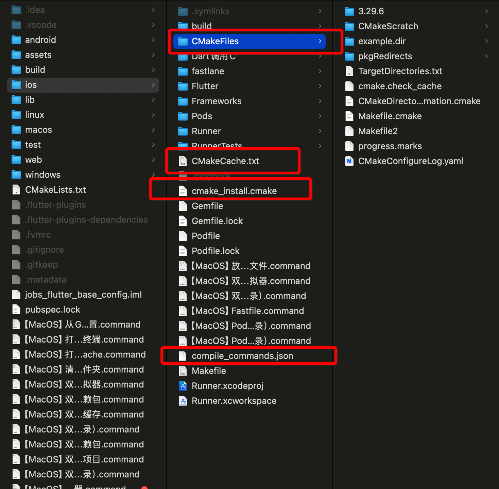
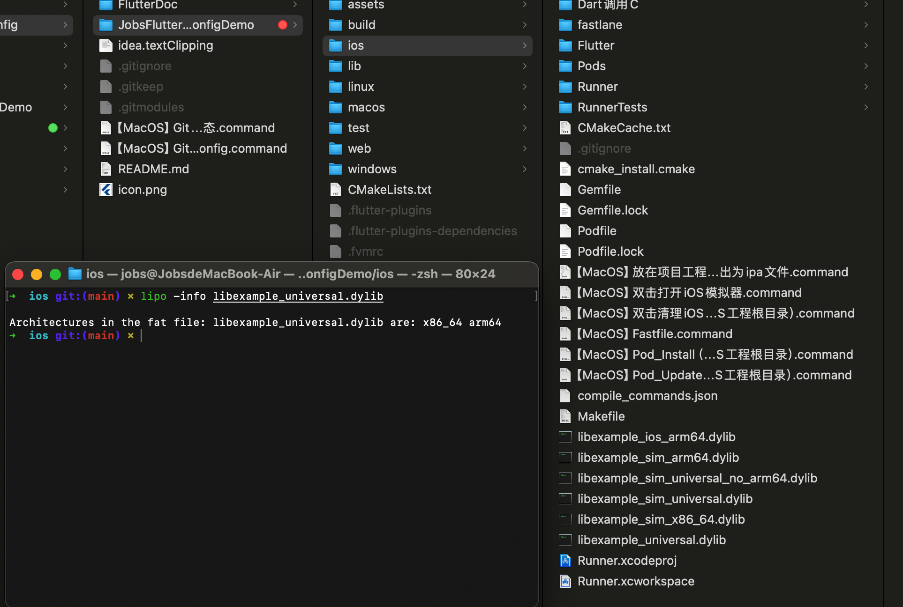
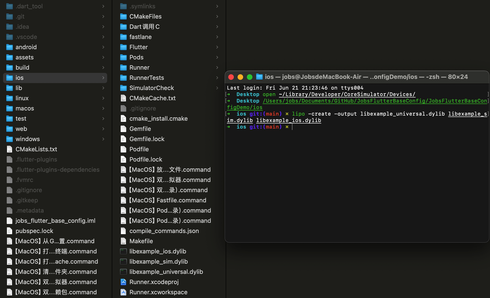
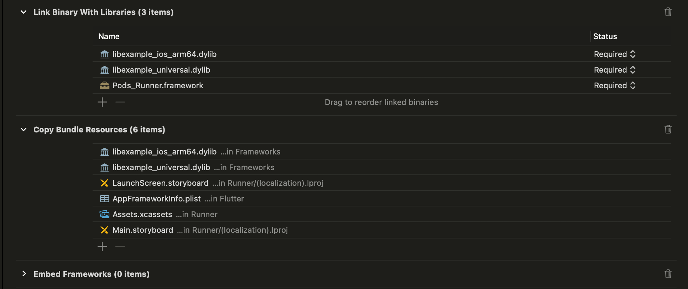
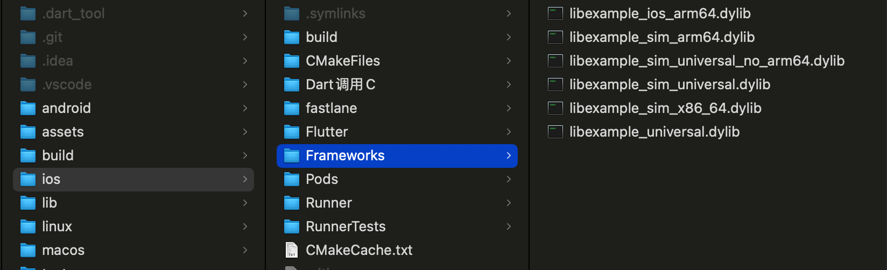
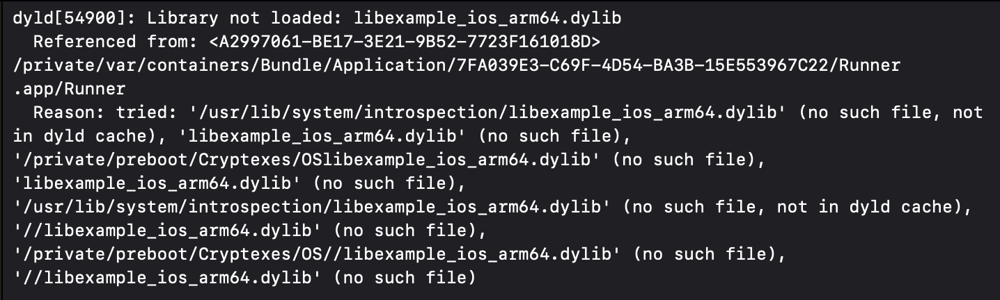

# Dart 调用 C文件（C文件打包成C库）

## 1、源文件 `example.c`

```c
#include <stdio.h>

void helloFromC() {
    printf("Jobs,Hello from C!\n");
}
```

## 2、借助Cmake，生成`compile_commands.json`文件



*定位于Flutter的ios目录*

```shell
➜  ios git:(main) ✗ cmake -DCMAKE_EXPORT_COMPILE_COMMANDS=1 ..
-- The C compiler identification is AppleClang 15.0.0.15000309
-- The CXX compiler identification is AppleClang 15.0.0.15000309
-- Detecting C compiler ABI info
-- Detecting C compiler ABI info - done
-- Check for working C compiler: /Applications/Xcode.app/Contents/Developer/Toolchains/XcodeDefault.xctoolchain/usr/bin/cc - skipped
-- Detecting C compile features
-- Detecting C compile features - done
-- Detecting CXX compiler ABI info
-- Detecting CXX compiler ABI info - done
-- Check for working CXX compiler: /Applications/Xcode.app/Contents/Developer/Toolchains/XcodeDefault.xctoolchain/usr/bin/c++ - skipped
-- Detecting CXX compile features
-- Detecting CXX compile features - done
-- Configuring done (0.7s)
-- Generating done (0.0s)
-- Build files have been written to: /Users/jobs/Documents/GitHub/JobsFlutterBaseConfig/JobsFlutterBaseConfigDemo/ios
```

*CMakeLists.txt*于项目根目录下

```cmake
cmake_minimum_required(VERSION 3.10)
project(ExampleProject)

set(CMAKE_CXX_STANDARD 11)
set(CMAKE_C_STANDARD 11)

# 修改为实际项目中C文件的路径.在CMake中，使用相对路径或绝对路径都是可以的
add_library(example SHARED ./lib/Data/Data.Origin🌍/调用C/example.c) 

# 定位于Flutter工程的ios文件夹，最后执行：cmake -DCMAKE_EXPORT_COMPILE_COMMANDS=1 ..
```

## 3、将`example.c`编译（合并）成不同平台上所支持的二进制库

<font color=red>**编译用gcc，合并用lipo**</font>

* Windows 上 编译成动态库。编译后的文件名：`example.dll`
  ```shell
  gcc -shared -o example.dll -Wl,--out-implib,libexample.a example.c
  ```
  
* Linux 上 编译成动态库。编译后的文件名：`libexample.so`
  ```shell
  gcc -shared -o libexample.so -fPIC example.c
  ```
  
* macOS 上 编译成动态库。编译后的文件名：`libexample.dylib`
  ```shell
  gcc -shared -o libexample.dylib -fPIC example.c
  ```

* **iOS真机+iOS模拟器 = 混合编译**

  * 编译每个架构的动态库

    * 编译模拟器的 x86_64 架构
  
      ```shell
      gcc -dynamiclib -o libexample_sim_x86_64.dylib -arch x86_64 example.c
      ```

    * 编译模拟器的 arm64 架构
  
      ```shell
      gcc -dynamiclib -o libexample_sim_arm64.dylib -arch arm64 -isysroot $(xcrun --sdk iphonesimulator --show-sdk-path) example.c
      ```

    * 编译真机的 arm64 架构
  
      ```shell
      gcc -dynamiclib -o libexample_ios_arm64.dylib -arch arm64 -isysroot $(xcrun --sdk iphoneos --show-sdk-path) example.c
      ```

  * 合并架构
  
    * 合并模拟器的架构
  
      ```shell
      lipo -create -output libexample_sim_universal.dylib libexample_sim_x86_64.dylib libexample_sim_arm64.dylib
      ```
  
    * 提取 libexample_sim_universal.dylib 中的 arm64 架构
  
      ```shell
      lipo -remove arm64 -output libexample_sim_universal_no_arm64.dylib libexample_sim_universal.dylib
      ```
  
    * 最终合并所有架构
  
      ```shell
      lipo -create -output libexample_universal.dylib libexample_sim_universal_no_arm64.dylib libexample_ios_arm64.dylib
      ```
  
  * 验证二进制文件架构（正确输出应包含 `x86_64` 和 `arm64` 架构）
  
    ```shell
    lipo -info libexample_universal.dylib
    ```
  
    

### 3.1、<font id=FatBinary>胖二进制（Fat Binary） </font>

* 胖二进制（Fat Binary）=  通用的二进制文件（Universal Binary）；
* **是指一个二进制文件中包含多个不同架构的代码**。这使得一个单一的二进制文件可以在多个平台或处理器架构上运行；
* 在 iOS 开发中，胖二进制文件通常用于同时支持 `x86_64` 和 `arm64` 架构，以便在模拟器（通常使用 `x86_64` 架构）和真实设备（通常使用 `arm64` 架构）上都能运行。

### 3.2、使用 `lipo` 创建通用二进制文件（胖二进制）

* 背景：如果将适用于iOS的真机的二进制文件和适用于iOS模拟器的二进制文件，都分别集成在xcode里面。<font color=red>**注意，此时没有使用通用的二进制文件（Universal Binary），那么此时编译将会报错**</font>；

* 创建通用二进制文件的前提是，将需要支持的各个平台的二进制文件包，先打出来。比如先确保输出这个例子的`libexample_sim.dylib`和`libexample_ios.dylib`，然后使用 `lipo` 工具将它们合并成一个通用二进制文件；

  ```shell
  lipo -create -output libexample_universal.dylib libexample_sim.dylib libexample_ios.dylib
  ```

  

## 4、关联库：将动态库复制到Flutter.ios项目中

* 在Xcode的 `Build Phases` 中，确保 `libexample_ios_arm64.dylib` 和 `libexample_universal.dylib` 正确地添加到了 Xcode 的 `Link Binary With Libraries` 和 `Copy Bundle Resources` 中；

  

* 单个的模拟器的库和真机的库，使用哪个就集成那个。<font color=red>**同时集成会报错**</font>。我这里选用的是[**胖二进制**](#FatBinary)的解决方案。✅

  

* <font color=red>**但实际上，我走到这一步，总是报错说当前二进制文件不能用于iOS模拟器，那我只好真机试一试。但是真机报错。**</font>

  <font color=red>**最好真机，目前iOS模拟器，我没有成功的集成**</font>
  
  

## 5、flutter run

* 命令行启动：定位于项目根目录下。先清理缓存，以免造成一些问题：

  ```shell
  flutter clean
  ```

* 命令行启动：定位于项目根目录下。以debug模式，利用target参数，运行非标准入口文件`dartInvokeC.dart `：

  ```shell
  ➜  JobsFlutterBaseConfigDemo git:(main) ✗ flutter run --target=/Users/jobs/Documents/GitHub/JobsFlutterBaseConfig/JobsFlutterBaseConfigDemo/lib/Data/Data.Origin🌍/调用C/dartInvokeC.dart --debug
  ```

