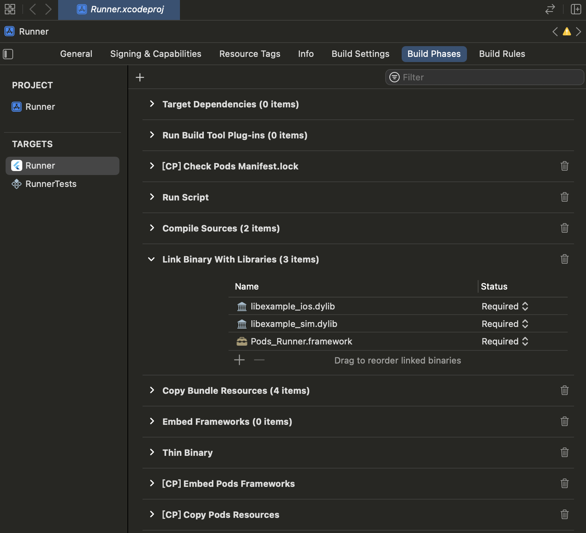
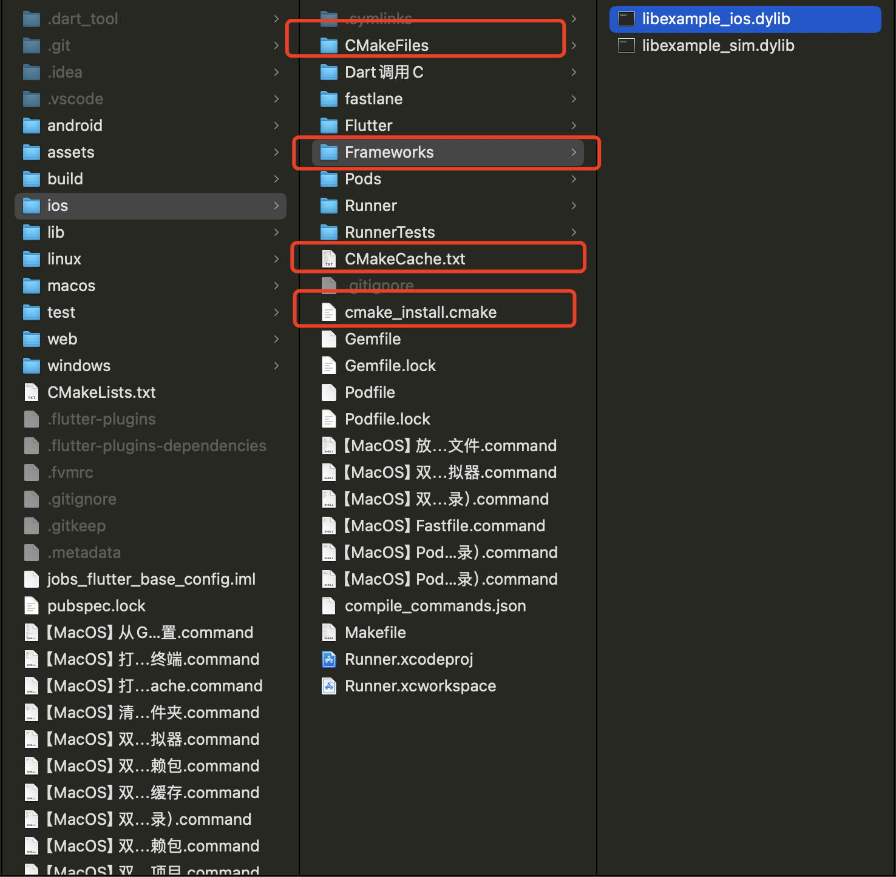

# Dart 调用 C文件（C文件打包成C库）

## 源文件 `example.c`

```c
#include <stdio.h>

void helloFromC() {
    printf("Jobs,Hello from C!\n");
}
```

## 将`example.c`编译成不同平台上所支持的二进制库

* Linux 上 编译成动态库。编译后的文件名：`libexample.so`

  ```shell
  gcc -shared -o libexample.so -fPIC example.c
  ```

* macOS 上 编译成动态库。编译后的文件名：`libexample.dylib`

  ```shell
  gcc -shared -o libexample.dylib -fPIC example.c
  ```

* 为iOS设备生成动态库

  ```shell
  xcrun --sdk iphoneos clang -arch arm64 -shared -o libexample_ios.dylib -fPIC example.c
  ```
  
* 为iOS模拟器生成动态库

  ```shell
  xcrun --sdk iphonesimulator clang -arch x86_64 -shared -o libexample_sim.dylib -fPIC example.c
  ```
  
* Windows 上 编译成动态库。编译后的文件名：`example.dll`

  ```shell
  gcc -shared -o example.dll -Wl,--out-implib,libexample.a example.c
  ```

## 关联库：将动态库复制到Flutter项目中

* 对于macOS：

  在Xcode的 `Build Phases` 中，确保 `libexample_ios.dylib`和`libexample_sim.dylib` 被包含在 `Link Binary With Libraries` 部分

  模拟器的库 和 真机的库，用哪个集成那个。同时集成会报错

  

  在 `ios` 目录下创建一个 `Frameworks` 文件夹（如果不存在），然后将动态库复制到该目录下。

  ```shell
  cp libexample_ios.dylib <flutter_project_path>/ios/Frameworks/
  cp libexample_sim.dylib <flutter_project_path>/ios/Frameworks/
  ```

* 对于Linux：

  ```shell
  cp libexample.so <flutter_project_path>/android/app/src/main/jniLibs/
  ```

* 对于Windows：

  ```shell
  cp example.dll <flutter_project_path>/windows
  ```

## 借助Cmake，生成`compile_commands.json`文件



*定位于Flutter的ios目录*

```shell
➜  ios git:(main) ✗ cmake -DCMAKE_EXPORT_COMPILE_COMMANDS=1 ..
-- The C compiler identification is AppleClang 15.0.0.15000309
-- The CXX compiler identification is AppleClang 15.0.0.15000309
-- Detecting C compiler ABI info
-- Detecting C compiler ABI info - done
-- Check for working C compiler: /Applications/Xcode.app/Contents/Developer/Toolchains/XcodeDefault.xctoolchain/usr/bin/cc - skipped
-- Detecting C compile features
-- Detecting C compile features - done
-- Detecting CXX compiler ABI info
-- Detecting CXX compiler ABI info - done
-- Check for working CXX compiler: /Applications/Xcode.app/Contents/Developer/Toolchains/XcodeDefault.xctoolchain/usr/bin/c++ - skipped
-- Detecting CXX compile features
-- Detecting CXX compile features - done
-- Configuring done (0.7s)
-- Generating done (0.0s)
-- Build files have been written to: /Users/jobs/Documents/GitHub/JobsFlutterBaseConfig/JobsFlutterBaseConfigDemo/ios
```

*CMakeLists.txt*于项目根目录下

```cmake
cmake_minimum_required(VERSION 3.10)
project(ExampleProject)

set(CMAKE_CXX_STANDARD 11)
set(CMAKE_C_STANDARD 11)

# 修改为实际项目中C文件的路径.在CMake中，使用相对路径或绝对路径都是可以的
add_library(example SHARED ./lib/Data/Data.Origin🌍/调用C/example.c) 

# 定位于Flutter工程的ios文件夹，最后执行：cmake -DCMAKE_EXPORT_COMPILE_COMMANDS=1 ..
```

